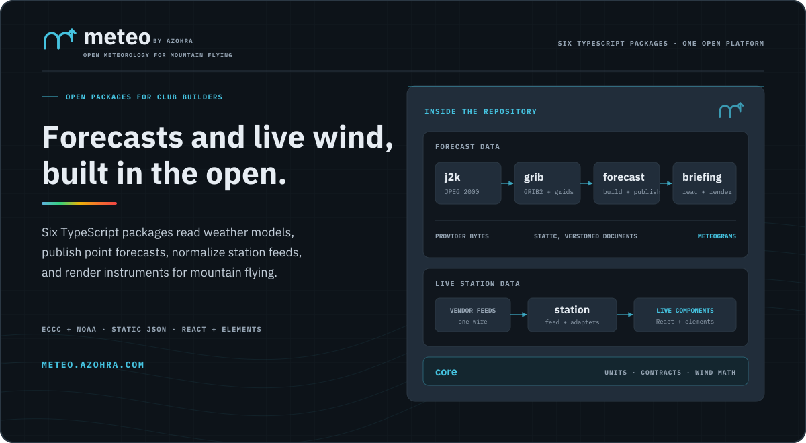
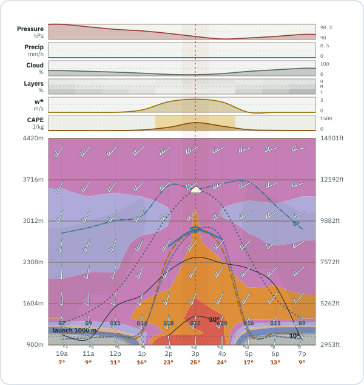
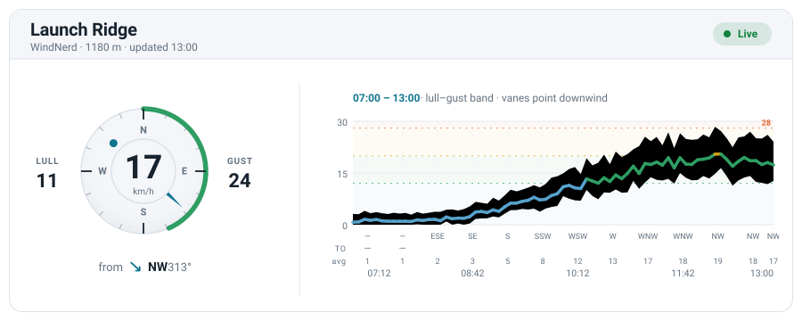

# meteo by Azohra



<p align="center"><strong>Open meteorology for mountain flying.</strong><br>
<sub>An engine you point at your launches, and packages that read, analyze, and draw what it publishes.</sub></p>

<p align="center">
  <a href="LICENSE"></a>
  
  
</p>

<p align="center">
  <a href="https://meteo.azohra.com">Project site</a> ·
  <a href="https://meteo.azohra.com/docs/">Documentation</a> ·
  <a href="https://meteo.azohra.com/logbook/">Logbook</a> ·
  <a href="https://meteo.azohra.com/docs/forecast/forecast-model-feeds/">Feed reference</a> ·
  <a href="#contributing">Contributing</a>
</p>

## The platform

Six packages under the `@azohra` scope, one workspace; each package
versions independently and keeps its own changelog. The layers stand
alone: read published documents without running a builder, bring the
typed data into a custom UI, or run the engine end to end.

| Package | Home | What it provides |
| --- | --- | --- |
| **`@azohra/meteo.forecast`** | [`forecast/`](forecast/) | The forecast engine and `meteo` CLI: fetches ECCC and NOAA model fields, samples each catalogued site, derives soaring quantities, and publishes versioned documents plus append-only history. |
| **`@azohra/meteo.briefing`** | [`briefing/`](briefing/) | Reads a published forecast and tells you what kind of day it is: zod contract and types, pure derivations, typed findings, cross-model and through-time comparison, transport guards, history loaders, and the Meteogram renderer (`/meteogram`). |
| **`@azohra/meteo.station`** | [`station/`](station/) | Live weather stations: one wire contract, vendor adapters (four built in, or your own), a mountable feed handler, a framework-free client layer, and peer React and custom-element bindings. |
| **`@azohra/meteo.core`** | [`core/`](core/) | The shared foundation: units, angle and wind-vector math (one sign convention platform-wide), zod primitives, the transport failure vocabulary, schema-artifact tooling. |
| **`@azohra/meteo.grib`** | [`grib/`](grib/) | A pure-TypeScript GRIB2 decoder (rotated and Lambert grids, complex packing, multi-field messages, `.idx` helpers), validated bit-for-bit against ecCodes golden fixtures. |
| **`@azohra/meteo.j2k`** | [`j2k/`](j2k/) | A pure-TypeScript JPEG 2000 decoder scoped to exactly the codestream subset ECCC ships; the production codec behind `@azohra/meteo.grib`. |

## Install

```sh
pnpm add @azohra/meteo.briefing   # read, analyze, render published forecast documents
pnpm add @azohra/meteo.forecast   # run the engine and publish your own
pnpm add @azohra/meteo.station    # live weather-station feeds and components
pnpm add @azohra/meteo.core       # shared units, wind math, zod primitives
pnpm add @azohra/meteo.grib       # decode GRIB2 provider bytes
pnpm add @azohra/meteo.j2k        # decode the JPEG 2000 inside ECCC GRIB2
```

## Read a forecast

<p align="center">
  
</p>

Point `curl` at a published forecast document:

```sh
curl -sS https://meteo.azohra.com/data-sample/hrdps-continental/sites/test-hill.json \
  | jq '.hours[] | {validAt} + .derived'
```

The sample is one real HRDPS run over the synthetic sites, truncated to
its first eight hourly steps.

Forecasts include surface conditions, winds and temperatures aloft, thermal
velocity, boundary-layer top, cloud base, and usable-lift top.
[`forecast/models.json`](forecast/models.json) declares each model's
capabilities and semantics; the
[feed reference](https://meteo.azohra.com/docs/forecast/forecast-model-feeds/)
records provider sources and verification dates.

In TypeScript, each capability is an explicit subpath:

```ts
import { parseSiteForecastJson } from "@azohra/meteo.briefing/contract";
import { buildMeteogramScene, renderMeteogramSvg } from "@azohra/meteo.briefing/meteogram";

const forecastUrl =
  "https://meteo.azohra.com/data-sample/hrdps-continental/sites/test-hill.json";
const response = await fetch(forecastUrl);
const forecast = parseSiteForecastJson(await response.text());
if (!forecast) throw new Error("forecast failed contract validation");

const svg = renderMeteogramSvg(
  buildMeteogramScene(forecast, { timeZone: "America/Vancouver" }),
);
```

Documents are launch-agnostic: one forecast serves every launch its grid
cell covers; a launch marker and its measured elevation are render inputs.
The TypeScript documentation starts at
[Render a first Meteogram](https://meteo.azohra.com/docs/briefing/render-first-meteogram/); the
[reading guide](https://meteo.azohra.com/docs/briefing/reading-a-meteogram/)
explains every mark on the chart using the committed
[synthetic scenarios](scenarios/).

## Live stations

<p align="center">
  <picture>
    <source media="(prefers-color-scheme: dark)" srcset="station/docs/figures/hero-dark.svg">
    
  </picture>
</p>

`@azohra/meteo.station` reads live weather stations through one wire contract:
vendor adapters normalize WindNerd, WeatherFlow Tempest, Campbell
Scientific, and Ecowitt hardware into it; `defineStationAdapter`
admits your own. A mountable `Request → Response` handler serves the
whole inventory as a single feed, and hooks and components render it
natively, in your design system, with no vendor iframe:

```tsx
import { StationFeedProvider, useStation, StationCard } from "@azohra/meteo.station/react";
import "@azohra/meteo.station/styles.css";

function LiveWind() {
  const { feed, receivedAtMs } = useStation("/api/wind", "launch");
  if (!feed) return null;
  return (
    <div className="meteo-root">
      <StationFeedProvider feed={feed} receivedAtMs={receivedAtMs}
        thresholds={{ unit: "kmh", values: [12, 20, 28] }}>
        <StationCard />
      </StationFeedProvider>
    </div>
  );
}
```

The custom-element binding (`@azohra/meteo.station/elements`) is a full peer of
the React one, framework-free and held byte-identical by a parity suite.
The [station documentation](https://meteo.azohra.com/docs/station/) covers
the wire contract, adapters, the client data layer, both bindings, and
theming.

## The decoders

Beneath the engine sit two decoders written for this workspace and
published on their own: [`@azohra/meteo.grib`](grib/) exists because no
maintained JavaScript GRIB2 decoder covered the grids ECCC and NOAA
actually ship, and [`@azohra/meteo.j2k`](j2k/) decodes the JPEG 2000
inside ECCC's messages. Every decode path is accepted to
[exact equality against ecCodes](https://meteo.azohra.com/docs/grib/correctness/).
Both cores run in the browser: no `node:` imports, no ambient I/O
([what the core never does](https://meteo.azohra.com/docs/grib/coverage/#what-the-core-never-does)).

## Run your own

The engine publishes static site forecasts to any storage you control, at
stable paths:

```text
<your root>/models.json                          # emitted by `meteo forecast catalogue`
<your root>/sites.json                           # authored by you, published verbatim
<your root>/site-context.json                    # measured by `meteo forecast terrain`
<your root>/runs.json                            # regenerated by `meteo forecast runs-index`
<your root>/<model>/manifest.json                # written by every build
<your root>/<model>/sites/<slug>.json            # written by every build
<your root>/<model>/history/<slug>/<YYYY-MM>.jsonl.gz   # appended by default
```

```sh
pnpm exec meteo forecast build --model hrdps-continental --sites ./sites.json --output ./public/data --dry-run
```

The [publisher documentation](https://meteo.azohra.com/docs/forecast/run-one-model/)
covers launch catalogues, output paths, smoke caps, full builds, and the
history flag (`--history`, on by default), which appends month archives
beside the current documents.
Builders move real provider volume (the
[feed reference](https://meteo.azohra.com/docs/forecast/forecast-model-feeds/)
records per-model transports and transfer costs)
and must not run more often than their model publishes.

An operator's pipeline is your own repository composing the engine; the platform ships
[the engine, not an instance](https://meteo.azohra.com/docs/forecast/#engine-not-instance),
and the reference operator's pipeline is public at
[`azohra/acrophobia-forecasts`](https://github.com/azohra/acrophobia-forecasts).
The operator path starts at
[Configure launches](https://meteo.azohra.com/docs/forecast/configure-launches/)
and runs in order through model choice, the first build, scheduling,
static output, and downstream access.

## Lineage

meteo by Azohra descends from
[canadarasp](https://github.com/ajberkley/canadarasp) (the first
derivations here were ports of its constants) and follows
[soaringmeteo](https://soaringmeteo.org/) in publishing open soaring
forecasts. The full story is on
[the about page](https://meteo.azohra.com/about/).

## Contributing

meteo by Azohra is solo-maintained. Read the [contributor guide](CONTRIBUTING.md)
for setup, repository checks, generated files, documentation rules, and
change intents. Discuss substantial changes in an issue before sending a pull
request.

## Licence

ECCC source data is used under the [Environment and Climate Change Canada Data Server End-use Licence](https://eccc-msc.github.io/open-data/licence/readme_en/); derived forecasts retain its attribution requirement. NOAA HRRR, GFS, and NAM data are public-domain products distributed through the [Open Data Dissemination program](https://www.noaa.gov/information-technology/open-data-dissemination). Code is [MIT licensed](LICENSE).

<p align="center">Made with <strong>♥</strong> by Justin Watts.</p>
