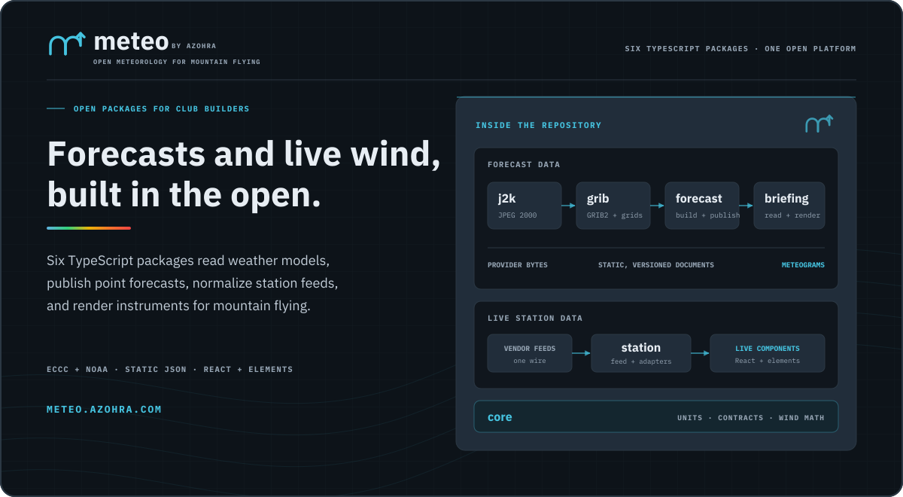
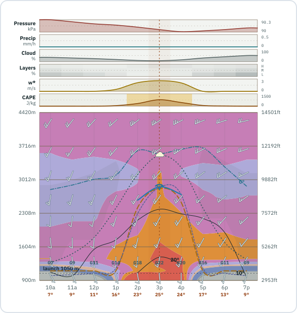
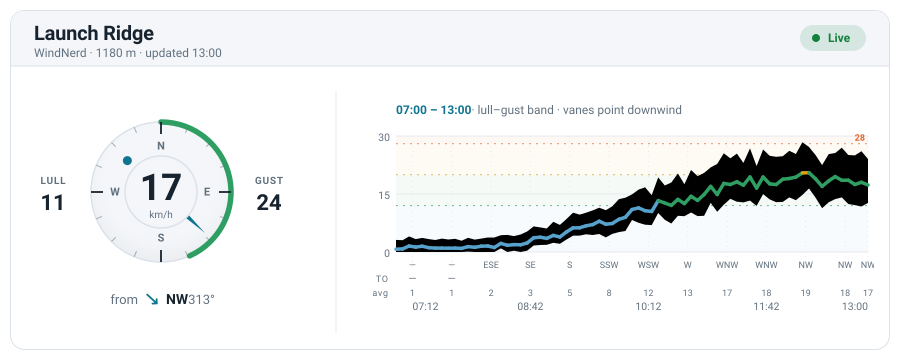

# meteo by Azohra



<p align="center"><strong>Open meteorology for mountain flying.</strong><br>
<sub>An engine you point at your launches, and packages that read, analyze, and draw what it publishes.</sub></p>

<p align="center">
  <a href="LICENSE"></a>
  
  
</p>

<p align="center">
  <a href="https://meteo.azohra.com">Project site</a> ·
  <a href="https://meteo.azohra.com/docs/">Documentation</a> ·
  <a href="https://meteo.azohra.com/logbook/">Logbook</a> ·
  <a href="https://meteo.azohra.com/docs/forecast/forecast-model-feeds/">Feed reference</a> ·
  <a href="#contributing">Contributing</a>
</p>

meteo is an open platform for soaring forecasts and live launch wind, built
for free-flight pilots. You run the forecast engine for the launches your club flies, host
the output yourself, and use the TypeScript packages to read it and draw the
charts.

## The platform

The workspace holds six packages under the `@azohra` scope. Each one has its
own version and changelog, and each can be used without the others. You can
read published forecasts without running the engine, put the typed data in
your own interface, or run the whole pipeline yourself.

| Package | Home | What it does |
| --- | --- | --- |
| **`@azohra/meteo.forecast`** | [`forecast/`](forecast/) | The forecast engine and the `meteo` CLI. It fetches ECCC and NOAA model fields, samples them at each site you list, derives soaring quantities, and publishes versioned documents with an append-only history. |
| **`@azohra/meteo.briefing`** | [`briefing/`](briefing/) | Reads a published forecast and describes the day. It has the zod contract and types, pure derivations, typed findings, comparison across models and across runs, transport guards, history loaders, and the Meteogram renderer (`/meteogram`). |
| **`@azohra/meteo.station`** | [`station/`](station/) | Live weather stations. It defines one wire contract, ships four vendor adapters and lets you write your own, and provides a feed handler you can mount, a framework-free client layer, and React and custom-element components. |
| **`@azohra/meteo.core`** | [`core/`](core/) | Shared building blocks: units, angle and wind-vector math with one sign convention for the whole platform, zod primitives, the transport failure vocabulary, and schema-artifact tooling. |
| **`@azohra/meteo.grib`** | [`grib/`](grib/) | A GRIB2 decoder in pure TypeScript. It handles rotated and Lambert grids, complex packing, multi-field messages, and `.idx` files, and matches ecCodes golden fixtures bit for bit. |
| **`@azohra/meteo.j2k`** | [`j2k/`](j2k/) | A JPEG 2000 decoder in pure TypeScript, limited to the codestream subset ECCC ships. `@azohra/meteo.grib` uses it in production. |

## Install

```sh
pnpm add @azohra/meteo.briefing   # read, analyze, render published forecast documents
pnpm add @azohra/meteo.forecast   # run the engine and publish your own
pnpm add @azohra/meteo.station    # live weather-station feeds and components
pnpm add @azohra/meteo.core       # shared units, wind math, zod primitives
pnpm add @azohra/meteo.grib       # decode GRIB2 provider bytes
pnpm add @azohra/meteo.j2k        # decode the JPEG 2000 inside ECCC GRIB2
```

## Read a forecast

<p align="center">
  
</p>

Fetch a published forecast document with `curl`:

```sh
curl -sS https://meteo.azohra.com/data-sample/hrdps-continental/sites/test-hill.json \
  | jq '.hours[] | {validAt} + .derived'
```

The sample is one real HRDPS run over the synthetic sites, cut to its first
eight hourly steps.

A forecast carries surface conditions, winds and temperatures aloft, thermal
velocity, boundary-layer top, cloud base, and usable-lift top.
[`forecast/models.json`](forecast/models.json) declares what each model can
publish and what its values mean. The
[feed reference](https://meteo.azohra.com/docs/forecast/forecast-model-feeds/)
lists provider sources and the dates they were last verified.

In TypeScript, each capability has its own import path:


```ts
import { parseSiteForecastJson } from "@azohra/meteo.briefing/contract";
import { buildMeteogramScene, renderMeteogramSvg } from "@azohra/meteo.briefing/meteogram";

const forecastUrl =
  "https://meteo.azohra.com/data-sample/hrdps-continental/sites/test-hill.json";
const response = await fetch(forecastUrl);
const forecast = parseSiteForecastJson(await response.text());
if (!forecast) throw new Error("forecast failed contract validation");

const svg = renderMeteogramSvg(
  buildMeteogramScene(forecast, { timeZone: "America/Vancouver" }),
);
```

A document is not tied to one launch. The same forecast serves every launch
inside its grid cell, and you pass the launch marker and its measured
elevation when you render. To start in TypeScript, follow
[Render a first Meteogram](https://meteo.azohra.com/docs/briefing/render-first-meteogram/).
The [reading guide](https://meteo.azohra.com/docs/briefing/reading-a-meteogram/)
explains every mark on the chart, using the committed
[synthetic scenarios](scenarios/).

## Live stations

<p align="center">
  <picture>
    <source media="(prefers-color-scheme: dark)" srcset="station/docs/figures/hero-dark.svg">
    
  </picture>
</p>

`@azohra/meteo.station` reads live weather stations through one wire
contract. Its adapters convert WindNerd, WeatherFlow Tempest, Campbell
Scientific, and Ecowitt data into that contract, and `defineStationAdapter`
lets you add your own. A mountable `Request → Response` handler serves every
station as a single feed. The hooks and components render it in your own
design system, without a vendor iframe:

```tsx
import { StationFeedProvider, useStation, StationCard } from "@azohra/meteo.station/react";
import "@azohra/meteo.station/styles.css";

function LiveWind() {
  const { feed, receivedAtMs } = useStation("/api/wind", "launch");
  if (!feed) return null;
  return (
    <div className="meteo-root">
      <StationFeedProvider feed={feed} receivedAtMs={receivedAtMs}
        thresholds={{ unit: "kmh", values: [12, 20, 28] }}>
        <StationCard />
      </StationFeedProvider>
    </div>
  );
}
```

The custom-element binding (`@azohra/meteo.station/elements`) matches the
React one and needs no framework. A parity suite keeps their output
byte-identical. The [station documentation](https://meteo.azohra.com/docs/station/)
covers the wire contract, adapters, the client data layer, both bindings,
and theming.

## The decoders

The engine reads provider files with two decoders written for this workspace
and published separately. [`@azohra/meteo.grib`](grib/) exists because no
maintained JavaScript GRIB2 decoder handled the grids ECCC and NOAA ship.
[`@azohra/meteo.j2k`](j2k/) decodes the JPEG 2000 images inside ECCC's
messages. Every decode path must match
[ecCodes exactly](https://meteo.azohra.com/docs/grib/correctness/). Both
decoders run in the browser because their decode cores have no `node:`
imports and do no I/O of their own
([what the core never does](https://meteo.azohra.com/docs/grib/coverage/#what-the-core-never-does)).

## Run your own

The engine writes static forecast files to storage you control, at stable
paths:

```text
<your root>/models.json                          # emitted by `meteo forecast catalogue`
<your root>/sites.json                           # authored by you, published verbatim
<your root>/site-context.json                    # measured by `meteo forecast terrain`
<your root>/runs.json                            # regenerated by `meteo forecast runs-index`
<your root>/<model>/manifest.json                # written by every build
<your root>/<model>/sites/<slug>.json            # written by every build
<your root>/<model>/history/<slug>/<YYYY-MM>.jsonl.gz   # appended by default
```

```sh
pnpm exec meteo forecast build --model hrdps-continental --sites ./sites.json --output ./public/data --dry-run
```

The [publishing guide](https://meteo.azohra.com/docs/forecast/run-one-model/)
covers launch catalogues, output paths, smoke caps, full builds, and
`--history`. History is on by default and appends month archives beside the
current documents.

Builds download a lot of provider data. The
[feed reference](https://meteo.azohra.com/docs/forecast/forecast-model-feeds/)
lists each model's transport and transfer cost. Don't run a build more often
than its model publishes.

The project ships the engine, and each
[operator](https://meteo.azohra.com/docs/glossary/#operator) runs it from a
repository of their own
([engine and instance](https://meteo.azohra.com/docs/forecast/#engine-not-instance)).
The reference operator's pipeline is public at
[`azohra/acrophobia-forecasts`](https://github.com/azohra/acrophobia-forecasts).
To set one up, start at
[Configure launches](https://meteo.azohra.com/docs/forecast/configure-launches/)
and follow the pages in order: choosing models, the first build,
scheduling, static output, and access for readers.

## Lineage

meteo by Azohra grew out of
[canadarasp](https://github.com/ajberkley/canadarasp): the first derivations
here were ports of its constants. Like [soaringmeteo](https://soaringmeteo.org/),
it publishes soaring forecasts in the open. The
[about page](https://meteo.azohra.com/about/) tells the full story.

## Contributing

I maintain meteo by Azohra on my own. The [contributor guide](CONTRIBUTING.md)
covers setup, repository checks, generated files, documentation rules, and
change intents. Please open an issue to discuss a large change before you
send a pull request.

## Licence

ECCC source data is used under the [Environment and Climate Change Canada Data Server End-use Licence](https://eccc-msc.github.io/open-data/licence/readme_en/); derived forecasts retain its attribution requirement. NOAA HRRR, GFS, and NAM data are public-domain products distributed through the [Open Data Dissemination program](https://www.noaa.gov/information-technology/open-data-dissemination). Code is [MIT licensed](LICENSE).

<p align="center">Made with <strong>♥</strong> by Justin Watts.</p>
