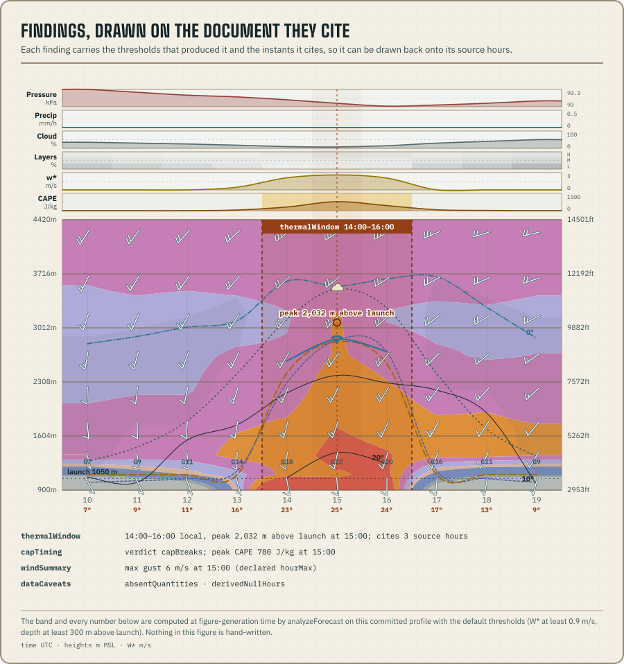

`@azohra/meteo.briefing/analyze` compresses one profile into a small, versioned vocabulary
of findings. Each finding is a typed statement about magnitudes, timing,
published absences, or arithmetic relationships in that document. Findings
that depend on thresholds carry the thresholds that produced them; findings
that cite hours carry the underlying values and UTC `validAt` instants in an
`evidence` block.



Use `@azohra/meteo.briefing/derive` when you need quantities. Use `@azohra/meteo.briefing/analyze` when you
need a statement that remains inspectable after the full profile is no longer
in the immediate view or prompt.

[`@azohra/meteo.briefing/compare`](/docs/briefing/compare/) applies one analysis threshold
set across multiple models and compares their findings.

## Analyze a validated document

Validate a profile before passing it to the analysis API:

```ts title="analyze-profile.ts"
import {
  analyzeForecast,
  type ForecastAnalysis,
} from "@azohra/meteo.briefing/analyze";
import { parseSiteForecastJson } from "@azohra/meteo.briefing/contract";

export function analyzeProfileJson(text: string): ForecastAnalysis {
  const profile = parseSiteForecastJson(text);
  if (!profile) throw new Error("invalid profile");

  return analyzeForecast(profile, {
    // The launch is yours, not the document's — typically site-context.json's
    // elevation pick. It anchors every launch-relative statement.
    launch: { elevationM: 1591 },
    thresholds: {
      thermalWindow: { wstarMinMps: 1.0, depthMinM: 350 },
    },
  });
}
```

`launch` is optional and mirrors the scene's `MeteogramOptions.launch`:
documents are launch-agnostic, so the caller names the launch the analysis
reads against. Without one the analysis degrades gracefully rather than
guessing: launch-relative arithmetic (the `thermalWindow` depth
threshold) falls back to the model's own ground (`site.modelElevationM`),
`peakLiftTopAboveLaunchM` is `null` instead of a number relative to the
wrong ground, and `terrainMismatch` (a launch-vs-model-ground statement)
is never emitted. The analysis envelope records the launch it used as
`site.launchAltitudeM` (`null` when none was supplied).

`thresholds` is optional. Overrides are merged by finding kind over
`DEFAULT_ANALYZE_THRESHOLDS`. They are conventions chosen by the caller, not
new physics, and the effective values are copied into every finding they
shape. The defaults (release-current values of `DEFAULT_ANALYZE_THRESHOLDS`):

| Kind | Default thresholds |
| --- | --- |
| `thermalWindow` | W* ≥ 0.9 m/s and depth ≥ 300 m above launch; gap tolerance 0 h |
| `liftCeiling` | cloud-cap margin 50 m |
| `capTiming` | instability from 100 J/kg; broken cap at ≤ 25 J/kg CIN with ≥ 200 J/kg CAPE; precipitation from 0.2 mm/h |
| `convectiveDay` | precipitation from 0.2 mm/h |
| `terrainMismatch` | reported from 250 m absolute delta |
| `windSummary` | climb band padded 200 m; persistence within 0.8 of the peak |
| `windDirection` | direction suppressed under 1 m/s |
| `bandShear` | layers thinner than 30 m skipped; light-endpoint relation at 2 m/s |

`thermalWindow.maxGapHours` is a segmentation tolerance: adjacent passing
runs merge when the failing steps between them cover at most that many
hours and every bridged step publishes both series (bridging a data hole
would manufacture continuity the model never forecast). The default `0`
merges nothing: exactly the pre-v4 segmentation. Bridged hours join the
cited evidence, so the dip stays visible.

## Two analysis inputs are not thresholds

`AnalyzeOptions` carries two more caller-owned inputs beside `launch`:

**`smoke`** joins a same-site smoke document (RAQDPS) beside a smoke-blind
profile, by exact `validAt` match. The `smokeImpact` kind then republishes
the smoke run's surface and column magnitudes with a coverage confession and
the smoke run's own `referenceTime` beside the envelope's. It is ignored
when the profile carries its own `hours[].smoke` (the model's own smoke
wins). Absent both, the analysis is smoke-blind and says so with the
`dataCaveats` `"smoke"` family token: absence means "not published", never
clear air.

**`windCeilings`** feeds `windExceedance`, and is deliberately **not** in
`thresholds`, because **no defaults exist**: the package never owns a "safe
wind" number. Without a ceiling the kind emits nothing; each supplied value
is echoed verbatim in the findings it produces. Gust ceilings are per
declared semantics class (`gust.hourMaxMps` / `gust.instantMps`) and are never
reused across classes: the two classes measure a factor ~1.8–2.8 apart at
matched means, so one number cannot serve both.

```ts title="analyze-with-inputs.ts"
import { analyzeForecast } from "@azohra/meteo.briefing/analyze";
import {
  parseSmokeDocumentJson,
  parseSiteForecastJson,
} from "@azohra/meteo.briefing/contract";

export function analyzeWithInputs(profileText: string, smokeText: string) {
  const profile = parseSiteForecastJson(profileText);
  if (!profile) throw new Error("invalid profile");

  return analyzeForecast(profile, {
    launch: { elevationM: 1591 },
    // Same-site RAQDPS document; ignored when the profile has its own smoke.
    smoke: parseSmokeDocumentJson(smokeText),
    // YOUR conventions for one pilot at one site — not recommendations, and
    // not package defaults: omit a ceiling and that quantity emits nothing.
    windCeilings: {
      surfaceMps: 7,
      gust: { hourMaxMps: 11, instantMps: 8 },
      bandMps: 9,
    },
  });
}
```

## Keep the evidence with the statement

Narrow findings by their `kind` discriminant. This example prepares rows for
a teaching table while retaining the exact series and instants behind every
window.

```ts title="window-rows.ts"
import type { ForecastAnalysis } from "@azohra/meteo.briefing/analyze";

export function windowRows(analysis: ForecastAnalysis) {
  return analysis.findings.flatMap((finding) => {
    if (finding.kind !== "thermalWindow") return [];

    return [{
      day: finding.day,
      // Hours from the run's referenceTime to the peak-lift hour: a day-10
      // window and a day-1 window are different objects wearing the same
      // vocabulary, and only this field says which one you hold.
      leadHours: finding.leadHours,
      localStart: finding.start.local,
      localEnd: finding.end.local,
      // The widest covered step among the cited hours — the quantization
      // bound on this window's timing and duration.
      stepHours: finding.stepHours,
      peakAboveLaunchM: finding.peakLiftTopAboveLaunchM,
      thresholds: finding.thresholds,
      evidence: {
        validAt: finding.evidence.hours,
        usableLiftTopM: finding.evidence.usableLiftTopM,
        thermalVelocityMps: finding.evidence.thermalVelocityMps,
        liftTopBandP10P90: finding.evidence.liftTopBandP10P90,
      },
    }];
  });
}
```

Do not reduce a finding to a prose label before storing its thresholds and
evidence. Those fields are what make the compressed statement auditable.

## The envelope self-describes

Everything a downstream comparison validates or states about a member is
**on the envelope**, so a serialized `ForecastAnalysis` re-enters
[`compareAnalyses`](/docs/briefing/compare/#compare-cached-analyses)
without re-opening the profile:

- `thresholds`: the complete resolved threshold set this analysis ran
  under (per-finding echoes are absent when a kind emitted nothing; this
  echo never is);
- `deterministic`: whether the document is deterministic or an ensemble
  read at p50, precomputed;
- `coveredDays`: the local calendar days the document's hours actually
  touch, computed in the envelope's own `timeZone` from `hours[].validAt`
  and never from cadence arithmetic (live documents widen their step
  mid-horizon);
- `extensions`: named third-party statements, when
  [extensions](#extend-over-the-public-frame) were passed; **absent, not
  empty**, otherwise, so an extension-free envelope is byte-identical to
  one serialized before the field existed.

These are required fields, which is additive for every *reader* of the
envelope: only code that constructs `ForecastAnalysis` values by hand
(test fixtures) gains fields to fill. Analyze once at the edge, cache the
envelope as JSON, and compare later: the self-description is what a
later compare validates against.

![The envelope analyzeForecast computed for the committed teaching profile, quoted field by field with the required self-description highlighted (the fully resolved thresholds, the precomputed deterministic flag, coveredDays, and extensions absent rather than empty), beside the six named validations compareAnalyses runs against those same fields: vocabulary-version skew, site and launch mismatch, timezone mismatch, thresholds deep-inequality, missing self-description, and duplicate member identity.](figures/analyze-envelope.svg)

## Versioning reads tolerantly

`vocabularyVersion` is typed `number`, not the version literal: a
deliberate loosening with zero wire consequence. It encodes
the **tolerant-reader convention**: consumers of serialized envelopes must
ignore finding kinds and envelope fields they do not know, so additive
kinds bump the version number without breaking any conforming reader.
Readers check the stamp at runtime (`compareAnalyses` throws on skew)
instead of recompiling on every bump, and cached envelopes survive
package upgrades as data.

An exhaustive `switch` over `finding.kind` stays available to compiled
consumers; with a `default` arm it too is conforming:

```ts title="tolerant-reader.ts"
import { ANALYZE_VOCABULARY_VERSION, type ForecastAnalysis } from "@azohra/meteo.briefing/analyze";

export function dayVerdicts(envelope: ForecastAnalysis) {
  if (envelope.vocabularyVersion > ANALYZE_VOCABULARY_VERSION) {
    // A newer package produced this envelope. Additive kinds are the
    // normal growth mode: read the kinds you know, ignore the rest.
  }
  return envelope.findings.flatMap((finding) => {
    switch (finding.kind) {
      case "thermalWindow":
        return [{ day: finding.day, window: true }];
      case "quietDay":
        return [{ day: finding.day, window: false }];
      default:
        // The default arm is what makes a compiled switch conforming:
        // an unknown kind is ignorable, never an error.
        return [];
    }
  });
}
```

The convention governs **readers** of the closed set, never the set
itself: unknown kinds are ignorable, not admissible. Nothing enters
`findings` without the evidence spike that gates the vocabulary;
third-party statements have their own door, below.

## The finding vocabulary

`ANALYZE_VOCABULARY_VERSION` is currently `5`. Adding,
renaming, or removing a `kind` is an analysis-contract event, independent
of the profile `schemaVersion`; the
[package changelog](https://github.com/azohra/meteo/blob/main/briefing/CHANGELOG.md)
records each boundary. One rename still bites old
code: vocabulary 4 renamed `flyableWindow` to `thermalWindow` because the
test reads two thermal quantities (W* and usable-lift depth) against
stated floors and is blind to wind, rain, and overdevelopment (the
flyability call stays downstream), so code that switches on
`"flyableWindow"` or overrides `thresholds.flyableWindow` now spells both
`thermalWindow`.

| Finding kind | What it states | Evidence and limits |
| --- | --- | --- |
| `thermalWindow` | Consecutive hours meeting the embedded W\* and launch-relative depth thresholds, with `leadHours` to the peak and its own `stepHours` quantization bound | `clippedAtStart` / `clippedAtEnd` mark edges set by the document horizon; `maxGapHours` may bridge published sub-threshold dips, never data holes |
| `percentileCrossing` | Ensemble days where some published percentile's day verdict differs from p50's, under thermalWindow's exact floors | Cites passing instants only, never windows: percentiles are per-hour marginals, not member trajectories; carries per-percentile member counts and `leadHours` |
| `quietDay` | A local day produced no thermal window, which floors its best hours missed, and the atmospheric context beside the arithmetic | `context` restates the document's own precipitation, cloud, gust, and heat-flux series with no causal verdict; `leadHours` and a `coverage.truncated` confession ride every statement |
| `convectiveDay` | CAPE magnitude and precipitation timing for models that publish CAPE and no CIN | `capIsJudgeable` is always `false`: absent CIN must never read as "no cap"; CAPE magnitudes are model-specific and never comparable across documents; mandatory `coverage` |
| `liftCeiling` | Whether each segment's arithmetic ceiling is cloud-capped or sink-limited | Each segment cites its **peak** lift top with cloud base and BL top sampled at that same hour, so the cause relation is checkable against co-timed values |
| `capTiming` | CAPE build, CIN erosion, and precipitation timing relative to a window | Deterministic documents with CIN only. `cadence` selects the verdict semantics: hourly days cite the broken hour (`capBreaksAt`); multi-hour days cite the interval between published steps (`capBreaksBetween`) or a day-edge `capAlreadyOpenAt`. `openButWeak` names a cap that sat open all day while CAPE never cleared the break floor |
| `smokeImpact` | Day-peak and during-window smoke magnitudes: republished numbers only, no derate verdict | Profile-sourced days carry the model's own AOT; joined (RAQDPS) days carry the column mass, the smoke run's own `referenceTime`, and a per-day join-coverage count. The `semantics` echo says whether the lift numbers already feel this smoke |
| `windSummary` | Maximum gust and climb-band wind magnitudes, timing, altitude, and persistence | The whole-day maxima and the `duringWindow` block answer different questions: the strongest gust of the day is outside the window often enough that the airborne-hours number is its own block |
| `windExceedance` | Maximal runs of window hours at or above a caller-supplied ceiling | Emits nothing without `AnalyzeOptions.windCeilings`: the package owns no safe-wind number; the caller's ceiling is echoed verbatim, and gust ceilings never cross semantics classes |
| `windDirection` | Surface-flow evolution across a window: start / peak-lift / end samples, net circular veer, vector means | Deterministic documents only: ensemble percentiles of raw degrees are not circular statistics. `netVeerDeg` is start→end displacement, never accumulated rotation, and is blind to a full 360° loop |
| `bandShear` | The strongest adjacent-layer shear rate inside the climb band, with its mandatory layer bounds | Analyze-only, never compared: rates are not comparable across level densities. Sparse columns rarely emit: absence means "too sparse to state", never "no shear" |
| `terrainMismatch` | Grid terrain delta and whether published lift ever arithmetically reaches the caller's launch | Emitted only when `AnalyzeOptions.launch` is supplied and the embedded mismatch threshold is met; evidence carries the max p90 lift top so the bench is checkable at the band's top |
| `ensembleMembership` | Contributor-count loss, p10–p90 band-width magnitude, and the per-day `dayBands` width series, each day read at its peak-p50-W\* hour | Spread and membership are not a confidence interval or confidence score; `dayBands` rows carry `leadHours` and a `truncated` flag, and no trend verdict exists |
| `dataCaveats` | Absent quantity families, derived-null hours, coarse cadence, or UTC fallback | Threshold-free; absence remains "not published," never zero, including the `"smoke"` family, where absence is never clear air |

## Read the finding kinds

The worked example compiles against the released package and keeps the
finding's own caveats visible instead of flattening them away; every other
kind narrows the same way.

`percentileCrossing` is ensemble-only and emits only where a percentile's
day verdict disagrees with p50's: a day where every percentile agrees emits
nothing, on either side. It cites passing instants, never windows: the
members composing p90 at 11:00 need not be the members composing it at
17:00, so no "p90 window" exists to state.

```ts title="upside-days.ts"
import type { ForecastAnalysis } from "@azohra/meteo.briefing/analyze";

export function upsideDays(analysis: ForecastAnalysis) {
  return analysis.findings.flatMap((finding) => {
    if (finding.kind !== "percentileCrossing") return [];

    const p90 = finding.perPercentile.p90;
    return [{
      day: finding.day,
      // The p50-quiet/band-window state concentrates at long lead; never
      // present a crossing as near-term hidden upside without this number.
      leadHours: finding.leadHours,
      minimalPassingPercentile: finding.minimalPassingPercentile,
      p50PassingSteps: finding.perPercentile.p50.passingSteps,
      p90PassingSteps: p90.passingSteps,
      // A "p75" over 12 contributing members is a different object than
      // one over 21 — the echo, not the label, is the guarantee.
      fewestContributingMembers: p90.membersMin,
    }];
  });
}
```

Beyond the vocabulary table's limits, these field-level caveats govern
the read:

| Kind | Reading caveats |
| --- | --- |
| `smokeImpact` | No derated window and no adjusted W\*, deliberately: the only live passive column source measured far below a satellite-verified column ([the column defect's home](/docs/briefing/smoke-document/#the-column-field-carries-a-provider-defect)), and even satellite-magnitude optics flipped almost nothing. `semantics: "radiativelyCoupled"` makes any downstream derate a double-count. A null `duringWindow` means no window, or no smoke hour landed on one |
| `convectiveDay` | Exists so a CAPE-without-CIN model's washout day still states instability where `capTiming`'s gate stays shut; deliberately unable to say "uncapped". A `coverage.truncated` day's peaks are peaks of the covered hours only: live horizon slivers carry nocturnal CAPE peaks cited at 01:00–05:00. A 0.00 precipitation series (`noPrecipAboveThreshold`) is a forecast of dryness, not absence |
| `windExceedance` | Supply the ceiling via [the analysis inputs](#two-analysis-inputs-are-not-thresholds). A day without a thermal window emits nothing whatever the wind; absence on a window day means no window hour met the ceiling. `gustSemantics` is present exactly when `quantity` is `"gust"`; each run's `hours` is the covered span at the document's actual cadence, with `stepHours` as its quantization bound |
| `windDirection` | The drainage-to-upvalley story across one window. All arithmetic is vector math (raw degrees are never averaged), and a sample under the embedded floor states its speed with a null bearing rather than a jittering direction. `netVeerDeg` reads zero for a flow that boxes the compass and returns; the per-hour path stays in `finding.evidence` |
| `bandShear` | Component-wise vector shear between adjacent published levels. The rate means nothing without its layer: "2.3 m/s/km across 1506–3129 m" must not be mistaken for a sharp shear zone, and a sparse column reports a different, smeared layer, not a softer number. `bothEndpointsUnderFloorMps` marks a "shear" that may be a direction difference between two near-calm winds |

## Extend over the public frame

The extraction frame (the normalization ground every first-party
extractor stands on) is public: `AnalysisFrame`, versioned
separately as `ANALYSIS_FRAME_VERSION` (the frame is where extractors
stand, the vocabulary is what they say; the frame changes rarely, and a
frame change is its own contract event). `AnalyzeOptions.extensions` runs
caller extractors over it **after** first-party extraction, receiving the
finished findings read-only.

The frame hands an extension the resolved per-analysis facts (timezone
and its source, `deterministic`, the leading `stepHours` plus the per-gap
`steps` truth, `referenceTime`, the launch resolution) and three bound
functions, `cite`, `dayOf`, and `leadHours`, which are the three ways an
extension gets midnight wrong on its own. The raw hour data stays
available through `frame.profile`; `@azohra/meteo.briefing/derive` exports the same
selectors the first-party extractors use (`p50`, `localDateKey`,
`groupByLocalDay`).

```ts title="window-pace-extension.ts"
import { analyzeForecast, type AnalysisExtension } from "@azohra/meteo.briefing/analyze";
import type { SiteForecast } from "@azohra/meteo.briefing/contract";

/** The extension's OWN statement type. The vocabulary's guarantees stop
 * at `findings`, so this contract is the extension's to state — and the
 * house discipline (evidence, embedded thresholds) is documented but
 * unenforceable expectation, yours to hold. */
interface WindowPaceStatement {
  day: string;
  citedHours: number;
  leadHoursAtStart: number;
}

const windowPace: AnalysisExtension = {
  // Namespaced, echoed verbatim on the envelope entry. Duplicate names
  // in one call throw.
  name: "example/windowPace",
  extract(frame, findings) {
    const statements: WindowPaceStatement[] = [];
    for (const finding of findings) {
      if (finding.kind !== "thermalWindow") continue;
      statements.push({
        // dayOf and leadHours are BOUND to this analysis's zone and run,
        // so timezone and lead arithmetic are correct for free.
        day: frame.dayOf(finding.start.validAt),
        citedHours: finding.evidence.hours.length,
        leadHoursAtStart: frame.leadHours(finding.start.validAt),
      });
    }
    return statements;
  },
};

export function paceStatements(profile: SiteForecast): WindowPaceStatement[] {
  const analysis = analyzeForecast(profile, { extensions: [windowPace] });
  // Statements land on the envelope's named `extensions` entry, NEVER in
  // `findings` — they stay unknown[], and consumers narrow through the
  // extension's own types, so no third-party statement can masquerade as
  // a first-party finding.
  const entry = analysis.extensions?.find((e) => e.extension === "example/windowPace");
  return (entry?.statements ?? []) as WindowPaceStatement[];
}
```

A throwing extension fails the analysis: you supplied the code, and
`analyzeForecast` does not sandbox it.

Three things are deliberately **not** exposed, and the absences are the
design:

- **the extraction `Context`**: it carries the full `AnalyzeThresholds`
  and `WindCeilings`, so exposing it would re-couple this rarely-changing
  surface to every vocabulary event. Extensions bring their own thresholds
  and are expected to embed them in their own statements, per the house
  discipline;
- **the citation and cadence factories**: the frame carries their
  *results* (`cite`, `dayOf`, `leadHours`, `steps`), not the machinery;
- **the first-party kind extractors**: extensions consume the finished
  findings; they do not re-run or re-order the pipeline.

## Local time and cadence stay visible

`analyzeForecast` chooses its timezone in this order:

1. `options.timeZone`, when supplied;
2. the profile's optional `site.timeZone`; then
3. UTC for an older document, with `timeZoneSource: "utcFallback"` and a
   `timesAreUtc` data caveat.

Every `CitedInstant` keeps both its local label and the document's UTC
`validAt`, so a finding can join back to the source hour.

Cadence is read from the document's actual per-gap spacing, never assumed
constant: live documents widen mid-horizon (GEPS publishes 3-hourly, then
6-hourly). The envelope's `stepHours` is the document's **leading** cadence
(a display fact), while every spacing-derived number inside a finding
(durations, covered spans, truncation verdicts) reads the real gap at each
step. Timing-sensitive findings carry their own `stepHours` echo: the
widest covered step among the hours they cite, which bounds how finely
their timings can be read. A mixed-cadence document also carries a
`stepCadence` caveat naming its widest step.

Every finding `day` uses the exported `LocalDayKey` string type. Compute scene
day windows and analysis with the same timezone so midnight does not split one
local day across two keys.

`resolveAnalyzeThresholds(overrides)` returns the complete threshold set used
by `analyzeForecast` and `compareForecasts`.

## Choose a payload

Findings serialize three ways: the full array (every finding with evidence),
a filtered subset (only the kinds a surface presents), or a single finding's
evidence object. Measure the serialized result against the consuming
surface's actual input budget (a chat context, a webhook body, a UI panel)
rather than assuming the full array fits; evidence dominates the byte count,
and filtering by kind before serializing is usually the right first cut.
