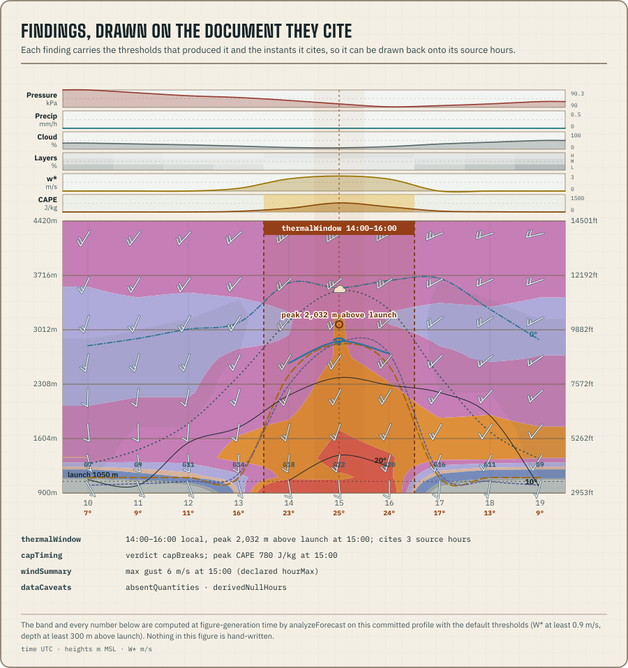
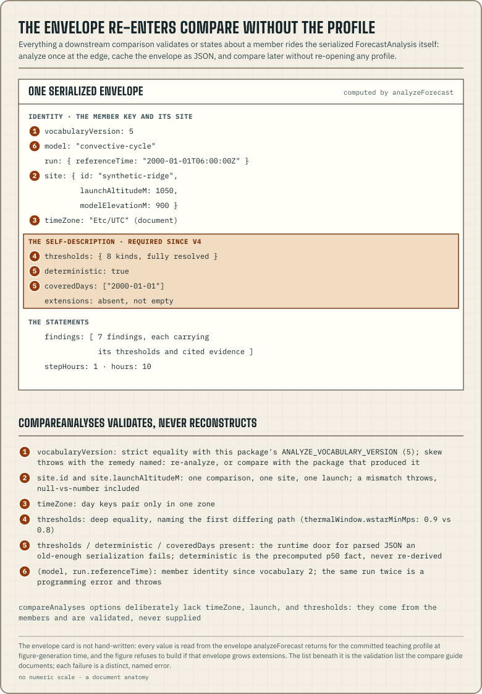

`@azohra/meteo.briefing/analyze` reduces one profile to a small, versioned
vocabulary of findings. A finding is a typed statement about magnitudes,
timing, published absences, or arithmetic relationships in that document.
A finding that depends on thresholds carries the thresholds that produced
it. A finding that cites hours carries the underlying values and their UTC
`validAt` instants in an `evidence` block.



Use `@azohra/meteo.briefing/derive` when you need quantities. Use
`@azohra/meteo.briefing/analyze` when you need a statement that can still
be checked after the full profile has left the view or the prompt.

[`@azohra/meteo.briefing/compare`](/docs/briefing/compare/) runs one set
of analysis thresholds across several models and compares their findings.

## Analyze a validated document

Validate a profile before you pass it to the analysis API:

```ts title="analyze-profile.ts"
import {
  analyzeForecast,
  type ForecastAnalysis,
} from "@azohra/meteo.briefing/analyze";
import { parseSiteForecastJson } from "@azohra/meteo.briefing/contract";

export function analyzeProfileJson(text: string): ForecastAnalysis {
  const profile = parseSiteForecastJson(text);
  if (!profile) throw new Error("invalid profile");

  return analyzeForecast(profile, {
    // One launch anchors every launch-relative statement — the sample's
    // Test Hill pick from site-context.json. The caller supplies it.
    launch: { elevationM: 1225.1 },
    thresholds: {
      thermalWindow: { wstarMinMps: 1.0, depthMinM: 350 },
    },
  });
}
```

`launch` is optional and matches the scene's `MeteogramOptions.launch`.
Documents do not name a launch, so the caller names the launch the
analysis reads against. Without one:

- launch-relative arithmetic, such as the `thermalWindow` depth threshold,
  uses the model's own ground (`site.modelElevationM`);
- `peakLiftTopAboveLaunchM` is `null`, so no number is stated relative to
  the wrong ground; and
- `terrainMismatch`, which compares the launch with the model's ground, is
  never emitted.

The envelope echoes the launch the analysis used as
`site.launchAltitudeM`, which is null when no launch was given.

`thresholds` is also optional. Overrides are merged over
`DEFAULT_ANALYZE_THRESHOLDS` by finding kind. Thresholds are caller
conventions, and the values in effect are copied into every finding they
shape. These are the defaults in the current release of
`DEFAULT_ANALYZE_THRESHOLDS`:

| Kind | Default thresholds |
| --- | --- |
| `thermalWindow` | W* ≥ 0.9 m/s and depth ≥ 300 m above launch; gap tolerance 0 h |
| `liftCeiling` | cloud-cap margin 50 m |
| `capTiming` | instability from 100 J/kg; broken cap at ≤ 25 J/kg CIN with ≥ 200 J/kg CAPE; precipitation from 0.2 mm/h |
| `convectiveDay` | precipitation from 0.2 mm/h |
| `terrainMismatch` | reported from 250 m absolute delta |
| `windSummary` | climb band padded 200 m; persistence within 0.8 of the peak |
| `windDirection` | direction suppressed under 1 m/s |
| `bandShear` | layers thinner than 30 m skipped; light-endpoint relation at 2 m/s |

`thermalWindow.maxGapHours` controls how windows are joined. Two adjacent
passing runs merge when the failing steps between them cover at most that
many hours and every bridged step publishes both series. A data hole is
never bridged, because that would invent continuity the model did not
forecast. The default of `0` merges nothing, which matches the
segmentation before vocabulary 4. Bridged hours join the cited evidence,
so the dip stays visible.

## Smoke and wind ceilings

`AnalyzeOptions` has two more caller inputs besides `launch`. Neither is a
threshold.

**`smoke`** joins a smoke document (RAQDPS) for the same site to a profile
that has no smoke of its own, matching on exact `validAt`. The
`smokeImpact` kind then republishes the smoke run's surface and column
magnitudes, with a coverage count and the smoke run's own `referenceTime`
beside the envelope's. The option is ignored when the profile carries its
own `hours[].smoke`, because the model's own smoke takes precedence. With
neither source, the analysis has no smoke information and reports it with
the `dataCaveats` `"smoke"` family token. That absence means "not
published". It does not mean clear air.

**`windCeilings`** feeds `windExceedance`. It sits outside `thresholds`
because it has no defaults: the package does not own a "safe wind"
number. Without a ceiling the kind emits nothing, and each value you
supply is echoed unchanged in the findings it produces. Gust ceilings are
set per declared semantics class (`gust.hourMaxMps` and
`gust.instantMps`) and are not shared between classes. The two classes
measure about 1.8 to 2.8 times apart at matched means, so one number
cannot serve both.

```ts title="analyze-with-inputs.ts"
import { analyzeForecast } from "@azohra/meteo.briefing/analyze";
import {
  parseSmokeDocumentJson,
  parseSiteForecastJson,
} from "@azohra/meteo.briefing/contract";

export function analyzeWithInputs(profileText: string, smokeText: string) {
  const profile = parseSiteForecastJson(profileText);
  if (!profile) throw new Error("invalid profile");

  return analyzeForecast(profile, {
    launch: { elevationM: 1225.1 },
    // Same-site RAQDPS document; ignored when the profile has its own smoke.
    smoke: parseSmokeDocumentJson(smokeText),
    // Caller conventions for one pilot at one site. Omit a ceiling and
    // that quantity emits nothing.
    windCeilings: {
      surfaceMps: 7,
      gust: { hourMaxMps: 11, instantMps: 8 },
      bandMps: 9,
    },
  });
}
```

## Keep the evidence with the statement

Narrow findings by their `kind` discriminant. This example prepares rows
for a teaching table and keeps the exact series and instants behind every
window.

```ts title="window-rows.ts"
import type { ForecastAnalysis } from "@azohra/meteo.briefing/analyze";

export function windowRows(analysis: ForecastAnalysis) {
  return analysis.findings.flatMap((finding) => {
    if (finding.kind !== "thermalWindow") return [];

    return [{
      day: finding.day,
      // Hours from the run's referenceTime to the peak-lift hour. A day-10
      // window and a day-1 window read very differently; this field says
      // which one you hold.
      leadHours: finding.leadHours,
      localStart: finding.start.local,
      localEnd: finding.end.local,
      // The widest covered step among the cited hours — the quantization
      // bound on this window's timing and duration.
      stepHours: finding.stepHours,
      peakAboveLaunchM: finding.peakLiftTopAboveLaunchM,
      thresholds: finding.thresholds,
      evidence: {
        validAt: finding.evidence.hours,
        usableLiftTopM: finding.evidence.usableLiftTopM,
        thermalVelocityMps: finding.evidence.thermalVelocityMps,
        liftTopBandP10P90: finding.evidence.liftTopBandP10P90,
      },
    }];
  });
}
```

Store a finding's thresholds and evidence along with any label you derive
from it. Those fields are what let someone check the statement later.

## The envelope self-describes

The envelope holds everything a later comparison validates or states
about a member. A serialized `ForecastAnalysis` can therefore go back into
[`compareAnalyses`](/docs/briefing/compare/#compare-cached-analyses)
without opening the profile again. The self-describing fields are:

- `thresholds`: the complete resolved threshold set the analysis ran
  under. Findings echo their own thresholds only when their kind emitted
  something, but this envelope echo is always present;
- `deterministic`: whether the document is deterministic or an ensemble
  read at p50, computed in advance;
- `coveredDays`: the local calendar days the document's hours actually
  touch. They are computed from `hours[].validAt` in the envelope's own
  `timeZone`, and never from cadence arithmetic, because live documents
  widen their step partway through the horizon; and
- `extensions`: named third-party statements, present when
  [extensions](#extend-over-the-public-frame) were passed. Otherwise the
  field is absent rather than empty, so an envelope without extensions is
  byte-identical to one serialized before the field existed.

These fields are required. For code that reads envelopes, the change is
additive. Only code that builds `ForecastAnalysis` values by hand, such as
test fixtures, has new fields to fill. Analyze once at the edge, cache the
envelope as JSON, and compare later without the profile.



## Versioning reads tolerantly

`vocabularyVersion` is typed as `number` rather than the version literal.
This loosening changes nothing on the wire. It encodes the tolerant-reader
convention: code that reads serialized envelopes must ignore finding kinds
and envelope fields it does not know. New kinds then raise the version
number without breaking any reader that follows the convention. Readers
check the version at runtime (`compareAnalyses` throws on a mismatch)
instead of recompiling for every bump, and cached envelopes keep working
as data across package upgrades.

Compiled consumers can still use an exhaustive `switch` over
`finding.kind`. With a `default` arm, that switch also follows the
convention:

```ts title="tolerant-reader.ts"
import { ANALYZE_VOCABULARY_VERSION, type ForecastAnalysis } from "@azohra/meteo.briefing/analyze";

export function dayVerdicts(envelope: ForecastAnalysis) {
  if (envelope.vocabularyVersion > ANALYZE_VOCABULARY_VERSION) {
    // A newer package produced this envelope. Additive kinds are the
    // normal growth mode: read the kinds you know, ignore the rest.
  }
  return envelope.findings.flatMap((finding) => {
    switch (finding.kind) {
      case "thermalWindow":
        return [{ day: finding.day, window: true }];
      case "quietDay":
        return [{ day: finding.day, window: false }];
      default:
        // The default arm is what makes a compiled switch conforming:
        // an unknown kind is ignorable, never an error.
        return [];
    }
  });
}
```

The convention applies to readers only. An unknown kind can be ignored,
but a kind enters `findings` only after the evidence investigation that
gates the vocabulary. Third-party statements have their own path,
described [below](#extend-over-the-public-frame).

## The finding vocabulary

`ANALYZE_VOCABULARY_VERSION` is currently `5`. Adding, renaming, or
removing a `kind` changes the analysis contract, and that is versioned
separately from the profile `schemaVersion`. The
[package changelog](https://github.com/azohra/meteo/blob/main/briefing/CHANGELOG.md)
records each change. One rename still affects old code. Vocabulary 4
renamed `flyableWindow` to `thermalWindow`. The test reads two thermal
quantities, W* and usable-lift depth, against stated floors, and it
ignores wind, rain, and overdevelopment, so the decision about whether a
day is flyable stays with the consumer. Code that switches on
`"flyableWindow"` or overrides `thresholds.flyableWindow` must use
`thermalWindow` for both.

| Finding kind | What it states | Evidence and limits |
| --- | --- | --- |
| `thermalWindow` | Consecutive hours that meet the W\* and launch-relative depth thresholds, with `leadHours` to the peak and its own `stepHours` bound on timing precision | `clippedAtStart` and `clippedAtEnd` mark edges set by the document's horizon. `maxGapHours` may bridge published dips below threshold, but never data holes |
| `percentileCrossing` | Ensemble days where a published percentile's day verdict differs from p50's, using the same floors as `thermalWindow` | Cites only passing instants, and no windows, because percentiles are per-hour marginals rather than member trajectories. Carries per-percentile member counts and `leadHours` |
| `quietDay` | A local day with no thermal window, which floors its best hours missed, and the atmospheric context beside the arithmetic | `context` restates the document's own precipitation, cloud, gust, and heat-flux series without a causal verdict. Every statement carries `leadHours` and a `coverage.truncated` flag |
| `convectiveDay` | CAPE magnitude and precipitation timing, for models that publish CAPE but not CIN | `capIsJudgeable` is always `false`, because a missing CIN must not read as "no cap". CAPE magnitudes are specific to each model and cannot be compared across documents. `coverage` is required |
| `liftCeiling` | Whether each segment's arithmetic ceiling is capped by cloud or limited by sink | Each segment cites its **peak** lift top with the cloud base and boundary-layer top from that same hour, so the cause can be checked against values from one time |
| `capTiming` | When CAPE builds, CIN erodes, and precipitation starts, relative to a window | Deterministic documents with CIN only. `cadence` selects how the verdict reads. Hourly days cite the hour the cap breaks (`capBreaksAt`). Multi-hour days cite the interval between published steps (`capBreaksBetween`), or a cap already open at the day's edge (`capAlreadyOpenAt`). `openButWeak` names a cap that stayed open all day while CAPE never reached the break floor |
| `smokeImpact` | Smoke magnitudes at the day's peak and during the window, republished as numbers without a derating verdict | Days sourced from the profile carry the model's own AOT. Days joined from RAQDPS carry the column mass, the smoke run's own `referenceTime`, and per-day join coverage (joined hours of profile hours). The `semantics` echo says whether the lift numbers already account for this smoke |
| `windSummary` | Maximum gust and climb-band wind, with timing, altitude, and persistence | The whole-day maxima and the `duringWindow` block answer different questions. The day's strongest gust often falls outside the window, so the airborne-hours number has its own block |
| `windExceedance` | Maximal runs of window hours at or above a ceiling the caller supplies | Emits nothing without `AnalyzeOptions.windCeilings`, because the package has no safe-wind number. The caller's ceiling is echoed unchanged, and gust ceilings stay within their semantics class |
| `windDirection` | How surface flow changes across a window: samples at the start, peak lift, and end, the net circular veer, and vector means | Deterministic documents only, because ensemble percentiles of raw degrees are not circular statistics. `netVeerDeg` is the displacement from start to end, not the accumulated rotation, so it cannot see a full 360° loop |
| `bandShear` | The strongest shear rate between adjacent layers inside the climb band, with the layer bounds it requires | Analyze only, and never compared, because rates are not comparable across level densities. Sparse columns rarely emit, and absence means "too sparse to state" rather than "no shear" |
| `terrainMismatch` | The difference between grid terrain and the launch, and whether published lift ever reaches the caller's launch | Emitted only when `AnalyzeOptions.launch` is supplied and the mismatch threshold is met. Evidence carries the maximum p90 lift top, so the check can be read at the top of the band |
| `ensembleMembership` | Loss of contributing members, the width of the p10 to p90 band, and the per-day `dayBands` width series, each day read at its hour of peak p50 W\* | Spread and membership are not a confidence interval or a confidence score. `dayBands` rows carry `leadHours` and a `truncated` flag, and there is no trend verdict |
| `dataCaveats` | Missing quantity families, hours with null derived values, coarse cadence, or a UTC fallback | Uses no thresholds. Absence means "not published" and never zero, including the `"smoke"` family, where absence does not mean clear air |

## Read the finding kinds

The example below compiles against the released package and keeps the
finding's own caveats visible. Every other kind narrows the same way.

`percentileCrossing` exists only for ensembles, and it is emitted only
where a percentile's day verdict disagrees with p50's. A day where every
percentile agrees emits nothing, whichever way they agree. It cites
passing instants and no windows, because the members that make up p90 at
11:00 need not be the members that make it up at 17:00. There is no "p90
window" to state.

```ts title="upside-days.ts"
import type { ForecastAnalysis } from "@azohra/meteo.briefing/analyze";

export function upsideDays(analysis: ForecastAnalysis) {
  return analysis.findings.flatMap((finding) => {
    if (finding.kind !== "percentileCrossing") return [];

    const p90 = finding.perPercentile.p90;
    return [{
      day: finding.day,
      // The p50-quiet/band-window state concentrates at long lead; never
      // present a crossing as near-term hidden upside without this number.
      leadHours: finding.leadHours,
      minimalPassingPercentile: finding.minimalPassingPercentile,
      p50PassingSteps: finding.perPercentile.p50.passingSteps,
      p90PassingSteps: p90.passingSteps,
      // A "p75" over 12 contributing members is a different object than
      // one over 21; check membersMin, not just the label.
      fewestContributingMembers: p90.membersMin,
    }];
  });
}
```

Beyond the limits in the vocabulary table, these field-level caveats
affect how you read each kind:

| Kind | Reading caveats |
| --- | --- |
| `smokeImpact` | There is no derated window and no adjusted W\*, because the only live source of a passive smoke column measured far below a satellite-verified column ([the column defect](/docs/briefing/smoke-document/#the-column-field-carries-a-provider-defect)), and even satellite-scale optics changed almost no verdicts. With `semantics: "radiativelyCoupled"`, any downstream derating counts the smoke twice. A null `duringWindow` means there was no window, or no smoke hour fell inside it |
| `convectiveDay` | Lets a model with CAPE but no CIN still state instability on a washout day, where `capTiming` does not run. It never says "uncapped". On a `coverage.truncated` day, the peaks are peaks of the covered hours only, and short slices at the end of a live horizon cite night-time CAPE peaks at 01:00 to 05:00. A precipitation series of 0.00 (`noPrecipAboveThreshold`) forecasts dry weather. It is not missing data |
| `windExceedance` | Supply the ceiling through [the analysis inputs](#smoke-and-wind-ceilings). A day without a thermal window emits nothing, whatever the wind. On a window day, absence means no window hour reached the ceiling. `gustSemantics` is present exactly when `quantity` is `"gust"`. Each run's `hours` is the covered span at the document's actual cadence, with `stepHours` as its bound on timing precision |
| `windDirection` | Describes the change from drainage flow to up-valley flow across one window. All the arithmetic is vector math and raw degrees are never averaged. A sample below the speed floor states its speed with a null bearing, so the direction does not jitter. `netVeerDeg` reads zero for a flow that turns all the way round and returns, and the hour-by-hour path stays in `finding.evidence` |
| `bandShear` | Vector shear between adjacent published levels, computed by component. The rate means nothing without its layer. "2.3 m/s/km across 1506–3129 m" is not a sharp shear zone, and a sparse column reports a different, smeared layer rather than a softer number. `bothEndpointsUnderFloorMps` marks a "shear" that may only be a difference in direction between two near-calm winds |

## Extend over the public frame

The extraction frame is public. It is the normalized ground every
first-party extractor works from, exported as `AnalysisFrame` and
versioned on its own as `ANALYSIS_FRAME_VERSION`. The frame changes
rarely, and each change is its own contract event.
`AnalyzeOptions.extensions` runs your extractors over the frame **after**
the first-party extraction, and passes them the finished findings as
read-only input.

The frame gives an extension the resolved facts for the analysis: the
timezone and its source, `deterministic`, the leading `stepHours` with the
actual `steps` for every gap, `referenceTime`, and how the launch was
resolved. It also provides three bound functions, `cite`, `dayOf`, and
`leadHours`. Those are the three calculations an extension would
otherwise get wrong around midnight. The raw hours are still available
through `frame.profile`, and `@azohra/meteo.briefing/derive` exports the
selectors the first-party extractors use (`p50`, `localDateKey`,
`groupByLocalDay`).

```ts title="window-pace-extension.ts"
import { analyzeForecast, type AnalysisExtension } from "@azohra/meteo.briefing/analyze";
import type { SiteForecast } from "@azohra/meteo.briefing/contract";

/** The extension's own statement type. The vocabulary's guarantees stop
 * at `findings`; this contract is the extension's to state. The house
 * discipline (evidence, embedded thresholds) is documented but
 * unenforced. */
interface WindowPaceStatement {
  day: string;
  citedHours: number;
  leadHoursAtStart: number;
}

const windowPace: AnalysisExtension = {
  // Namespaced, echoed verbatim on the envelope entry. Duplicate names
  // in one call throw.
  name: "example/windowPace",
  extract(frame, findings) {
    const statements: WindowPaceStatement[] = [];
    for (const finding of findings) {
      if (finding.kind !== "thermalWindow") continue;
      statements.push({
        // dayOf and leadHours are BOUND to this analysis's zone and run,
        // so timezone and lead arithmetic are correct for free.
        day: frame.dayOf(finding.start.validAt),
        citedHours: finding.evidence.hours.length,
        leadHoursAtStart: frame.leadHours(finding.start.validAt),
      });
    }
    return statements;
  },
};

export function paceStatements(profile: SiteForecast): WindowPaceStatement[] {
  const analysis = analyzeForecast(profile, { extensions: [windowPace] });
  // Statements land on the envelope's `extensions` entry, not in
  // `findings`. They stay unknown[]; consumers narrow through the
  // extension's own types, so a third-party statement cannot masquerade
  // as a first-party finding.
  const entry = analysis.extensions?.find((e) => e.extension === "example/windowPace");
  return (entry?.statements ?? []) as WindowPaceStatement[];
}
```

A throwing extension fails the analysis. You supplied the code, and
`analyzeForecast` does not sandbox it.

Three things stay private:

- the extraction `Context`. It carries the full `AnalyzeThresholds` and
  `WindCeilings`, so exposing it would tie this stable surface to every
  vocabulary change. Extensions bring their own thresholds and should
  embed them in their own statements;
- the citation and cadence factories. The frame carries their *results*
  (`cite`, `dayOf`, `leadHours`, `steps`) and keeps the machinery
  private; and
- the first-party kind extractors. Extensions read the finished findings.
  They do not re-run or re-order the pipeline.

## Local time and cadence stay visible

`analyzeForecast` chooses its timezone in this order:

1. `options.timeZone`, when supplied;
2. the profile's optional `site.timeZone`; then
3. UTC for an older document, with `timeZoneSource: "utcFallback"` and a
   `timesAreUtc` data caveat.

Every `CitedInstant` keeps both its local label and the document's UTC
`validAt`, so a finding can be joined back to its source hour.

Cadence is read from the actual spacing of each gap in the document and
is never assumed to be constant. Live documents widen partway through the
horizon, for example GEPS publishes every 3 hours and then every 6 hours.
The envelope's `stepHours` is the document's **leading** cadence, which is
a display fact. Every number inside a finding that depends on spacing,
such as durations, covered spans, and truncation verdicts, uses the real
gap at each step. Findings that depend on timing carry their own
`stepHours` echo. It is the widest covered step among the hours they
cite, and it bounds how precisely their timings can be read. A document
with mixed cadence also carries a `stepCadence` caveat naming its widest
step.

Every finding's `day` uses the exported `LocalDayKey` string type. Compute
the scene's day windows and the analysis with the same timezone, so that
midnight never splits one local day across two keys.

`resolveAnalyzeThresholds(overrides)` returns the complete threshold set
that `analyzeForecast` and `compareForecasts` use.

## Choose a payload

Findings serialize three ways: the full array, with every finding and its
evidence; a subset filtered to the kinds a surface presents; or a single
finding's evidence object. Measure the serialized result against the real
input budget of the surface that consumes it, such as a chat context, a
webhook body, or a UI panel, instead of assuming the full array fits.
Evidence makes up most of the bytes, so filtering by kind before you
serialize is usually the first cut to make.
