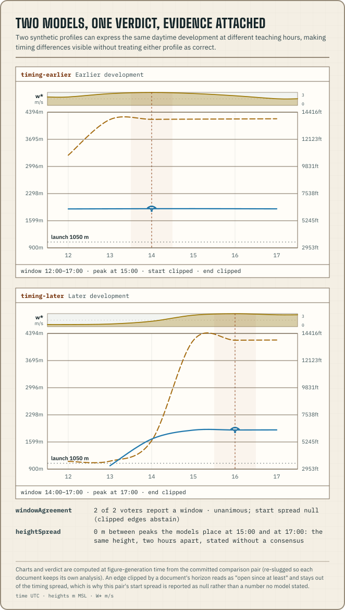

`@azohra/meteo.briefing/compare` compares validated profiles for one site.
It analyzes every document with the same timezone and threshold set, then
compares the resulting findings.



## Build a comparison

```ts title="compare-profiles.ts"
import type { SiteForecast } from "@azohra/meteo.briefing/contract";
import { compareForecasts, type ForecastComparison } from "@azohra/meteo.briefing/compare";

export function compareSite(
  profiles: readonly SiteForecast[],
  timeZone: string,
): ForecastComparison {
  return compareForecasts(profiles, {
    timeZone,
    // ONE launch for the whole comparison — here the sample's Test Hill
    // pick from site-context.json. Every member's analysis reads against it.
    launch: { elevationM: 1225.1 },
    thresholds: {
      thermalWindow: { wstarMinMps: 1.0, depthMinM: 350 },
    },
    unavailable: [{ model: "nam", miss: "absent" }],
  });
}
```

Every profile must carry the same `site.id`. The function throws for an
empty input or a mix of sites. The output records the resolved thresholds
and keeps each member's analysis under `analyses`.

`launch` is optional. One launch applies to the whole comparison and is
passed to every member's analysis as `AnalyzeOptions.launch`, because
launch-relative votes can only be compared when every member reads
against the same point. If you omit it, each member uses its model's own
ground. The ledger's `elevationDeltaM` is then null, no member is
benched, and `heightSpread` is not emitted. The envelope records the
launch it used as `site.launchAltitudeM`, which is null when none was
supplied.

## Compare cached analyses

`compareForecasts` is a one-call wrapper around `compareAnalyses`, which
does the work: it compares one site's analysis envelopes at the level of
their findings. Use `compareAnalyses` directly for envelopes that were
cached or produced at the edge. Analyze each profile where the document
lives, serialize the
[self-describing envelope](/docs/briefing/analyze/#the-envelope-self-describes)
as JSON, and compare later without opening any profile again. Its options
have no `timeZone`, `launch`, or `thresholds`. Those come from the
members and are checked for coherence, which is what the envelope's
self-describing fields are for.

```ts title="compare-cached.ts"
import { ANALYZE_VOCABULARY_VERSION, type ForecastAnalysis } from "@azohra/meteo.briefing/analyze";
import { compareAnalyses, type ForecastComparison } from "@azohra/meteo.briefing/compare";

export function compareCached(
  envelopes: readonly ForecastAnalysis[],
): ForecastComparison {
  // Version skew is the one routine failure of a long-lived cache, and
  // re-analysis is its remedy. Left unchecked, compareAnalyses throws the
  // same fact as a named error:
  //   compareAnalyses: vocabulary version skew — member
  //   gdps@2026-08-09T00:00:00Z carries vocabularyVersion 4, this package
  //   compares vocabulary 5; re-analyze the forecast with this package, or
  //   compare with the package that produced it
  const skewed = envelopes.filter(
    (envelope) => envelope.vocabularyVersion !== ANALYZE_VOCABULARY_VERSION,
  );
  if (skewed.length > 0) {
    throw new Error(`re-analyze ${skewed.length} cached member(s) with this package`);
  }
  return compareAnalyses(envelopes, {
    unavailable: [{ model: "nam", miss: "absent" }],
  });
}
```

Each coherence failure throws its own named error:

- an empty member list;
- a `site.id` mismatch;
- a duplicate `(model, referenceTime)` member, meaning the same run was
  passed twice;
- a `vocabularyVersion` that differs from this package's
  `ANALYZE_VOCABULARY_VERSION`, with the remedy named in the error. The
  check requires exact equality for now, and loosening it would need
  evidence;
- missing self-describing fields. An envelope serialized by an old
  enough release lacks `thresholds`, `deterministic`, or `coveredDays`,
  and for parsed JSON the runtime check is the only guard, because the
  compile-time type cannot vouch for it;
- a `timeZone` mismatch, because day keys only pair within one zone;
- a launch mismatch in `site.launchAltitudeM`, including null against a
  number; and
- thresholds that are not deeply equal, with the first differing path
  named (`thermalWindow.wstarMinMps: 0.9 vs 0.8`).

`windCeilings` and `smoke` are not checked. They are analysis inputs that
no comparison kind reads.

`compareForecasts` analyzes every member itself with the comparison's one
timezone, launch, and threshold set, so its members are coherent by
construction. The profile-level errors (mixed sites, duplicate members,
an empty list) still surface through the same checks. The version and
self-description errors cannot occur there.

## A member is a run, not a model

Since vocabulary 2, a member is identified by the pair
`(model, referenceTime)`. Two runs of one model are two members, each with
its own ledger row, votes, and `analyses` entry. Passing the same run
twice is a programming error and throws.

The identity change re-keyed the envelope, and it was a documented
breaking change for vocabulary 1 consumers. The `analyses` record is keyed
by `"{model}@{referenceTime}"` for every member, because a key of the
model slug alone can hold only one of a model's two runs. The exported
`comparisonMemberKey` builds the key. Every vote, abstention, and roster
entry carries both `member` (the key used by `analyses` and the ledger)
and `model` (the headline name), so provenance joins on one string
without parsing it.

[`compareRuns`](/docs/briefing/history/#compare-a-models-runs-through-time)
in `@azohra/meteo.briefing/history` compares one model's runs through time
instead of several models. It has its own, separately versioned
vocabulary.

```ts title="join-provenance.ts"
import { comparisonMemberKey, type ForecastComparison } from "@azohra/meteo.briefing/compare";

export function analysisFor(
  comparison: ForecastComparison,
  model: string,
  referenceTime: string,
) {
  // v1 read comparison.analyses[model]; v2 keys every entry by member.
  return comparison.analyses[comparisonMemberKey(model, referenceTime)];
}
```

## Read the member ledger

Each `ComparisonMemberLedger` states the facts that affect whether members
can be compared:

| Field | Meaning |
| --- | --- |
| `member` / `model` | The member key (`"{model}@{referenceTime}"`) that every vote and `analyses` entry uses, and the plain model slug |
| `kind` | Deterministic or ensemble document shape |
| `referenceTime` / `runAgeHours` | Run identity, and age relative to the newest member |
| `stepHours` / `hours` | Leading forecast cadence (documents can widen partway through the horizon) and the published horizon |
| `modelElevationM` / `elevationDeltaM` | Grid terrain, and its difference from the comparison's launch (null without a launch) |
| `benched` | A terrain mismatch where the member's published lift never reaches the comparison's launch |

The ledger does not score or weight members. Weighting is up to the
consumer. Transport misses go in `options.unavailable`, which keeps the
expected model roster when a document is absent or invalid.

## Read the findings

The vocabulary has four comparison kinds. Narrow on `kind`, and read each
finding's caveat fields together with its numbers.

```ts title="comparison-findings.ts"
import type { ForecastComparison } from "@azohra/meteo.briefing/compare";

export function comparisonRows(comparison: ForecastComparison) {
  return comparison.findings.map((finding) => {
    switch (finding.kind) {
      case "windowAgreement":
        return {
          day: finding.day,
          windows: finding.windows.map((vote) => vote.member),
          quiet: finding.quiet.map((vote) => vote.member),
          abstained: finding.abstained,
          unanimous: finding.unanimous,
          wstarFlipAtMps: finding.sensitivity.wstarFlipAtMps,
          startSpreadHours: finding.timing.startSpreadHours,
          // Spread up to startStepHoursMax - 1 hours can be cadence,
          // not forecast difference — see the timing envelope note.
          startStepHoursMax: finding.timing.startStepHoursMax,
        };
      case "heightSpread":
        return { day: finding.day, spreadM: finding.spreadM, peaks: finding.peaks };
      case "windDivergence":
        return {
          day: finding.day,
          bandWindSpreadMps: finding.bandWind.spreadMps,
          // Gust spreads exist only within one declared semantics class.
          hourMaxGustSpreadMps: finding.gust.hourMax.spreadMps,
          instantGustSpreadMps: finding.gust.instant.spreadMps,
          undeclaredGusts: finding.gust.undeclared.entries.length,
        };
      case "windDirectionSpread":
        return {
          day: finding.day,
          maxAngularSeparationDeg: finding.maxAngularSeparationDeg,
          // Check elevationDeltaM before reading the angle — see
          // windDirectionSpread.
          acrossElevationDeltaM: finding.maxSeparation.elevationDeltaM,
        };
    }
  });
}
```

### windowAgreement

`windowAgreement` counts qualifying windows and complete quiet days as
votes, for each local day. Every member that does not vote has a stated
reason:

- a **truncated quiet day abstains** (`truncatedDay`), because a model
  that lacks a day's data does not get to call the day;
- a member whose horizon covers **zero hours** of a day abstains as
  `outOfHorizon`, so "voters 3, unanimous true" cannot read as consensus
  when seven members never reached the day;
- a **benched** member appears in no roster, and the ledger's `benched`
  entry is its stated reason for every day; and
- a window that crosses local midnight **votes on every day its cited
  hours touch**. On days other than the window's start day, the vote
  carries `viaWindowFrom` naming the start day, because its numbers
  (duration and peaks) describe the whole window rather than that day's
  part of it.

A day's finding is dropped only when it has no voters **and** no
abstentions. A day at the edge of the horizon where every member abstains
keeps its record, with each abstention's reason. `unanimous` is null when
there are fewer than two voters.

Window votes carry `minimalPassingPercentile`, the member's same-day
`percentileCrossing` value: the lowest published percentile whose day
verdict passes the window floors. Null means the member emitted no
crossing. That is always the case for deterministic members, and for
ensemble members it means every percentile agreed with p50. It marks the
absence of a crossing and makes no claim about confidence.

`sensitivity` states the smallest threshold change that would flip a
voter, given as the value at which it flips: the voter's own peak nearest
each floor. For window votes the flip value is exact. For quiet votes it
is necessary but not sufficient, because the day's peaks are maxima of
each quantity, possibly at different hours, and a window needs both
floors met in the same hour.

The timing envelope uses only unclipped edges. An edge set by a
document's horizon reads as "open since at least" or "still open at", and
is not used as timing. Every contributing edge carries its window's
`stepHours`, and `startStepHoursMax` and `endStepHoursMax` state the widest
step among the contributors. A 3-hourly member's 11:00 edge means
"somewhere in 08:00–11:00", so spread of up to that step minus one hour
can come from cadence rather than disagreement. Members with multi-hour
steps stay in the spread and are not excluded.

### heightSpread

`heightSpread` lists each voting member's peak relative to the launch and
the difference between the highest and the lowest. It does not produce a
mean or consensus height. Measured spreads among comparable members reach
thousands of metres, and the average of such a spread is a forecast no
model made.

Ensemble peaks carry `bandP10P90AboveLaunchM`, the member's own p10 to p90
lift-top band at its peak hour. It is context and does not detect
outliers. In live measurements, 57 of 61 deterministic peaks that fell
outside an ensemble band sat *above* it. The models differ in physics and
vertical resolution, so a peak outside the band is normal and carries no
verdict.

### windDivergence

`windDivergence` lists each window voter's maximum climb-band wind and
maximum gust inside the window (its `windSummary` restated), with the
spread. Wind often decides whether a day is flyable, and vocabulary 1 had
no way to express a split in wind. The shape follows what was measured:

- every entry carries `modelElevationM`. Cross-model ratios of mean wind
  ranged from 0.18 to 1.22 at matched mountain sites, because models that
  place a site's ground hundreds of metres apart forecast different flow
  *regimes*. Read the spread with the ground elevations beside it;
- gusts are grouped within one declared semantics class. `hourMax` and
  `instant` are never pooled, because of the
  [measured gap between the classes](/docs/briefing/analyze/). Members
  without a declared gust semantics are listed under `undeclared` with no
  spread, because an undeclared gust cannot be compared with anything,
  including another undeclared gust;
- shear rates are not part of compare. When a dense model was subsampled
  to a five-level ensemble grid, it read a median of 0.41× the dense rate
  over the same hours. The sparse column reports a different, smeared
  layer, so rates cannot be compared across level densities, and
  `bandShear` stays an analyze-only statement; and
- directions are not part of this kind. `windDirectionSpread` covers
  them.

### windDirectionSpread

`windDirectionSpread` states how surface-flow direction splits among a
day's **deterministic** window voters. It lists each member's vector-mean
direction over its window, the largest angular separation between any
two members, and that pair with both members' model elevations. Ensembles
never take part, because published direction percentiles are not
circular statistics, and the analyze kind's own gate keeps them out. All
aggregation is vector math, and raw degrees are never averaged. A member
whose vector-mean speed falls below the speed floor has no direction to
list.

Read `maxSeparation.elevationDeltaM` before the angle. In live
measurements, most daytime maximum separations spanned a model-ground
difference of more than 300 m. Such a pair is a low-terrain member
forecasting a different flow regime. The models are not disagreeing about
the same flow.

## Versioning

`COMPARE_VOCABULARY_VERSION` (currently `3`) versions these finding kinds
separately from the published profile `schemaVersion`. The
[package changelog](https://github.com/azohra/meteo/blob/main/briefing/CHANGELOG.md)
records each change. Code that reads serialized comparison envelopes
checks the version at runtime and ignores kinds and fields it does not
know, following the
[tolerant-reader convention](/docs/briefing/analyze/#versioning-reads-tolerantly).
The set of kinds itself stays first-party, and a kind is added only after
an evidence investigation. The operator chooses the weighting, the
display language, and the operational thresholds.
