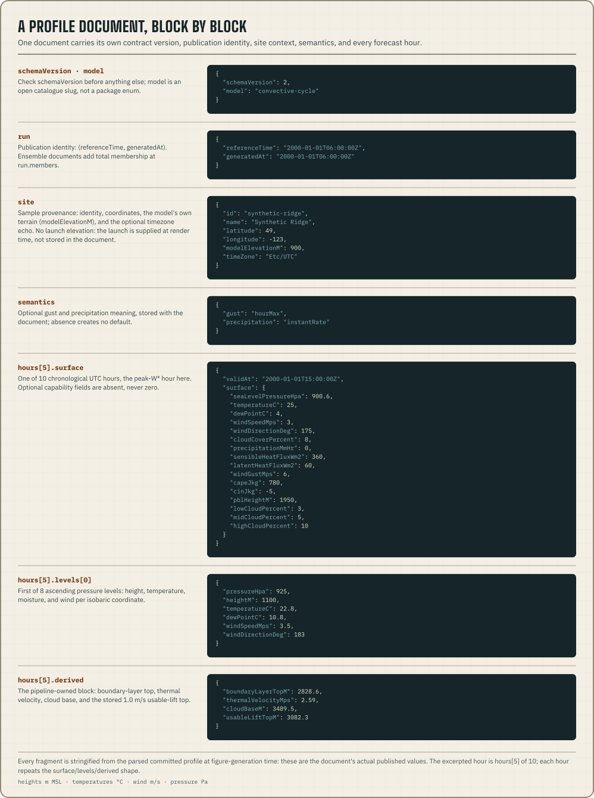

import {
  MANIFEST_SCHEMA_VERSION,
  MODEL_CATALOGUE_SCHEMA_VERSION,
  OBSERVATION_SCHEMA_VERSION,
  RUNS_INDEX_SCHEMA_VERSION,
  SITE_CONTEXT_SCHEMA_VERSION,
  SITE_FORECAST_SCHEMA_VERSION,
  SITES_SCHEMA_VERSION,
  SMOKE_SCHEMA_VERSION,
} from "@azohra/meteo.briefing/contract";

`@azohra/meteo.briefing/contract` defines what published JSON may contain,
in code. Its zod schemas, inferred TypeScript types, parse guards, and
generated JSON Schemas all describe the same nine document families.

Every guard normalizes up. It parses each version its family has ever
published and returns the newest shape. It refuses only versions newer than
the package. Archived documents stay readable forever, and the only version
that reads as invalid is one published by a newer writer.
[Compatibility](/docs/compatibility/) sets out the rollout rule.



| Document | Parser | Published location |
| --- | --- | --- |
| Profile | `parseSiteForecastJson` | `<model>/sites/<site>.json` and each history line |
| Manifest (forecast and smoke) | `parseForecastManifestJson` | `<model>/manifest.json` |
| Manifest (observation) | `parseObservationManifestJson` | `<model>/manifest.json` for observation datasets; the same path carries a different manifest shape (`firstObservedAt`, `lastObservedAt`, `observationCount` in place of the forecast-hour extent) |
| Manifest (either) | `parseManifestJson` | `<model>/manifest.json` when the caller does not know the dataset kind: the union of the two shapes above |
| Models | `parseModelCatalogueJson` | `models.json` |
| Sites | `parseSitesCatalogueJson` | `sites.json` |
| Site context | `parseSiteContextJson` | `site-context.json` |
| Run index | `parseRunsIndexJson` | `runs.json` |
| Smoke | `parseSmokeDocumentJson` | `<model>/sites/<site>.json` for smoke models |
| Observation | `parseObservationDocumentJson` | `<model>/sites/<site>.json` for observation datasets |

Each parser also has a counterpart without the `Json` suffix that takes an
already-parsed value. All of them return the typed document or `null`. They
never patch rejected input into shape.

```ts title="validate-profile.ts"
import {
  parseSiteForecastJson,
  type SiteForecast,
} from "@azohra/meteo.briefing/contract";

export function requireProfile(text: string): SiteForecast {
  const profile = parseSiteForecastJson(text);
  if (!profile) throw new Error("unsupported or invalid profile");
  return profile;
}
```

## Site timezone propagation

The [profile reference](/docs/briefing/profile-document/#run-site-and-semantics)
defines the optional `site.timeZone` echo. An older document simply lacks
it, and that does not put the launch on UTC. For such a document, supply a
known timezone yourself or rely on the API's documented fallback:

| API | Timezone behaviour |
| --- | --- |
| `analyzeForecast` | Override, then `profile.site.timeZone`, then UTC with a `timesAreUtc` caveat |
| `projectForecast({ day })` | Override, then `profile.site.timeZone`; throws if neither exists |
| `buildMeteogramScene` | Requires an explicit `timeZone` option |
| `groupByLocalDay` / `meteogramDisplayHours` | Require the caller's explicit timezone |

## Scalar values

Decide how to read a value from its shape. A model slug does not tell you.
The [profile reference](/docs/briefing/profile-document/#deterministic-and-ensemble-values)
has a worked example of narrowing.

Full ensemble dropout is `members: 0` with every percentile `null`.
`isEnsembleDropout` tells it apart from a populated percentile block.

If your code supports only deterministic documents, run
`isDeterministicProfile(profile)` once per document. After that one check,
every scalar position is typed as `number`.

## Unit boundary map

Every document uses the platform's shared units and conventions.
[Units, angles, one wind sign](/docs/core/conventions/) defines the wind
sign convention and the conversion helpers. These are the unit boundaries
that most often cause integration errors:

| Quantity family | Contract convention | Common mistake |
| --- | --- | --- |
| Sea-level pressure (`surface.seaLevelPressureHpa`) | hPa, the one pressure unit, shared with station documents | Assuming whole pascals; the wire carries hPa |
| Pressure levels | hPa | Multiplying named isobaric levels by 100 in labels |
| Heights and elevations | metres; profile altitude values are MSL unless explicitly AGL | Plotting model PBL depth directly on an MSL axis |
| Model PBL height | metres AGL | Comparing it to `derived.boundaryLayerTopM` without adding `site.modelElevationM` |
| Temperature and dew point | °C | Treating dew-point depression as published dew point |
| Wind speed and gust | m/s | Displaying as km/h without a named conversion |
| Wind direction | meteorological FROM, 0–359° | Using mathematical TO-direction |
| Vertical velocity | omega, Pa/s; negative is lift | Reading negative as sinking geometric velocity |
| Precipitation | mm/h with declared provider window semantics | Comparing instantaneous and window-mean rates as identical measurements |
| Cloud and cloud layers | percent | Replacing unavailable fields with 0% |
| CAPE/CIN | J/kg | Treating absent CIN as zero inhibition |
| Smoke concentrations | µg/m³ at the surface, mg/m² for columns; optical thickness dimensionless | Assuming provider units: RAQDPS GRIBs carry kg/m³ and kg/m² with no units metadata ([verified in the smoke reference](/docs/briefing/smoke-document/)); builders convert at fetch |
| Measured shortwave (observations) | W/m², instantaneous at the surface | Treating an absent instant as zero output, or provider DQF 0 as validity: night pixels are fill with DQF 0 |

The contract JSDoc and the generated schemas define each field. The
[profile guide](/docs/briefing/profile-document/) maps the document blocks,
and [Model capabilities](/docs/forecast/model-capabilities/) explains
declared absence and semantics.

For example, to plot `surface.pblHeightM` beside MSL series, add
`profile.site.modelElevationM`. Do not add the launch elevation, because the
model's PBL depth is measured from the model's own terrain. For plain unit
conversions, use package exports such as `msToKmh` from
[`@azohra/meteo.briefing/derive`](/docs/briefing/derive/).

## Building-block exports

Every block inside the nine document families is also exported as a zod
schema with an inferred type. You can validate or type one fragment, such as
a single hour, a capability declaration, or a manifest stats block, without
handling a whole document. Each schema and type pair feeds exactly one parse
entry point.

The document roots are `siteForecastSchema`/`SiteForecast`,
`forecastManifestSchema`/`ForecastManifest`,
`observationManifestSchema`/`ObservationManifest` (parsed by
`parseObservationManifest(Json)`),
`modelCatalogueSchema`/`ModelCatalogue`,
`sitesCatalogueSchema`/`SitesCatalogue`,
`siteContextSchema`/`SiteContext`,
`runsIndexSchema`/`RunsIndex`,
`smokeDocumentSchema`/`SmokeDocument`, and
`observationDocumentSchema`/`ObservationDocument`.
`manifestSchema`/`Manifest`, parsed by `parseManifest(Json)`, is the
union of the two manifest roots, for callers that read
`<model>/manifest.json` without knowing the dataset kind.

Each document family pins its own exported version constant, so a breaking
change to one family cannot invalidate readers of another. Manifests pin
`MANIFEST_SCHEMA_VERSION` (<code>{MANIFEST_SCHEMA_VERSION}</code>), the model catalogue
`MODEL_CATALOGUE_SCHEMA_VERSION` (<code>{MODEL_CATALOGUE_SCHEMA_VERSION}</code>), the run index
`RUNS_INDEX_SCHEMA_VERSION` (<code>{RUNS_INDEX_SCHEMA_VERSION}</code>), smoke documents
`SMOKE_SCHEMA_VERSION` (<code>{SMOKE_SCHEMA_VERSION}</code>), observation documents
`OBSERVATION_SCHEMA_VERSION` (<code>{OBSERVATION_SCHEMA_VERSION}</code>), the profile
`SITE_FORECAST_SCHEMA_VERSION` (<code>{SITE_FORECAST_SCHEMA_VERSION}</code>), and sites
and site context `SITES_SCHEMA_VERSION` (<code>{SITES_SCHEMA_VERSION}</code>) and
`SITE_CONTEXT_SCHEMA_VERSION` (<code>{SITE_CONTEXT_SCHEMA_VERSION}</code>). The pieces are:

| Schema (type) | One-line role | Feeds |
| --- | --- | --- |
| `scalarSchema` (`Scalar`) | Any numeric position: a number or an ensemble percentile object | every value field below |
| `ensembleValueSchema` (`EnsembleValue`) | The percentile-object arm of `Scalar`, including full dropout | every value field below |
| `forecastHourSchema` (`ForecastHour`) | One forecast hour: `validAt` plus the surface, levels, derived, and optional smoke blocks below | `parseSiteForecast(Json)` |
| `forecastSurfaceSchema` (`ForecastSurface`) | An hour's surface block; optional declared-capability fields are absent when unpublished, never zero | `parseSiteForecast(Json)` |
| `forecastLevelSchema` (`ForecastLevel`) | One pressure-level entry in an hour's ascending `levels` array | `parseSiteForecast(Json)` |
| `forecastDerivedSchema` (`ForecastDerived`) | The forecast engine's `derived` block of an hour | `parseSiteForecast(Json)` |
| `forecastSiteSchema` (`ForecastSite`) | Sample provenance: identity, coordinates, the model's own terrain (`modelElevationM`), and the optional timezone echo; no launch elevation | `parseSiteForecast(Json)` |
| `forecastRunSchema` (`ForecastRun`) | Publication identity: `referenceTime`, `generatedAt`, optional `members` | `parseSiteForecast(Json)` |
| `forecastSemanticsSchema` (`ForecastSemantics`) | The optional gust/precipitation meaning tag stored with a document | `parseSiteForecast(Json)` |
| `forecastManifestSiteSchema` (`ForecastManifestSite`) | One published site name/slug pair in a manifest | `parseForecastManifest(Json)` |
| `forecastManifestStatsSchema` (`ForecastManifestStats`) | The stable accounting core plus open numeric extension keys | `parseForecastManifest(Json)` |
| `modelEntrySchema` (`ModelEntry`) | One model catalogue entry: slug, cadence and typical publication lag, levels, lifecycle | `parseModelCatalogue(Json)` |
| `modelCapabilitiesSchema` (`ModelCapabilities`) | A model's declared capability set, absences included | `parseModelCatalogue(Json)` |
| `siteCatalogueEntrySchema` (`SiteCatalogueEntry`) | One catalogued site: identity only since sites schemaVersion 2 (slug, name, coordinates, required IANA `timeZone`; nothing physical) | `parseSitesCatalogue(Json)` |
| `siteContextSourceSchema` (`SiteContextSource`) | One upstream terrain/land-cover source, with the licence attribution that travels with its values | `parseSiteContext(Json)` |
| `siteContextEntrySchema` (`SiteContextEntry`) | One site's measured ground truth (the launch `elevation` pick, terrain, and land cover), joined to `sites.json` by slug | `parseSiteContext(Json)` |
| `runsIndexEntrySchema` (`RunsIndexEntry`) | One model's current `(referenceTime, generatedAt)` pair | `parseRunsIndex(Json)` |

`DeterministicSiteForecast` is the narrowed profile type
`isDeterministicProfile` returns.

## Compatibility rules

- Check `schemaVersion`. Filenames say nothing about compatibility.
- A model is identified by an open slug that you discover from the
  catalogue. The package has no enum of models.
- An absent optional field means the value was not published there. It is
  never zero.
- A stored profile's optional `semantics` and `site.timeZone` travel with
  the document, and leaving either out does not imply a default
  ([profile reference](/docs/briefing/profile-document/#run-site-and-semantics)).
- The zod contract decides behaviour. For other languages, the generated
  JSON Schema files ship in the `schema/` directory of the
  `@azohra/meteo.briefing` tarball and live in the repository at
  `briefing/schema/`. The package also exports them as
  `@azohra/meteo.briefing/schema/*.json` (`profile.schema.json` and its
  siblings), so a resolver can reach them by specifier as well as by path.

[Compatibility](/docs/compatibility/) lists the document families and the
rule for reading across versions.
[Package versioning](/docs/briefing/versioning/) covers npm versions.
