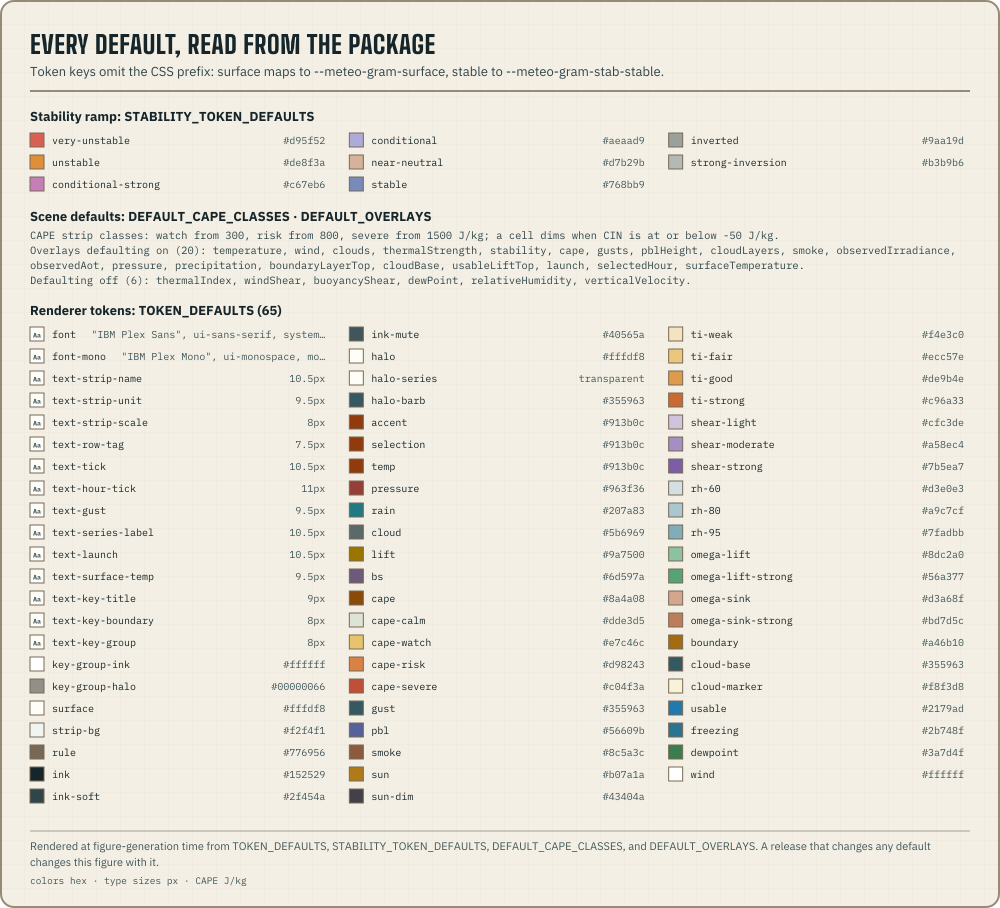

meteo by Azohra ships one reference look. Configure scene behaviour through
`MeteogramOptions` and visual values through the renderer's `--meteo-gram-*` CSS tokens.

```ts title="build-reference-scene.ts"
import type { SiteForecast } from "@azohra/meteo.briefing/contract";
import { buildMeteogramScene, DEFAULT_OVERLAYS } from "@azohra/meteo.briefing/meteogram";

export function buildClubScene(profile: SiteForecast) {
  return buildMeteogramScene(profile, {
    timeZone: profile.site.timeZone ?? "Etc/UTC",
    smooth: false,
    overlays: {
      ...DEFAULT_OVERLAYS,
      thermalIndex: true,
    },
  });
}
```

`DEFAULT_OVERLAYS` exposes the package defaults when a control must enumerate
every layer. Omit `overlays` when the reference defaults are sufficient.

## Read token authorities

`@azohra/meteo.briefing/meteogram` exports four maps:

- `TOKEN_DEFAULTS` contains every non-stability renderer token;
- `STABILITY_TOKEN_DEFAULTS` contains the ordered eight-class stability ramp;
- `SERIES_TOKENS` maps key-entry ids to the token that themes each line
  (`"meteo-gram-series-cloud-base"` → `cloud-base`); and
- `FIELD_STYLE_DEFAULTS` carries each field-overlay class's fill token and
  opacity for legend chips built outside SVG.

Token keys omit the CSS prefix: `surface` maps to `--meteo-gram-surface`, and
`stable` maps to `--meteo-gram-stab-stable`. Read the maps for legends and swatches;
override CSS custom properties on an ancestor for a downstream presentation.
This page does exactly that — every default below is imported from the
package when the committed figure is regenerated (`pnpm figures`):



```ts title="stability-swatches.ts"
import { STABILITY_TOKEN_DEFAULTS } from "@azohra/meteo.briefing/meteogram";

export const stabilitySwatches = Object.entries(STABILITY_TOKEN_DEFAULTS).map(
  ([name, color]) => ({ name, color }),
);
```

The reference renderer keeps the stability field pale so lines, markers,
labels, and white wind barbs remain foreground. The
[stability-ramp logbook entry](/logbook/stability-ramp/) records the
measured palette constraints.

Display windows, overlay choices, CAPE classes, sink rates, and local colour
overrides belong to the downstream publisher. Pass them directly to
`buildMeteogramScene` or the consuming stylesheet.
