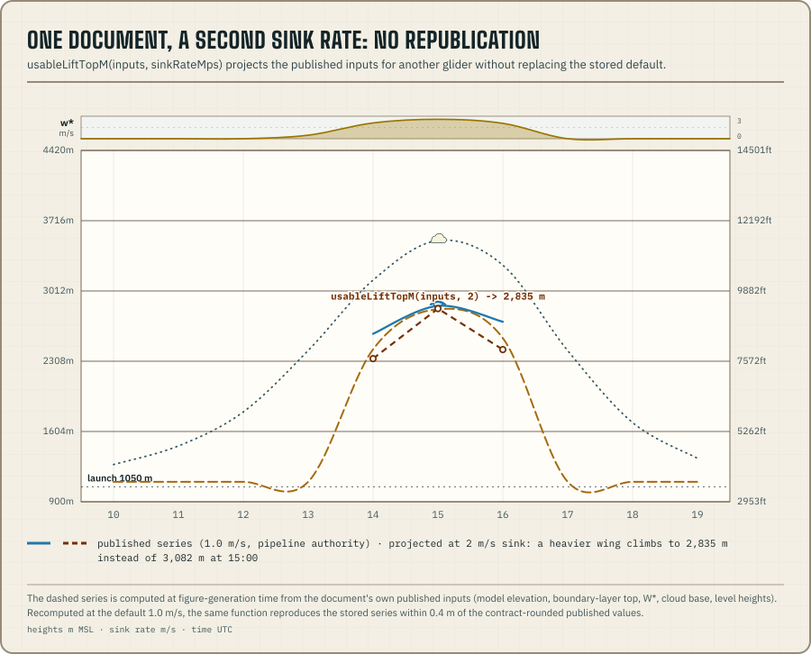

`@azohra/meteo.briefing/derive` holds the calculations that depend only on
published documents. It covers moisture conversions, vector wind, lapse
and stability, the parcel ascent and its thermal index, shear, the B/S
ratio, local-day grouping, projection, valid-time alignment, units, run
freshness, usable lift at a chosen sink rate, the smoke correction,
measured irradiance, and sunrise and sunset instants. Display smoothing
lives elsewhere, in `smooth121` from `@azohra/meteo.briefing/meteogram`.

This subpath does not repeat the engine's stored derivations. Those are
the values that need raw model inputs, so the engine computes them and
writes them into the published document. The
[project overview](/docs/#who-owns-each-value) sets out the split.

Usable lift is the clearest example of the split.
`usableLiftTopM(inputs, sinkRateMps)` is the only implementation. The
forecast engine imports this function and stores its result at a fixed
sink rate of `1.0` m/s. Projecting the published inputs for another sink
rate therefore runs the same arithmetic as the stored value, and at
`1.0` m/s it reproduces the engine's parity fixture exactly. The scene
does not apply this p50 recomputation to ensembles, because it would not
equal a per-member derivation aggregated to percentiles.



## Deterministic and ensemble inputs

Derivation functions take numbers. For an ensemble value, select a
percentile first:

```ts title="median-lapse.ts"
import type { SiteForecast } from "@azohra/meteo.briefing/contract";
import { p50, surfaceLapseCPer1000Ft, stabilityClass } from "@azohra/meteo.briefing/derive";

export function firstStability(profile: SiteForecast): string | null {
  const hour = profile.hours[0];
  const level = hour?.levels[0];
  if (!hour || !level) return null;

  const surfaceTemperatureC = p50(hour.surface.temperatureC);
  const heightM = p50(level.heightM);
  const temperatureC = p50(level.temperatureC);
  if (surfaceTemperatureC === null || heightM === null || temperatureC === null) return null;

  const lapse = surfaceLapseCPer1000Ft(
    surfaceTemperatureC,
    profile.site.modelElevationM,
    { heightM, temperatureC },
  );
  return lapse === null ? null : stabilityClass(lapse);
}
```

`p50` returns `null` when every ensemble member dropped out, so check the
selected value before passing it on.

## Lift one parcel for buoyancy

`parcelAscent(surface, levels)` lifts the hour's surface parcel through
the published levels. The parcel rises dry adiabatically below the
lifting condensation level and moist pseudo-adiabatically above it.
Buoyancy is read in virtual temperature, so water vapour counts toward
density in both the parcel and the environment.

Each sample pairs the parcel and environment temperatures with their
virtual counterparts and gives `buoyancyC`, the parcel minus the
environment, which is positive while the parcel is buoyant. `lclM` is the
ascent's own condensation height. It is null when the column does not
saturate below its highest published level. Samples come out at exactly
the published levels, in published order, with no resampling.

The optional `entrainmentPerM` is a trial parameter that the caller can
change. It is a bulk fractional entrainment rate that mixes the rising
parcel toward the environment. The default is `0`, an undiluted parcel.

The thermal index is the same ascent in the RASP sign convention.
`thermalIndexC` and `thermalIndexProfile` return `buoyancyC` negated, so
the index is negative while thermals still reach a level and crosses
zero where they stop. There is only one buoyancy quantity, and the
Meteogram's `thermalIndex` field draws it. Dew points are optional on the
thermal-index functions. Without them the column is treated as fully
dry, which reproduces the plain dry-adiabatic comparison.

```ts title="parcel-buoyancy.ts"
import type { SiteForecast } from "@azohra/meteo.briefing/contract";
import { p50, parcelAscent } from "@azohra/meteo.briefing/derive";

export function firstHourAscent(profile: SiteForecast) {
  const hour = profile.hours[0];
  if (!hour) return null;
  const temperatureC = p50(hour.surface.temperatureC);
  const dewPointC = p50(hour.surface.dewPointC);
  if (temperatureC === null || dewPointC === null) return null;

  const levels: Array<{ heightM: number; temperatureC: number; dewPointC: number }> = [];
  for (const level of hour.levels) {
    const heightM = p50(level.heightM);
    const levelTemperatureC = p50(level.temperatureC);
    const levelDewPointC = p50(level.dewPointC);
    if (heightM === null || levelTemperatureC === null || levelDewPointC === null) continue;
    levels.push({ heightM, temperatureC: levelTemperatureC, dewPointC: levelDewPointC });
  }

  return parcelAscent(
    { temperatureC, dewPointC, elevationM: profile.site.modelElevationM },
    levels,
  );
}
```

## Choose shear for the terrain

`surfaceToBoundaryLayerShearMps` subtracts the surface wind vector from
the wind vector at the boundary-layer top. This assumes both vectors
sample one air mass. In a mountain valley, thermally driven surface flow
can run beneath separate flow aloft, which makes the ratio low even on a
deeply convective day.

`buoyancyShearRatio` returns `Infinity` when there is buoyancy but no
shear, and `null` when both are zero. When terrain separates the surface
circulation from the winds aloft, use the height-resolved `windShear`
field instead. The [valley B/S case study](/logbook/bs-ratio-valley/)
records a measured case.

## Window in the site's timezone

Profiles publish every forecast hour in UTC. An older document may lack
the optional [`site.timeZone` echo](/docs/briefing/profile-document/#run-site-and-semantics),
so callers still need an explicit fallback.

```ts title="local-days.ts"
import type { SiteForecast } from "@azohra/meteo.briefing/contract";
import { groupByLocalDay } from "@azohra/meteo.briefing/derive";
import { meteogramDisplayHours } from "@azohra/meteo.briefing/meteogram";

export function displayDays(profile: SiteForecast, olderProfileTimeZone?: string) {
  const timeZone = profile.site.timeZone ?? olderProfileTimeZone;
  if (!timeZone) throw new Error("older profile needs an explicit IANA timezone");
  const display = meteogramDisplayHours(profile.hours, { timeZone });
  return groupByLocalDay(display, timeZone);
}
```

`groupByLocalDay` and `meteogramDisplayHours` are tested across timezones,
custom bounds, short days, and empty input. You can pass a returned day's
`hours` straight to `buildMeteogramScene`.

## Sunrise and sunset

`solarEventsForDate(dateKey, latitude, longitude)` returns a day's
sunrise and sunset as UTC instants, using the NOAA formulation at the
official zenith of 90.833°. It returns null for polar day and night, an
invalid key, or out-of-range coordinates.

It takes the `YYYY-MM-DD` keys that `localDateKey` produces and anchors
them on longitude instead of civil time. The result is correct wherever
the civil date matches the longitudinal solar date. It is a full day off
only where the date line separates the two, in UTC+13 and UTC+14 zones at
western longitudes. The package returns the instants, and the
[inspector recipe's time-cursor step](/docs/briefing/wire-an-inspector/#time-cursors)
draws them on a Meteogram.

## Subtract fields with `projectForecast`

`projectForecast` reduces a document to the hours and fields a reader
needs. It can select one local calendar day, replace every `levels` array
with `[]`, and keep named subsets of fields. Every value it keeps is
copied unchanged. It applies no threshold, aggregation, interpolation, or
judgment.

```ts title="project-profile.ts"
import type { SiteForecast } from "@azohra/meteo.briefing/contract";
import { projectForecast } from "@azohra/meteo.briefing/derive";

export function compactTeachingInput(profile: SiteForecast, day: string) {
  return projectForecast(profile, {
    day,
    dropLevels: true,
    fields: {
      surface: ["windSpeedMps", "windGustMps"],
      derived: ["thermalVelocityMps", "usableLiftTopM"],
    },
  });
}
```

Day selection uses `options.timeZone` first and `profile.site.timeZone`
second. If neither is set, `projectForecast` throws, because it cannot
tell which UTC hours belong to the requested local day. Projection
without a `day` needs no timezone.

With no field selection, the result is still a full document in the
contract's shape. `dropLevels` keeps it valid too, because an empty
levels array is allowed. Selecting fields produces a
`ProjectedSiteForecast`, whose hour blocks are partial by design. Do not
pass that partial projection back through the full profile parser or
into `buildMeteogramScene`.

## Derate thermals for smoke

`@azohra/meteo.briefing/derive` implements the smoke correction as small
pure functions over published values. The physical constants are
exported under names, each with its source:
`SMOKE_MASS_EXTINCTION_M2_PER_G` from Reid et al. 2005, and
`SMOKE_TRANSMITTANCE_K_MIDDAY` and `K_VERTICAL` from Donaldson 2021,
Chubarova 2012 and McKendry 2019.

```ts title="smoke-adjusted-w.ts"
import type { SmokeDocument, SiteForecast } from "@azohra/meteo.briefing/contract";
import {
  cosSolarZenith,
  isSmokeAwareProfile,
  p50,
  smokeAdjustedThermalVelocityMps,
  smokeAotFromColumn,
  smokeHoursByValidAt,
  smokeTransmittance,
} from "@azohra/meteo.briefing/derive";

export function adjustedWStar(
  profile: SiteForecast,
  smoke: SmokeDocument,
  hourIndex: number,
): number | null {
  // Already smoke-aware (HRRR): the published w* includes the model's own
  // smoke attenuation, and derating it again would double-count.
  if (isSmokeAwareProfile(profile)) return null;
  const hour = profile.hours[hourIndex];
  const joined = hour && smokeHoursByValidAt(smoke).get(hour.validAt);
  if (!hour || !joined) return null;

  const columnMgm2 = p50(joined.smokePlumeColumnMgm2);
  const wStar = p50(hour.derived.thermalVelocityMps);
  if (columnMgm2 === null || wStar === null) return null;

  const transmittance = smokeTransmittance(
    smokeAotFromColumn(columnMgm2),
    cosSolarZenith(hour.validAt, profile.site.latitude, profile.site.longitude),
  );
  return smokeAdjustedThermalVelocityMps(wStar, transmittance);
}
```

The guard runs first. On models whose fluxes already account for their
own smoke (`isSmokeAwareProfile`, which is true for HRRR), the published
w* is already derated, and applying the correction again would count the
smoke twice. The adjustment itself is one multiplication, `w* × ∛f`,
because Deardorff's w* is the cube root of the heat flux. The flux is not
re-derived. [Smoke and thermals](/logbook/smoke-and-thermals/) explains
the scope and the derivation.

One caveat applies to the input of `smokeAotFromColumn`. The RAQDPS
`smokePlumeColumnMgm2` field is currently
[kept out of derived optics](/docs/briefing/smoke-document/#the-column-field-carries-a-provider-defect).
The arithmetic is sound, and it reproduced HRRR's own optics to within
5 %, but the provider's column content is not. For profiles with their
own smoke block, use the published `aot` directly.

## Interpret measured irradiance

Observation documents carry measured irradiance in W/m², and three
functions put that number beside a forecast. `clearSkyGhiWm2` gives the
expected clear-sky value from Haurwitz (1945). Reno, Hansen and Stein
2012 (SAND2012-2389) identify it as the best clear-sky model that needs
only the sun's zenith. `observedTransmittance` divides measured by
expected. A value of 1 is a textbook clear sky, about 0.85 is a moderate
smoke plume, and well under 0.5 is heavy cloud. It returns null near the
horizon, where the ratio has no meaning.

`nearestObservation` joins the two. Observations arrive at the product's
native cadence, which is the GOES scan start times, so an exact match
against a forecast `validAt` never succeeds.

```ts title="measured-transmittance.ts"
import type { ObservationDocument, SiteForecast } from "@azohra/meteo.briefing/contract";
import {
  cosSolarZenith,
  nearestObservation,
  observedTransmittance,
} from "@azohra/meteo.briefing/derive";

export function transmittanceAtHour(
  profile: SiteForecast,
  observed: ObservationDocument,
  hourIndex: number,
): number | null {
  const hour = profile.hours[hourIndex];
  const nearest = hour && nearestObservation(observed, hour.validAt);
  // Entry shapes differ by product; transmittance wants the DSR kind.
  if (!hour || !nearest || !("downwardShortwaveWm2" in nearest.observation)) return null;
  return observedTransmittance(
    nearest.observation.downwardShortwaveWm2,
    cosSolarZenith(hour.validAt, profile.site.latitude, profile.site.longitude),
  );
}
```

Compare the result with `smokeTransmittance(aot)` from the same site's
smoke document, hour by hour. That is the comparison of measurement
against forecast that the smoke correction's constants were fitted from.

## Intersect instants with `alignByValidAt`

`alignByValidAt` returns only the UTC `validAt` instants that every input
profile shares. Each row keeps each model's original hour, keyed by the
model's slug.

```ts title="align-hours.ts"
import type { SiteForecast } from "@azohra/meteo.briefing/contract";
import { alignByValidAt, p50 } from "@azohra/meteo.briefing/derive";

export function sharedSurfaceWind(profiles: readonly SiteForecast[]) {
  return alignByValidAt(profiles).map((row) => ({
    validAt: row.validAt,
    values: Object.entries(row.byModel).map(([model, hour]) => ({
      model,
      windSpeedMps: p50(hour.surface.windSpeedMps),
    })),
  }));
}
```

The join compares published UTC instants as strings and keeps each
model's original values, elevation, semantics, and run identity. Empty
input returns no rows, and duplicate model slugs throw. For findings
across models, use [`compareForecasts`](/docs/briefing/compare/).

## Judge run freshness

`runFreshness(runsEntry, model, now, thresholds)` grades one runs.json
entry as `"current"`, `"delayed"`, or `"stale"`. It keeps the model's
facts separate from the consumer's policy.

The facts come from the model's catalogue entry. `runIntervalHours` is
how often a new run appears, and `typicalPublicationLagHours` is the
upper end of the normal delay between `referenceTime` and publication.
The thresholds come from the consumer. Both count run intervals of age
beyond the lag. They are required parameters, because how late a product
may run before its users are warned is a display decision the dataset
cannot make.

Age is `now − referenceTime`. The function accepts `generatedAt` so a
runs.json entry can be passed in unchanged, but republishing the same
run does not make the forecast younger. An instant that does not parse
throws a `RangeError` instead of returning a wrong grade.

Observation datasets have no runs, so they don't use this function.
Judge them against their catalogue `cadenceMinutes`. The polling loop
around `runFreshness` is in the
[ingest recipe](/docs/briefing/run-an-ingest/#judge-freshness-with-runfreshness).
