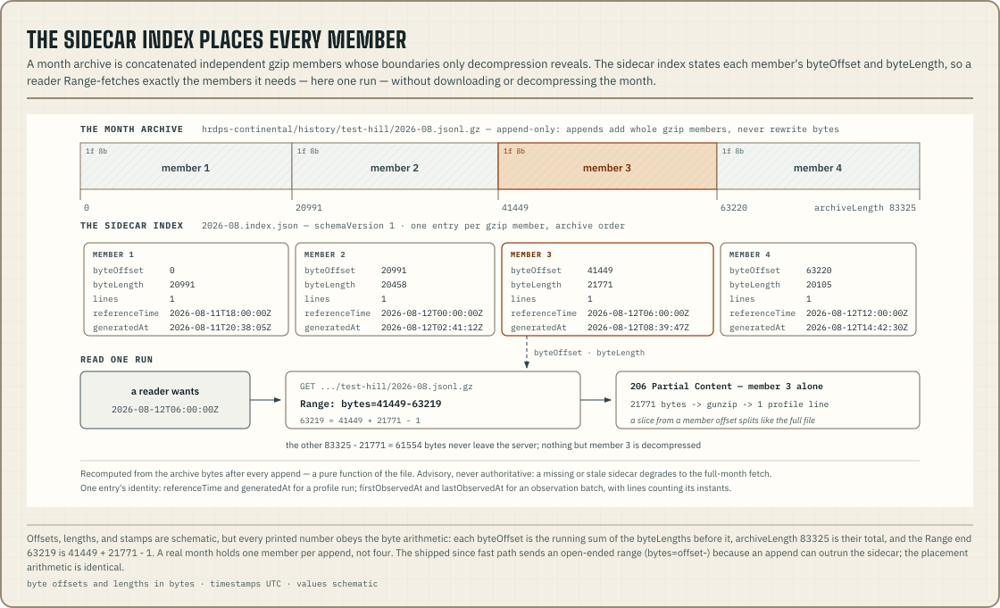

When an operator publishes with the default `--history` flag, the dataset
keeps monthly gzip archives of everything it publishes, at one path shape:

```text
<model>/history/<site>/<YYYY-MM>.jsonl.gz
```

Forecast and observation archives share the path shape but not the line
format. A profile archive stores one whole document per run. An observation
archive stores one observation object per instant. Check which kind of
dataset an archive belongs to before reading it, because a line in one
format does not parse as the other. This page describes the archive format.
[`@azohra/meteo.briefing/history`](/docs/briefing/history/) is the API that
reads the archives.

The operator decides whether history is kept. `meteo forecast build
--no-history` publishes current documents only, and that deployment has no
archive. A missing archive is a publication choice and does not mean data
was lost.

## Profile history: one document per line

Each successful new run appends the complete site profile as one line, in
the month of its `run.referenceTime`. Each line is the same profile document
that `parseSiteForecast` accepts. The archive has no reduced, history-only
shape.

## Storage properties

- One JSON line represents one model run for one site.
- Appends are independent gzip members and never rewrite existing
  archive bytes.
- Archives retain the run, site, semantics, hours, and derived values as
  published at that time.
- Current catalogue values do not retroactively reinterpret an archived
  profile.
- A corrected re-publication appends a new line for the same
  `run.referenceTime` with a later `run.generatedAt`, and leaves the earlier
  line in place. The archive therefore records each republication. Readers
  deduplicate by `referenceTime`, keeping the latest `generatedAt`.

## The sidecar index

Every archive publishes an advisory byte-offset index beside it:

```text
<model>/history/<site>/<YYYY-MM>.index.json
```



The index has one entry per gzip member, in archive order. Each entry holds
`byteOffset`, `byteLength`, `lines` and the member's identity, which is
`referenceTime` and `generatedAt` for a profile run, or `firstObservedAt` and
`lastObservedAt` for an observation batch. A reader that wants "runs since
T" or "the last N runs" can Range-fetch only the members it needs instead of
the whole month, as long as the operator's storage serves `Range` requests.
Object stores and CDNs usually do. Check that yours does before building a
reader on it.

The index is recomputed from the archive bytes after every append, so it is
a pure function of the file. It is advisory, and no reader may depend on it.
The
[history loaders' since-suffix strategy](/docs/briefing/history/#the-sidecar-index-and-the-since-suffix-strategy)
shows how to use it, including what happens when it is missing or wrong.

## Observation history: one observation per line

The [observation datasets](/docs/briefing/observation-document/)
(`goes18-dsr`, `goes18-aod`) use the same path shape and the same appends of
independent gzip members. Each line, however, is a **single observation
object** (`{"observedAt": …, "downwardShortwaveWm2": …}` or
`{"observedAt": …, "aot": …}`). It is not an observation document, and
`parseObservationDocument` does not accept a line.

The format differs because the publishing cadence differs. A profile is
published once per run. An observation document is a rolling window rebuilt
about every 15 minutes, so archiving whole documents would store each
instant roughly 290 times. Each instant is instead archived once, when it
first enters the window, under the month of its own `observedAt`. An instant
near a month boundary therefore lands in its own month, which may differ
from the month of the build.

The provider's bucket remains the full archive of raw granules. This archive
is the curated per-site record of exactly what was published, including the
quality gate, the rounding and the absences.

## Read for analysis

```sh title="Terminal"
curl -sS https://meteo.azohra.com/data-sample/hrdps-continental/history/test-hill/2026-08.jsonl.gz \
  | gzip -cd | jq -r '.run.referenceTime'
```

For an observation archive, the same pipeline works with `.observedAt`,
because each line is one measured instant.

Any equivalent gzip reader works when `gzip` or `jq` is unavailable, as long
as it handles **multi-member** gzip. Command-line `gzip` handles concatenated
members. WHATWG `DecompressionStream("gzip")` does not; the
[history API](/docs/briefing/history/) lists the measured failures per
runtime and provides loaders that read these archives correctly.
Applications should stream lines instead of inflating a long archive into
memory all at once.

History supports reproducible analysis, calibration audits and downstream
archives. Archived output can also calibrate scenario-profile ranges offline.

Operators choose retention, indexing, query APIs and access control. None of
these is part of the profile schema.
