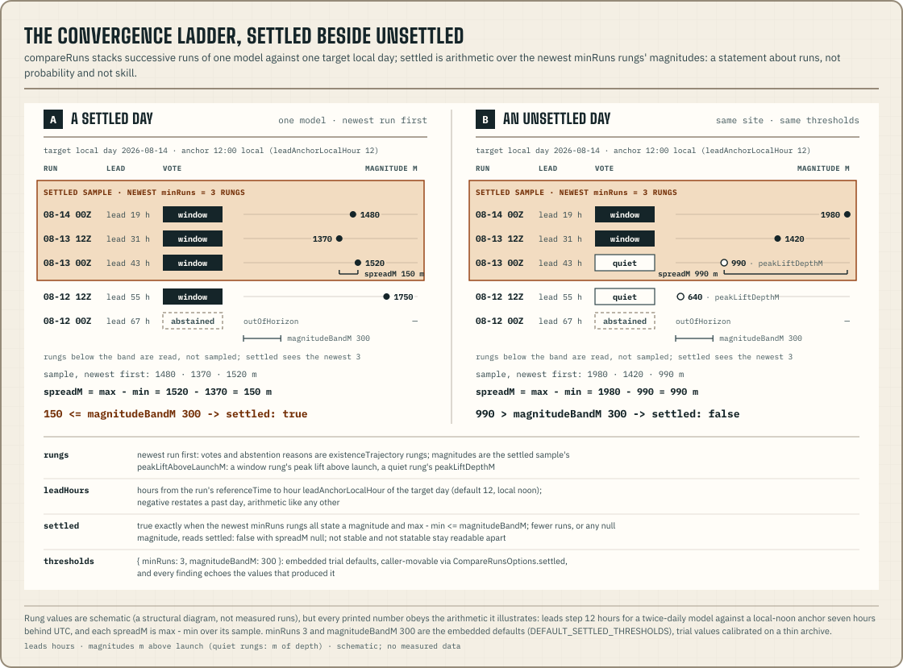

`@azohra/meteo.briefing/history` works with documents through time. It has two
parts, and the first feeds the second. The loaders read the published
[month archives](/docs/briefing/history-archives/) into deduplicated runs in
chronological order. `compareRuns` then takes the member axis of
[`@azohra/meteo.briefing/compare`](/docs/briefing/compare/), which normally
means "models at one instant", and uses it for "runs of one model". Its
result is the convergence ladder: what each successive run said about the
same local day.

This is the only server-side subpath in the briefing package. The archive
reader is built on `node:zlib`, so it runs in Node, Bun and Deno but not in
browsers. Every other subpath runs anywhere
([the reason is below](#why-the-reader-splits-gzip-members-itself)).

## Why the reader splits gzip members itself

A month archive is a sequence of independent gzip members
([the archive format](/docs/briefing/history-archives/)). A member does not
always hold one line. Forecast archives have one line per member, while
observation archives put a whole granule of instants in each member
(re-verified 2026-08-10 across every published model). The reader splits
members first and lines second.

WHATWG `DecompressionStream("gzip")` is unreliable on these archives. The
spec treats any bytes after the end of the first member as an error, and
these archives have many members. The runtimes also disagree with each other
(measured 2026-08-10):

| Runtime | `DecompressionStream("gzip")` on a multi-member archive |
| --- | --- |
| Node 24.19 | throws `ERR_TRAILING_JUNK_AFTER_STREAM_END` |
| Deno 2.9 | throws a different `TypeError` |
| Bun 1.3 | silently decompresses every member |

The package therefore ships `splitHistoryArchive`, a reader that splits
members using `node:zlib`'s raw-deflate decoder. That decoder reports exactly
how many input bytes each member's deflate stream consumed, which is the
member boundary `DecompressionStream` never exposes. `splitHistoryArchive`
returns `null` on structurally corrupt bytes (not gzip, a truncated member,
a trailer length mismatch), following the contract guards' convention of
never throwing. The loaders report that as `"miss": "invalid"`. It accepts
any slice that starts on a member boundary, so a Range fetch from a member
offset splits with the same code as a full fetch.

That decoder is also why the subpath is server-side, because only
`node:zlib` reports consumed input bytes. Verified 2026-08-10: Node 24.19 runs
the full test suite, and Bun 1.3 (split and load) and Deno 2.9 (member
splitting) run it through their `node:zlib` compatibility layers.
**Browsers are not supported by this subpath.** No other subpath is
affected: contract, derive, analyze, compare, transport, scene and SVG still
run in any runtime.

## Load a site's months

`loadForecastHistory` and `loadSmokeHistory` are typed wrappers around
`loadHistory`, whose `guard` parameter types each archive line. A history
line is exactly the published document, so the guards are the contract's
own (`parseSiteForecastJson`, `parseSmokeDocumentJson`).

There is no observation wrapper. `loadHistory`'s line type requires the run
stamp (`model`, `run.referenceTime`, `run.generatedAt`) that drives
deduplication, and an [observation archive](/docs/briefing/history-archives/)
line is a single observation object without one. To read those months, split
them with `splitHistoryArchive` and type the lines yourself.

The loaders fetch the same way
[`@azohra/meteo.briefing/transport`](/docs/briefing/transport/) does: an
injected fetch, a discriminated `DocumentMiss`, `TransportHttpError` as the
only throw, and no storage side effects.

```ts title="load-history.ts"
import { loadForecastHistory } from "@azohra/meteo.briefing/history";

export async function loadRecentRuns(baseUrl: string) {
  const result = await loadForecastHistory({
    fetch, // the global WHATWG fetch satisfies HistoryFetch directly
    baseUrl,
    modelSlug: "hrdps-continental",
    siteSlug: "test-hill",
    months: ["2026-07", "2026-08"],
    // Inclusive referenceTime lower bound — also the index fast path's key.
    since: "2026-07-25T00:00:00Z",
  });

  // "absent" here means EVERY requested month is absent — the site simply
  // has no history at this root. Months absent beside present ones stay
  // routine per-month entries in result.misses instead.
  if ("miss" in result) return null;

  for (const line of result.invalidLines) {
    // A guard-rejected line is a contract break or prototype data — never
    // routine; the surviving lines still load.
    console.error(`contract break in ${line.url} @ member ${line.memberByteOffset}`);
  }
  return result;
}
```

A `LoadedHistory` has four fields:

| Field | What it holds |
| --- | --- |
| `runs` | The deduplicated runs, ascending by `referenceTime`. There is one per `(model, referenceTime)`, keeping the latest `generatedAt` |
| `revisions` | Republications that deduplication discarded: which stamps were superseded, per run |
| `invalidLines` | Lines the guard rejected, located by archive URL, member byte offset and line number. Log them loudly |
| `misses` | Each requested month with nothing to contribute. `"absent"` is routine, because a month file exists only once a run of that month was archived. `"invalid"` (archive bytes that failed to split) is not routine |

Deduplication always runs. The same `referenceTime` can legitimately appear
on more than one archive line, because a corrected re-publication appends a
new line instead of rewriting bytes. The loader keeps the line with the
latest `generatedAt` and reports what it discarded as `revisions`. Without
that record, a convergence comparison would score an operator's fix as a
change in the weather. `compareRuns`'s `identityDrift` finding exists to
prevent exactly that.

## The sidecar index and the since-suffix strategy

The forecast engine publishes an advisory byte-offset index beside every
archive as `{YYYY-MM}.index.json`. For each gzip member it records where the
member's bytes sit and which run they carry. When you pass `since` and a
month's sidecar exists, the loader Range-fetches from the first needed
member's offset **to the end of the file** instead of fetching the whole
month.

Fetching to the end of the file is what makes this safe. The archives are
append-only, so a sidecar that has not yet seen the newest members (an
append that raced the index upload, or a stale CDN cache) still yields every
byte the selection could need. When nothing indexed matches `since`, the
loader probes the tail past the last indexed member, and a `416` past the end
of the file means nothing is new.

The index is advisory. Each of these falls back to fetching the full archive:
a missing sidecar (the state at launch), an unparsable one, any failure to
fetch the index, or a server that ignores `Range` and answers `200` with the
full body. The fallback is silent and still correct, because both paths
filter identically, so loads with and without the index return the same
result.

## Compare a model's runs through time

`compareRuns` applies the [compare rules](/docs/briefing/compare/) to
successive runs of one model at one site. Under those rules every verdict is
stated arithmetic over embedded thresholds the caller can move, agreement
comes only from the votes, and every non-vote has a stated reason. Since
compare vocabulary 2, a member already *is* a `(model, referenceTime)` run,
so the per-day votes are built entirely by `compareAnalyses`. `compareRuns`
adds the run axis. Its product is the convergence ladder: for each target
local day, what each run stated, newest run first.

```ts title="compare-runs.ts"
import type { SiteForecast } from "@azohra/meteo.briefing/contract";
import { compareRuns, type RunComparison } from "@azohra/meteo.briefing/history";
import type { HistoryRevision } from "@azohra/meteo.briefing/history";

export function convergenceLadder(
  runs: readonly SiteForecast[], // loadForecastHistory(...).runs, as-is
  revisions: readonly HistoryRevision[], // ...and its revisions statement
): RunComparison {
  return compareRuns(runs, {
    timeZone: "America/Vancouver",
    launch: { elevationM: 1225.1 },
    // Pass the loader's republication statements through, so a corrected
    // re-publication is stated on identityDrift instead of silenced.
    revisions,
  });
}
```

The history loader is the natural input. Its `runs` are already
deduplicated and in order, and its `revisions` pass straight through. Mixing
models throws, because this function compares one model through time;
`compareForecasts` compares models at one instant.

`compareRuns` wraps `compareRunAnalyses`, which, like `compareAnalyses`,
takes cached envelopes. You can analyze at the edge, cache the result as JSON,
and compare through time later. Every coherence check (one site, one zone,
one launch, one threshold set, duplicate runs, version skew, missing
self-description) is delegated to `compareAnalyses` and thrown as its named
errors.

The `RunComparison` envelope carries its own
`RUN_COMPARISON_VOCABULARY_VERSION` (currently `2`). It sits beside
`COMPARE_VOCABULARY_VERSION` and is versioned independently, so through-time
statements can grow without a cross-model contract change, and the reverse.
Readers of serialized envelopes follow the same tolerant-reader convention
and ignore kinds and fields they do not know. The `runs` ledger reuses
compare's member ledger verbatim, newest first. `runAgeHours` and `stepHours`
are ledger facts, and `benched` gives a benched run's reason for appearing on
no rung.

Every `leadHours` in the envelope is measured to one instant per target day:
hour `leadAnchorLocalHour` of that day in the comparison's zone (default
`12`, local noon). This single instant stands for "the flying day" and
assumes nothing about when the window opens or closes. A negative lead is ordinary
arithmetic; a run that restates a past day reads negative.

## The five run-comparison kinds

`existenceTrajectory` is the worked example. For each target local day it
lists every unbenched run's vote (window, quiet, or an abstention with its
reason), newest run first. You read a change in whether a window exists from
the `vote` sequence; the finding does not describe it with an adjective. Each
rung carries the run's own sensitivity flip values against the shared floors.
A genuine flip right at a threshold therefore reads as a small margin in
the numbers, not as the model changing its mind.

```ts title="existence-ladder.ts"
import type { RunComparison } from "@azohra/meteo.briefing/history";

export function existenceLadder(comparison: RunComparison) {
  return comparison.findings.flatMap((finding) => {
    if (finding.kind !== "existenceTrajectory") return [];
    return [{
      day: finding.day,
      rungs: finding.rungs.map((rung) => ({
        referenceTime: rung.referenceTime,
        leadHours: rung.leadHours,
        vote: rung.vote, // "window" | "quiet" | "abstained"
        abstained: rung.abstained ?? null, // the stated non-vote reason
        // A quiet rung one flip value under the floor is a knife-edge
        // case; see the sensitivity note above.
        wstarFlipAtMps: rung.sensitivity.wstarFlipAtMps,
      })),
    }];
  });
}
```

You narrow the other four kinds the same way. What each states, and how to
read it:

| Kind | What it states | Reading caveats |
| --- | --- | --- |
| `timingTrajectory` | Window start and end instants across runs (`starts` / `ends`), built exactly as compare builds timing. Per-edge spread facts: `startSpreadHours` / `endSpreadHours` (max − min, null below two) and `startStepHoursMax` / `endStepHoursMax` | Only unclipped edges vote. An edge clipped by the horizon reads as "open since at least" and is not used for timing. An edge belongs to the day whose local calendar date contains its instant. Every vote carries its window's `stepHours`, and a run-to-run difference of up to that many hours minus one is quantization rather than drift |
| `magnitudeTrajectory` | For each voting run: peak W\* (`peakThermalVelocityMps`), peak lift relative to launch, and covered window duration. The run-to-run differences in these numbers speak for themselves | Whole-window numbers belong to the window's own day. A run that touches the day only through a window crossing midnight, keyed to another day, states `null` instead of repeating that day's magnitudes. Ensemble runs carry per-day p10–p90 band widths (`bandWidth`) as evidence, with no verdict about narrowing. The recorded spike measured band widths moving in both directions as lead fell, so "narrowing means converging" would misstate the data |
| `identityDrift` | Facts other than weather that changed between runs. The loader's republication records pass through verbatim (`revisions`), and a walk of the ledger names identity facts (`modelElevationM`, `stepHours`, `hours`) that differ between runs adjacent in time | Keeps an operator or model change from being read as weather. It has no day, and it is emitted only when there is drift to report |
| `settled` | Arithmetic stability for each target local day: whether the lift magnitudes, relative to launch, of the newest `minRuns` runs all sit within `magnitudeBandM` of each other (max − min ≤ band). The embedded constants are echoed on `thresholds` | A statement about the runs ("the forecast has stopped moving"). It is not a probability and not a measure of skill: a settled forecast can settle on the wrong answer, and nothing here scores the atmosphere. `settled` is `false` whenever the arithmetic cannot run (fewer runs than `minRuns`, or any sampled run with no magnitude). Then `spreadM` is null and the `sample` roster shows which case applies, so "not stable" and "cannot be stated" stay distinguishable |

The default constants (`minRuns: 3`, `magnitudeBandM: 300`) are trial values.
They were calibrated on a thin archive (days of runs, one basin), not swept
over a representative one, and a re-sweep once there are two or more weeks
of month-file archive is a recorded obligation (~2026-08-24). You can move
them per call through `CompareRunsOptions.settled`, and every finding echoes
the values that produced it.



## What the vocabulary leaves out

These exclusions are binding:

- No trend adjectives. No "converging", "diverging", "shrinking" or
  "growing" token appears anywhere. Trajectories are series, the deltas and
  rosters carry the information, and the reader sees the shape.
- No weighting of runs. Run age is the ledger's `runAgeHours` fact, and
  nothing is weighted by it.
- No graded agreement enums.
- No staleness finding. A target day beyond an old run's horizon is an
  `outOfHorizon` abstention with a reason. It is not reported as a changed
  forecast.
- No verdict about ensemble narrowing. Band widths appear in the magnitude
  trajectory as evidence only.
- No per-finding version tags. The envelope's `vocabularyVersion` governs, as
  everywhere else.

Other candidate kinds (flip counts, oscillation summaries, cross-model
convergence) each wait for their own evidence spike. None is pre-approved.
