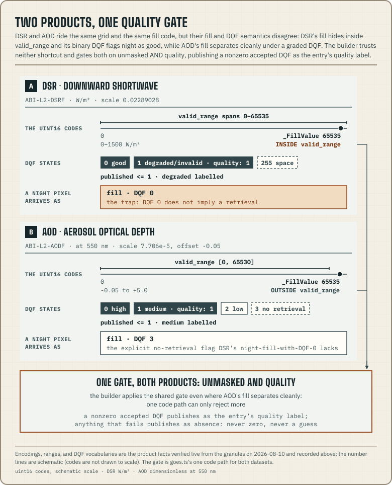

The observation document is the contract's only measured
[document family](/docs/compatibility/#document-families). It is a time
series of satellite observations for one site, which today are GOES-18's
downward shortwave radiation and aerosol optical depth. Every other document
here describes forecasts; this one records what was measured.

It exists to test the
[smoke-adjusted derivation](/logbook/smoke-and-thermals/), which claims that
smoke of a stated optical depth lets through a computable fraction of the
sun. Measurement tests both parts of that claim. Measured irradiance under a
known plume tests the transmittance, and measured optical depth tests whether
the stated plume is there at all. Consumers join an observation series to
profile or smoke documents by instant.
[Measured against the sky](/logbook/measured-against-the-sky/) is the case
study behind this document kind.

The live sample dataset has no observation documents. The datasets this
document kind was built against stayed with their operator when the engine
went public, and they are private. The JSON shown here is an illustration,
captured before that split and no longer fetchable. The one real capture in
the repository is the [history-archive](/docs/briefing/history-archives/)
fixture `briefing/test/fixtures/goes18-aod-erie-2026-08.jsonl.gz`, a smoky
afternoon of measured AOT entries. It uses the archive's format of one
observation per line, which differs from this document's shape.

## On the wire

| Fact | Value |
| --- | --- |
| **Published at** | `<model-slug>/sites/<site-slug>.json`: `goes18-dsr` and `goes18-aod` today |
| **Parse** | `parseObservationDocument(Json)` from [`@azohra/meteo.briefing/contract`](/docs/briefing/contract/) |
| **Zod authority** | `observationDocumentSchema` |
| **JSON Schema** | [`observation.schema.json`](https://github.com/azohra/meteo/blob/main/briefing/schema/observation.schema.json) |
| **Discovery** | the catalogue's `observationModels` array. It is kept separate from `models` for the same reason as `smokeModels`, so consumers written before observations existed still parse the catalogue unchanged |
| **Cadence** | The entries have no run schedule. `cadenceMinutes` (10 for both) is what freshness is judged against, and `gridKm` (3) is the nominal resolution at the sites, which is coarser than the instrument's finest |

## Shape and units

Measurements have no model initialization, so an `observed` block takes the
place of the `run` block. It records the time window the document currently
holds and when the document was generated. The dataset manifest's
`referenceTime` equals `lastObservedAt`, so the shared
[freshness code](/docs/briefing/manifest/) reads it without changes. The
manifest itself is the observation variant, with `firstObservedAt`,
`lastObservedAt`, and `observationCount` instead of the forecast-hour extent,
and `parseForecastManifestJson` does not accept it.

```json
{
  "schemaVersion": 1,
  "model": "goes18-dsr",
  "observed": {
    "firstObservedAt": "2026-08-06T22:50:00Z",
    "lastObservedAt": "2026-08-09T22:50:00Z",
    "generatedAt": "2026-08-09T23:07:12Z"
  },
  "site": { "id": "dundee", "name": "Dundee", "latitude": 49.291977, "longitude": -117.183569, "timeZone": "America/Vancouver" },
  "observations": [
    { "observedAt": "2026-08-09T22:50:00Z", "downwardShortwaveWm2": 624.7 }
  ]
}
```

*Captured from the now-private dataset (`dundee`) and kept because its
measured values are real. No published dataset serves it today.*

| Field | Unit | Meaning |
| --- | --- | --- |
| `observedAt` | UTC instant | The product's own timestamp, at its native 10-minute cadence. |
| `downwardShortwaveWm2` | W/m² | Measured instantaneous downward shortwave flux at the surface. The thermal derivation's transmittance claim is about this irradiance. DSR entries only. |
| `aot` | dimensionless | Measured aerosol optical thickness at 550 nm. A [profile's `smoke` block](/docs/briefing/profile-document/#run-site-and-semantics) forecasts the same quantity at the same wavelength under the same field name, `aot`, so forecast and measurement compare directly. AOD entries only. |
| `quality` | provider DQF | The provider's DQF for an accepted retrieval, present only when it is **nonzero**. **A missing field means the best grade** (DQF 0), so the common case adds nothing. The meaning depends on the product. DSR's DQF is binary, so `quality: 1` is its combined "degraded/invalid" state, which is indicative only. AOD's is graded, so `quality: 1` is medium, part of the validated top two grades described below. Consumers who need strictly quantitative values keep only entries without the field. |

`observations[]` accepts **two entry shapes**: the DSR dataset's
`{ observedAt, downwardShortwaveWm2 }` and the AOD dataset's
`{ observedAt, aot }`. A single document uses one shape throughout, but the
schema and the parser accept both. Consumers therefore check which key is
present before reading the value, as the example below does.

Observations are in time order, and **gaps are real**. A missing instant had
no accepted retrieval, because of night, rejected quality flags, or scan
gaps. It means "not measured" and must not be read as zero. Both products
are daytime products, so a series that goes quiet overnight is normal.

```ts title="read-observations.ts"
import { parseObservationDocumentJson } from "@azohra/meteo.briefing/contract";

export function measuredInstants(text: string): string[] {
  const document = parseObservationDocumentJson(text);
  if (!document) throw new Error("unsupported observation document");

  // Entry shapes differ by product — narrow before reading the value.
  return document.observations.map((observation) =>
    "downwardShortwaveWm2" in observation
      ? `${observation.observedAt}: ${observation.downwardShortwaveWm2} W/m²`
      : `${observation.observedAt}: AOT ${observation.aot}`,
  );
}
```

## DSR product facts — verified 2026-08-10

The [forecast model feed reference](/docs/forecast/forecast-model-feeds/)
covers the feed itself: cadence, latency, granule sizes, and the April 2024
product transition that every archive consumer needs to know about. These
facts were measured live from the granules:

| Fact | Value |
| --- | --- |
| **Product** | GOES-R ABI L2 Downward Shortwave Radiation, full disk: `ABI-L2-DSRF` on the anonymous `noaa-goes18` bucket |
| **Quantity** | instantaneous surface downward shortwave flux over 0.2–4.0 µm, W/m², CF standard name `surface_downwelling_shortwave_flux_in_air` |
| **Encoding** | the DSR variable is uint16, scale factor 0.02289028, spanning 0–1500 W/m² |
| **Fill** | `_FillValue` (65535) sits **inside** `valid_range`, so range checks alone cannot separate fill from data |
| **DQF** | only two working states (0 good, 1 degraded/invalid) plus 255 for space |
| **Navigation** | The files carry no lat/lon arrays. Pixels are addressed on the ABI fixed grid (x/y scan angles in radians plus a `goes_imager_projection`), so sites are located with the GOES-R PUG Volume 3 forward equations, using each granule's own projection attributes |
| **Geometry at the catalogued sites** | at ≈49.3–49.8°N, ≈117.2–117.6°W the view (local) zenith angle is ≈ 59°, inside the ≤ 70° good-quality bound below, and the effective ground cell is ≈ 2.4 km east–west × 4.1 km north–south |

Quirks:

- **DQF 0 does not mean there was a retrieval.** Night pixels are fill with
  DQF 0. A value is published only when the DSR pixel is unmasked **and**
  its DQF is ≤ 1. The unmasked check is the part that keeps night out. The
  builder
  ([`goes.ts`](https://github.com/azohra/meteo/blob/main/forecast/src/builders/goes.ts))
  publishes an unmasked DQF-1 retrieval labelled `quality: 1`, and
  everything else as absence.
- **DSR's DQF 1 is one combined "degraded/invalid" state**, with no graded
  medium. In practice it covers the sun beyond the 70° good-quality zenith
  bound, around sunrise and sunset. Live values at those times follow the
  clear-sky expectation plausibly, but the provider gives them no grade, so a
  labelled entry only indicates that the sun is out and roughly how strong it
  is. It is not a quantitative value. The reference scene draws these entries
  as dimmed dots off the measured line and never lets them shade the dimming
  cells.
- **The forward equations' visibility check is required.** Without it, a
  point on the far side of the earth maps to plausible scan angles.
- **The often-quoted 2 km resolution applies at nadir.** The measured ground
  cell above is why the catalogue entry declares `gridKm: 3`.

## What a published DSR value claims

The quality conditions come from the Enterprise SRB ATBD v5.0 (Laszlo,
Kim & Liu 2020), Tables 2-1 and 2-2, checked against the threshold variables
in the files themselves [verified 2026-08-10]:

- Retrievals are attempted for solar and local zenith angles below 90°, but
  **good quality is claimed only below 70°**. The catalogued sites are inside
  that bound with about 11° to spare.
- The accuracy specification applies when the sun is more than 25° above the
  horizon: 65 W/m² in the typical 200–500 W/m² range, 85 W/m² above it, and
  110 W/m² below it. The ATBD states overall accuracy better than about 2 %,
  with about 17 % precision, against SURFRAD, SOLRAD, and CERES. For an
  independent, tower-scale use of the product, see Losos, Hoffman & Stoy 2024
  ([doi:10.1038/s41597-024-03071-z](https://doi.org/10.1038/s41597-024-03071-z)).
- **GOES-18-specific validation** [verified 2026-08-10, NOAA OSPO GOES-18
  ABI L2+ SRB Full Data Quality ReadMe, Dec 2024; Full maturity 2025-01-04]:
  against SURFRAD and SOLRAD ground stations, the Enterprise DSR's **bias is
  generally below 30 W/m²** and the **standard deviation of its biases is
  generally below 80 W/m²**, roughly half the error of the older Baseline
  product. Two caveats apply to those numbers. Full maturity was granted after
  two years of operational use without major anomalies, rather than through a dedicated
  validation review. The retrieval also still converts narrowband reflectance
  to broadband albedo with coefficients derived for GOES-16, which is an open
  known issue on GOES-18.
- **The measurement cannot tell what dimmed the sun.** A dimmed value alone
  cannot separate smoke from thin cloud. Attributing it needs the smoke
  documents alongside, which is the join this document kind exists for.

## AOD product facts — verified 2026-08-10

The second dataset measures the plume itself. The
[forecast model feed reference](/docs/forecast/forecast-model-feeds/) covers
the feed: cadence, latency, granule sizes, and the February 2024 algorithm
transition. These facts were measured live from the granules:

| Fact | Value |
| --- | --- |
| **Product** | GOES-R ABI L2 Aerosol Optical Depth, full disk: `ABI-L2-AODF` on the same anonymous `noaa-goes18` bucket |
| **Quantity** | aerosol optical thickness at 550 nm, dimensionless |
| **Grid and navigation** | The same 5424² ABI fixed grid and projection attributes as DSRF. One navigation (the PUG forward equations above, with site indices located once) serves both products, and the DSR geometry facts (view zenith, effective ground cell) apply unchanged |
| **Encoding** | the AOD variable is uint16, scale factor 7.706 × 10⁻⁵, offset −0.05, spanning −0.05 to +5.0 |
| **Fill** | unlike DSR, `_FillValue` (65535) sits **outside** `valid_range` ([0, 65530]), so range masking alone separates fill from data |
| **DQF** | graded: 0 high, 1 medium, 2 low quality, 3 no retrieval |

Quirks:

- **The builder still applies the shared unmasked-and-quality gate**, even
  though the fill separates cleanly. It is one code path for both products,
  and the extra check can only reject more.
- **Night pixels are fill with DQF 3**, an explicit no-retrieval flag. DSR's
  night pixels, fill with DQF 0, have no such flag.



## What a published AOT claims

The quality gate and its accuracy rest on the Enterprise (EPS) aerosol
algorithm's validation record [verified 2026-08-10]:

- **Published values pass DQF ≤ 1**, meaning high and medium quality.
  NOAA's product ReadMe recommends high quality only for strict quantitative
  use, but the operational smoke literature found high-only "very
  conservative". The top two grades together score r = 0.87, with bias 0.04
  and RMSE 0.09, against AERONET (Zhang, Kondragunta et al. 2020,
  [AMT 13:5955](https://doi.org/10.5194/amt-13-5955-2020)), and they are the
  choice for smoke events. A medium-quality entry carries
  `quality: 1`, so one filter gives the strict high-only view.
- **The dataset exists because of the Enterprise algorithm.** Operational
  since 2024-02-06, it raised the quantitative view-zenith limit from the
  Baseline algorithm's 60° to 78.5°. The catalogued sites' view zenith of
  about 59° left no margin under the old bound (the Baseline cutoff
  excluded the western-US view geometry). The Enterprise limit gives the
  same geometry nearly 20° to spare.
- **Accuracy over land against AERONET**: bias below 0.06, 0.04, and 0.12,
  with σ below 0.13, 0.25, and 0.35, for AOD < 0.04, 0.04–0.8, and > 0.8
  respectively. Smoke events fall in the > 0.8 range.
- **Retrievals are often rejected, even in daylight.** On one live smoky
  afternoon, 17–58 % of granules per site gave accepted retrievals (about
  40 % pooled). Winter snow suppresses retrievals over land, and a thick
  plume core can fail the algorithm's cloud tests, so the strongest smoke is
  exactly what can go unmeasured. A missing instant means "not measured"; it
  does not mean clear air. The builder's first live run was at night and
  correctly published nothing.

The entry shape is `{ observedAt, aot }`, with the same field name and
wavelength that the profile's `smoke` block forecasts as `aot`. (The
[smoke document](/docs/briefing/smoke-document/) itself has no optical-depth
field.) A measured value can therefore sit next to a forecast one without
converting units, wavelength, or names.

## Rolling window, history archive

Each document holds a rolling window of about 72 hours. The build is
incremental and merges granules newer than the published `lastObservedAt`.
Older data goes to [history archives](/docs/briefing/history-archives/) at
`<model-slug>/history/<site>/<YYYY-MM>.jsonl.gz`, which both datasets keep.
They use the same seeded gzip members as profile history, with a different
line format: **one observation object per line**, archived exactly once, when
the instant first enters the window. The history page describes the format
and the reasons for it.

NOAA's own bucket remains the complete archive, with every granule and every
pixel. Read the bucket for raw granules, the history archive for a month's
published series, and this document for the recent sky next to today's
forecast.

## Joining observations to forecasts

Observations arrive every 10 minutes and forecasts are hourly. Join by
instant, placing each observation with the forecast hour that contains it.
Label the join with the forecast's run and the observation's `generatedAt`,
the same way smoke-to-profile joins show both runs. The main use is the one
this document kind was built for: comparing measured surface shortwave under
a plume, whose optical depth the
[profile's `smoke` block](/docs/briefing/profile-document/#run-site-and-semantics)
states, with the transmittance the
[smoke-adjusted derivation](/logbook/smoke-and-thermals/) predicts.

The package supports that comparison end to end. `nearestObservation` in
[`@azohra/meteo.briefing/derive`](/docs/briefing/derive/) does the join, and
`clearSkyGhiWm2` (Haurwitz, per Reno, Hansen & Stein 2012) turns a
measurement into an `observedTransmittance` against the clear-sky
expectation. Passed to a Meteogram as
[`options.observations` and `options.aotObservations`](/docs/briefing/scene/),
the two datasets draw the **Sun** and **AOT** strips, each labelled with its
own source.
