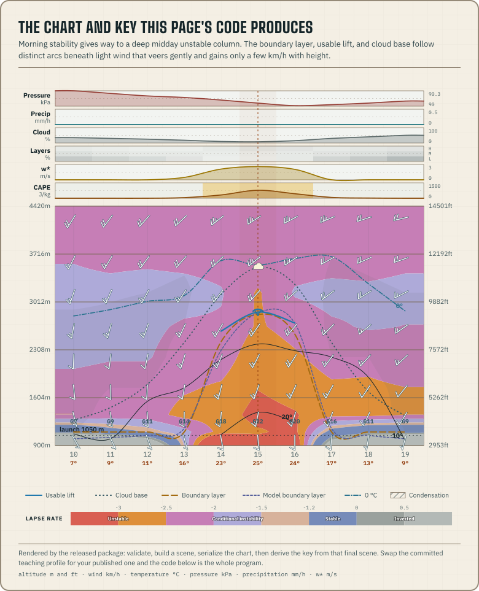

This tutorial renders a Meteogram from a real published forecast. You will
write one script that fetches a [profile](/docs/glossary/#profile), validates
it, and saves the chart and its key as SVG files. It needs Node 22 or
later.

The package ships ESM with types and needs no DOM, so the same code also runs
in workers and browsers. Your chart will look like this one, drawn from the
Synthetic Ridge teaching scenario:



## 1. Install the package

```sh
pnpm add @azohra/meteo.briefing
```

## 2. Write the script

Save this as `render-meteogram.mjs`. It fetches a profile and its site context
from the live sample dataset, validates both, builds a scene, and writes the
chart and its key.

```js title="render-meteogram.mjs"
import { writeFileSync } from "node:fs";
import { parseSiteContextJson, parseSiteForecastJson } from "@azohra/meteo.briefing/contract";
import {
  buildKeySpec,
  buildMeteogramScene,
  renderKeySvg,
  renderMeteogramSvg,
} from "@azohra/meteo.briefing/meteogram";

// The live sample dataset: one real HRDPS run over three synthetic sites.
const base = "https://meteo.azohra.com/data-sample";

const profile = parseSiteForecastJson(
  await (await fetch(`${base}/hrdps-continental/sites/test-hill.json`)).text(),
);
if (!profile) throw new Error("profile failed contract validation");

// The launch marker is a render input — documents are launch-agnostic
// (a "launch" is the place you fly; the document's "site" is its record).
// site-context.json at the dataset root carries the measured elevation pick.
const context = parseSiteContextJson(
  await (await fetch(`${base}/site-context.json`)).text(),
);
const launchElevationM = context?.sites[profile.site.id]?.elevation.elevationM;

const timeZone = profile.site.timeZone;
if (!timeZone) throw new Error("older profile needs an explicit IANA timezone");

const scene = buildMeteogramScene(profile, {
  timeZone,
  launch: launchElevationM === undefined ? undefined : { elevationM: launchElevationM },
  widthPx: 960,
  hourLabel: "12h",
});
writeFileSync("./meteogram.svg", renderMeteogramSvg(scene, { idPrefix: "club-main" }));
writeFileSync("./meteogram-key.svg", renderKeySvg(buildKeySpec(scene), { idPrefix: "club-main-key" }));
console.log(`rendered ${profile.site.name} at ${launchElevationM} m: meteogram.svg + meteogram-key.svg`);
```

Three details in the script matter later:

- Each parser returns `null` instead of throwing when a document fails
  validation, so the script checks the result before using it.
- A forecast document covers a grid cell, not one launch. The launch
  elevation comes from the site context and is passed to the renderer, which
  draws it as the launch line.
- Profiles store UTC instants, and `buildMeteogramScene` needs a timezone to
  label the hours. The script uses the document's optional
  [`site.timeZone`](/docs/briefing/profile-document/#run-site-and-semantics)
  echo. If a profile has none, pass a zone you choose. Never infer it from a
  name or a coordinate.

## 3. Run it

```sh
node render-meteogram.mjs
```

You should see:

```text
rendered Test Hill at 1225.1 m: meteogram.svg + meteogram-key.svg
```

Open `meteogram.svg` in a browser to see the chart, and `meteogram-key.svg`
for its key.

## 4. Put the chart in a page

Each file holds a complete, self-contained `<svg>` document. Inline its text
into any HTML page, template, or build output. It needs no runtime,
stylesheet, or script beside it.

The key is derived from the scene. If your page lets readers change the
chart's options, rebuild the key each time you rebuild the scene.

## Next steps

- Learn what each mark on the chart means in
  [Reading a Meteogram](/docs/briefing/reading-a-meteogram/).
- Make the chart respond to pointer and keyboard input with
  [Wire an inspector](/docs/briefing/wire-an-inspector/).
- Load documents in production with `loadForecast()` from
  `@azohra/meteo.briefing/transport`. A bare `fetch` is fine for a first
  render, but an application that reads a manifest and profiles from
  separately cached static storage can get a mismatched pair. The
  [transport guide](/docs/briefing/transport/) explains the consistent-pair
  result, the `stale` flag, and how a miss is reported.
