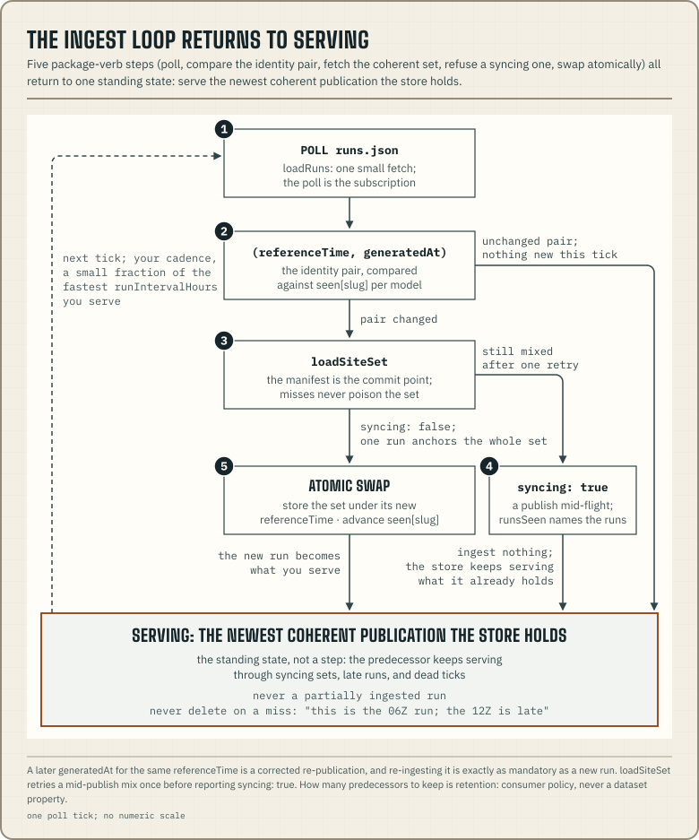

An ingest loop polls the published dataset, notices a new publication,
pulls one model's documents as a coherent set, and serves them from its own
storage. Some of its questions have correct answers: "is this set one
publication", "why is this document missing", "is this run late".
`@azohra/meteo.briefing/transport` and `@azohra/meteo.briefing/derive`
answer all of them. The rest is policy that depends on your product and
runtime: the scheduler, the store, retention, and what you tell users when a
feed runs late. This page is a recipe for wiring the loop, and there is no
module to import for it. It is the server-side counterpart of
[Wire an inspector](/docs/briefing/wire-an-inspector/).



## Poll runs.json on your own cadence

The dataset is static files, so there is no webhook, and none is needed:
polling is how you subscribe. One fetch of `runs.json` answers "which run is
current for every model". It is the cross-model run index, regenerated in
full at every publish. `loadRuns({ fetch, baseUrl })` fetches it and reports
misses the same way as every other loader in the
[transport guide](/docs/briefing/transport/).

You choose the cadence. A sensible loop wakes at a small fraction of the
fastest `runIntervalHours` it serves. Every few minutes is plenty when the
fastest feed publishes every six hours, and a poll that finds nothing new
costs one small document.

## Detect a publication by its identity pair

A publication is identified by the pair `(run.referenceTime,
run.generatedAt)`. [Compatibility](/docs/compatibility/#publication-identity)
defines this and what follows from it. For the loop, it means you remember
the last pair you ingested for each model and treat any change as work. A new
`referenceTime` is a new run. A later `generatedAt` for the same
`referenceTime` is a corrected re-publication, and you must re-ingest it just
the same. A loop that compared `referenceTime` alone would serve retracted
values forever.

```ts title="detect-publications.ts"
import type { RunsIndexEntry } from "@azohra/meteo.briefing/contract";
import { loadRuns } from "@azohra/meteo.briefing/transport";

/** The last pair ingested per model slug — persisted however you persist things. */
export type SeenRuns = Record<string, RunsIndexEntry>;

export async function modelsToIngest(
  baseUrl: string,
  seen: SeenRuns,
): Promise<{ changed: string[]; index: SeenRuns }> {
  const index = await loadRuns({ fetch, baseUrl });
  if ("miss" in index) {
    // Either miss is loud here: "absent" means the data root itself is gone.
    console.error(`runs.json ${index.miss} at ${index.url}`);
    return { changed: [], index: seen };
  }
  const changed = Object.keys(index.runs).filter((slug) => {
    const previous = seen[slug];
    const current = index.runs[slug];
    return (
      !previous ||
      previous.referenceTime !== current.referenceTime ||
      previous.generatedAt !== current.generatedAt
    );
  });
  return { changed, index: index.runs };
}
```

Advance `seen[slug]` to the new pair only after that model's documents have
ingested coherently, as below. A publish caught mid-flight then stays on the
work list, and the next tick retries it at no extra cost.

## Ingest a coherent set

A model's sites are separate files behind separate cache entries. Around a
publish, per-site fetches can therefore span two runs, even when each
manifest and document pair looks consistent on its own. `loadSiteSet` solves
exactly this. It fetches the model's manifest once as the commit point,
requires every site document to carry that manifest's run, and retries once
if a publish mixed them. The
[transport guide](/docs/briefing/transport/#load-a-site-set-as-one-publication)
defines the contract. The result discriminates on `syncing`:

```ts title="ingest-coherent-set.ts"
import { parseSiteForecastJson, type SiteForecast } from "@azohra/meteo.briefing/contract";
import { loadSiteSet } from "@azohra/meteo.briefing/transport";

export interface IngestedRun {
  referenceTime: string;
  documents: Record<string, SiteForecast>;
}

/** Returns the coherent publication to store, or null to wait for the next poll. */
export async function ingestProfileModel(
  baseUrl: string,
  modelSlug: string,
  siteSlugs: readonly string[],
): Promise<IngestedRun | null> {
  const set = await loadSiteSet({
    fetch,
    baseUrl,
    modelSlug,
    siteSlugs,
    guard: parseSiteForecastJson,
  });
  if ("miss" in set) {
    // The whole model missed — loud either way for a feed you serve.
    console.error(`${modelSlug} manifest ${set.miss} at ${set.url}`);
    return null;
  }
  if (set.syncing) {
    // A publish is mid-flight; set.runsSeen names the runs observed.
    // Ingest nothing — the next poll reads cleanly.
    return null;
  }
  for (const [siteSlug, miss] of Object.entries(set.misses)) {
    // "absent" is routine: a site outside this model's domain.
    if (miss.miss === "invalid") console.error(`contract break at ${miss.url} (${siteSlug})`);
  }
  return { referenceTime: set.referenceTime, documents: set.documents };
}
```

Three behaviours in that code make the recipe work:

- On `{ syncing: true }` the loop ingests **nothing**, not even the sites
  that agreed with the manifest. A partial ingest would leave the store
  holding two runs. The next poll reads the finished publication, and your
  store keeps serving what it already holds in the meantime.
- Per-site misses do not spoil the set. `"absent"` sites are routine, and
  `"invalid"` is a contract break to log loudly, as the
  [miss table](/docs/briefing/transport/#absent-is-routine-invalid-is-loud)
  says.
- A coherent set may be the *previous* publication, which is
  [the newest complete forecast there is](/docs/briefing/transport/#load-a-site-set-as-one-publication).
  Store it under its `referenceTime`, and let the identity-pair check decide
  whether it was new.

For a smoke model the recipe is the same, with `parseSmokeDocumentJson` as
the guard.

## Observation series are the exception

Observation documents are ingested per site with `loadObservation`. It makes
one guarded fetch, with no manifest anchor and no coherence check. The
[transport guide](/docs/briefing/transport/#observations-one-guarded-fetch-no-dance)
explains why a coherence check would be wrong here.

```ts title="ingest-observations.ts"
import type { ObservationDocument } from "@azohra/meteo.briefing/contract";
import { loadObservation } from "@azohra/meteo.briefing/transport";

export async function ingestObservations(
  baseUrl: string,
  modelSlug: string,
  siteSlugs: readonly string[],
): Promise<Record<string, ObservationDocument>> {
  const documents: Record<string, ObservationDocument> = {};
  await Promise.all(
    siteSlugs.map(async (siteSlug) => {
      const result = await loadObservation({ fetch, baseUrl, modelSlug, siteSlug });
      if ("miss" in result) {
        if (result.miss === "invalid") console.error(`contract break at ${result.url}`);
        return;
      }
      documents[siteSlug] = result;
    }),
  );
  return documents;
}
```

Observation series have no run, so there is no publication pair to detect
either. Poll them on their own tick, sized against the catalogue's
`cadenceMinutes` instead of any `runIntervalHours`.

## Serve the predecessor through gaps

Publishes take time and providers have bad days, so gaps are routine: a set
that is still syncing, a run that never appears, an ingest tick that dies
halfway. The recipe handles all of them the same way. The store serves the
newest coherent publication it holds until a newer one has ingested
completely, then swaps to it atomically under the new `referenceTime`. Do
not serve a partially ingested run, and do not delete on a miss. A model
that went quiet still has a good previous run, dated by its own `run` block.
Telling the reader "this is the 06Z run; the 12Z is late" is better than
showing nothing.

How many previous runs to keep (one, a season, all of them) is your
retention policy. The dataset's own
[history archives](/docs/briefing/history-archives/) already keep the per-site
record of everything published, and the
[`@azohra/meteo.briefing/history` loaders](/docs/briefing/history/) read it,
so your store only needs what your product serves right now.

## Baseline feeds and bonus feeds

Some feeds matter more than others, and your gap handling should reflect
that. A **baseline** feed is one your product cannot do its job without. A
**bonus** feed adds to the picture while it is available, such as a second
model's opinion, a smoke overlay or an observation series. Their failures
mean different things. A stale baseline model is *your outage*: alert,
escalate and apologize. A bonus feed going quiet is the weather or a
provider's bad day. Say so in the product and keep serving everything else.
One feed's freshness grade should not take the whole product down.

Which feeds are baseline is your product's decision. The catalogue declares
what each model publishes, and it does not know which ones you depend on.

## Judge freshness with `runFreshness`

A store that keeps serving through gaps has to answer "how current is
this?". `runFreshness` from `@azohra/meteo.briefing/derive` grades a
runs.json entry as `"current" | "delayed" | "stale"`. The
[derive reference](/docs/briefing/derive/#judge-run-freshness) defines the
grades.

```ts title="grade-feeds.ts"
import type { ModelCatalogue, RunsIndex } from "@azohra/meteo.briefing/contract";
import { runFreshness, type RunFreshness } from "@azohra/meteo.briefing/derive";

/** This product's tolerance; yours will differ. */
const THRESHOLDS = {
  currentIntervals: 1, // the successor run may simply not exist yet
  staleAfterIntervals: 3, // a whole run skipped, and the one after is late too
};

export function gradeFeeds(
  index: RunsIndex,
  catalogue: ModelCatalogue,
  now: string,
): Record<string, RunFreshness> {
  const grades: Record<string, RunFreshness> = {};
  for (const model of [...catalogue.models, ...(catalogue.smokeModels ?? [])]) {
    const entry = index.runs[model.slug];
    if (entry) grades[model.slug] = runFreshness(entry, model, now, THRESHOLDS);
  }
  return grades;
}
```

Pass the runs.json entry and the catalogue entry straight in. A `"delayed"`
run is still the newest forecast there is. `"stale"` means the feed has
missed enough runs that presenting it as current weather would mislead.
Which grade triggers which behaviour in your product follows from the
baseline and bonus decision above.
