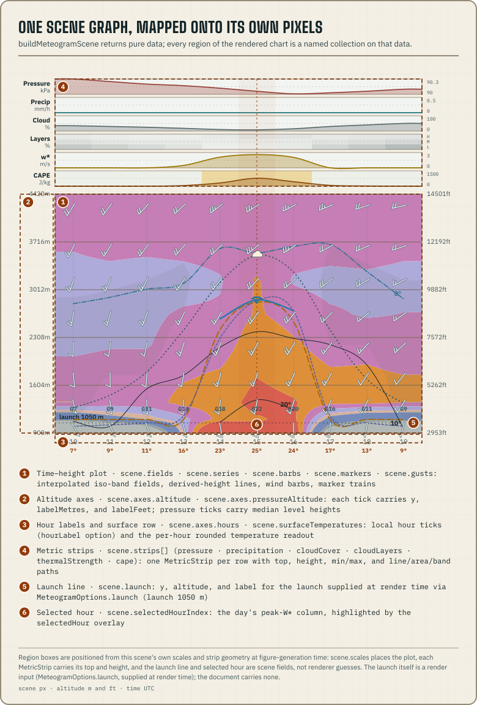

`buildMeteogramScene(profile, options)` turns a validated document into
plain data: scales, ticks, strips, sampled fields, line and band paths,
wind barbs, labels, markers, and pointer readings. It never touches the
DOM and holds no functions, so a scene can be sent across a worker
boundary or serialized for inspection.



```ts title="build-scene.ts"
import type { SiteForecast } from "@azohra/meteo.briefing/contract";
import { buildMeteogramScene, cursorReading } from "@azohra/meteo.briefing/meteogram";

export function sceneAndFirstReading(profile: SiteForecast, olderProfileTimeZone?: string) {
  const timeZone = profile.site.timeZone ?? olderProfileTimeZone;
  if (!timeZone) throw new Error("older profile needs an explicit IANA timezone");
  const scene = buildMeteogramScene(profile, {
    timeZone,
    // The caller picks the launch: here the sample's Test Hill pick
    // from site-context.json. Omit it and no launch marker draws.
    launch: { name: "Test Hill", elevationM: 1225.1 },
    hours: profile.hours.slice(0, 8),
    overlays: { thermalIndex: true, windShear: true },
    widthPx: 900,
    plotHeightPx: 380,
    hourLabel: "12h",
    barbStride: "auto",
    markerStride: {
      cloudBase: { every: 2 },
      usableLiftTop: { every: 2 },
    },
    stripLabels: { thermalStrength: "LIFT" },
  });

  const reading = cursorReading(
    scene,
    scene.scales.plotLeft + 5,
    scene.scales.plotTop + 5,
  );
  return { scene, reading };
}
```

## Supply the launch

A profile records where the model sampled the atmosphere and what the
model thinks the ground there is (`site.modelElevationM`). It has no
launch elevation, because one grid sample serves every launch its cell
covers. The launch is an input to the render:

- `launch: { elevationM }` draws the launch line at that elevation,
  labelled `launch <n> m`. Add `name` and the label becomes
  `<name> <n> m`. The number comes from the consumer, usually the
  `elevation` pick in [site-context.json](/docs/briefing/site-context-document/).
- Without a `launch` option, `scene.launch` is null and no marker draws.
  That only means the document was never given a launch. It is not an
  error.
- The `launch` overlay is still a display toggle. Turning it off hides
  the launch line even when a launch is provided.

## Select hours explicitly

Options accept any one of three equivalent forms:

- `hourIndices`, indices into `profile.hours`. This wins when both
  forms are present.
- `hours`, hour objects matched back by `validAt`.
- `hours: { timeZone, dateKey }`, one local calendar day.

Without a selection, the scene includes every hour in the profile.
`buildMeteogramScene` needs an explicit timezone for its labels and
accessible descriptions. Pass `profile.site.timeZone` when it is present,
or your own fallback for an older profile. The package does not guess a
zone from a site name or coordinates.

## Configure presentation

`MeteogramOptions` controls overlays, 1-2-1 display smoothing, CAPE class
thresholds (`capeClasses`, which defaults to the exported
`DEFAULT_CAPE_CLASSES`), the sink rate, chart geometry, hour labels,
barbs, line markers, and strip labels. Every drawn data layer except the
axes and frame has an overlay toggle. The `surfaceTemperature` overlay is
on by default and adds one rounded `<n>°` reading per hour below the hour
labels. Fields the document lacks draw nothing, and the scene does not
fill them with zeros.

## Draw smoke, and the adjusted view

Pass a site's smoke document as `options.smoke`, and the smoke strip
draws wherever the profile publishes no smoke of its own. Each strip has
one source, and sources are never blended. `scene.smokeSource` names the
model and run the strip was drawn from.

Set `options.smokeAdjusted: true` to build the smoke-adjusted view. Every
hour's w* is derated by the slant-path transmittance and the usable-lift
envelope is derived again, all in one consistent scene. The scene then
carries `scene.smokeAdjustment`, the smoke model and run, and you should
render that label. The reference key does this for you through
`KeySpec.smokeAdjusted`. The option does nothing, and `smokeAdjustment`
stays null, when there is no smoke data or when the profile's own fluxes
already account for smoke (`semantics.smoke: "radiativelyCoupled"`).

Pointer readings from `cursorReading` include the drawn hour's
`smokeSurfaceUgm3` and `smokeAot`, so tooltips show the same numbers the
strip draws.

## Draw measurements beside the forecast

Pass a site's observation document as `options.observations`, and the
Sun strip draws. It shows satellite-measured W/m² at the product's own
cadence, with every sample inside the window placed at its own instant.
A shadow behind the line deepens as the measured sky falls short of the
clear-sky expectation. The tint is 1 − observed transmittance.

A measured line stops where its data stops:

- It does not extend to the plot edges the way a forecast strip does.
- A gap wider than `measurementGapMinutes` breaks the line instead of
  interpolating across a retrieval outage. The default, 45, is a trial
  value.
- A single remaining sample draws as a dot (`MetricStrip.dots`) instead
  of disappearing.
- The rest of the window after the newest measured instant is not a
  gap. A pending tint fills from `MetricStrip.measuredToX` to the right
  edge.

Entries with a nonzero `quality` are left off the line. For DSR these
are the binary DQF-1 "degraded/invalid" state, which covers the sunrise
and sunset shoulders. They draw as dimmed dots
(`MetricStrip.degradedDots`), as an indication and not a measurement,
and they never shade the dimming cells. A ratio built on a measurement
the provider refused would draw a shadow the data cannot support.

`scene.observationSource` names the dataset and its newest measured
instant. The strip is a separate source with its own cadence, and
renderers must be able to label it. The reference key explains the
shadow through `KeySpec.measuredDimming`.

The shadow cells, pointer readings, and the sampling row still join by
hour, to the nearest instant. Per-hour consumers read the nearest
measurement for each hour, and the line draws every measurement. Pointer
readings carry `observedIrradianceWm2`, `observedIrradianceQuality`, and
`observedTransmittance`, so an inspector shows the measurement and its
grade at the spot the strip drew it.

Pass an AOD observation document as `options.aotObservations`, and the
AOT strip draws beside the Sun strip. It shows satellite-measured
aerosol optical thickness at 550 nm, which is the same quantity,
wavelength, and field name as the `aot` the profile's per-hour `smoke`
block forecasts. It draws at the product's own cadence under the same
rules as the Sun strip: gaps break the line, single retrievals draw as
dots, and the remainder not yet measured renders as pending.
`scene.aotObservationSource` names the dataset and its newest measured
instant.

The haze behind the line uses the forecast smoke strip's own cell
encoding, with the same class and the same scale (full tint at AOT 3).
One key chip, `KeySpec.smokeHaze`, explains both tints. Unlike on the
Sun strip, a `quality: 1` AOT entry joins the line. AOD's graded DQF ≤ 1
is the top-two set the smoke literature validates, so medium quality is
accepted data. The grade travels in the pointer reading
(`observedAotQuality`) for consumers that want only high-quality values.
The `observedAot` overlay is on by default, a document whose entries are
not AOT entries contributes nothing, and pointer readings carry
`observedAot`.

Every strip declares whose data it draws, as
`provenance: "model" | "crossModel" | "measurement"`, and the stack is
split by position. The viewed model's own strips render as one group.
Anything from elsewhere, such as another model's smoke or the Sun and
AOT measurement strips, renders below a labelled divider (*"beside this
model — not in its physics"*, `scene.stripDivider`), and each of those
strips writes its source and instant inside itself (`sourceLabel`). The
reference renderer always draws the divider when any such strip exists.

A model's own passive smoke is the one special case. It is the model's
data, so it stays above the divider, but the strip says *"this model's
forecast · not in its physics"*. The strip's position shows whose data
it is, and the label says whether the model's own fluxes already
accounted for the smoke. Radiatively coupled smoke (HRRR) carries no
label, because it is ordinary model data.

## Render continuous field bands

The sampled stability, thermal-index, shear, humidity, vertical-velocity,
and dew-point-depression fields are drawn as interpolated iso-bands.
Class boundaries cross each grid cell at the actual threshold instead of
following rectangular runs of samples.

`sampledFieldPaths({ banding, nodesByHour, ...geometry })` takes
ascending `breakpoints` and one `classNames` entry per interval. A `null`
class is left unpainted. Each returned band path contains both its outer
and inner threshold outlines, so consumers fill `FieldLayer.paths` with
`fill-rule="evenodd"`. `renderMeteogramSvg` applies that rule.

The lower-level geometry helpers behind the scene, such as
`windBarbParts`, `curvedPath`, and `interpolateVertical`, are exported
for renderers that build their own layers. The shipped type declarations
document them.

The optional `buoyancyShear` strip draws hours with buoyancy but no shear
as `meteo-gram-bs-unopposed`. A blank cell is kept for a ratio that
cannot be computed.

Pass the model's declared capabilities as `options.capabilities`, which
is the object from the model's `models.json` catalogue entry, and the
scene can hold back the `verticalVelocity` field. When fewer than 3
declared omega levels fall inside the altitude window, the scene draws
no field and records why in `scene.suppressed`
(`{ key: "verticalVelocity", reason }`). RDPS, for example, declares
omega only at 850 and 700 hPa, and a high site's floor removes the lower
one. Two levels can only imply a band, not outline one. `buildKeySpec`
reads only what was drawn, so a suppressed field never appears in the
key. Without a capabilities declaration the scene does not hold the
field back, because it cannot know what the model publishes.

## Fit and label the consuming surface

| Option | Use it when | Behaviour |
| --- | --- | --- |
| `widthPx` | The chart must fill a known panel | Sets total scene width after hour windowing and wins over `columnWidthPx` |
| `columnWidthPx` | The chart should scroll by a chosen hour pitch | Sets pixels per hour when `widthPx` is absent |
| `minColumnWidthPx` / `maxColumnWidthPx` | A density policy bounds the pitch | Clamps the resolved pitch; a moved fit narrows the chart or lets it scroll. The minimum wins a conflict |
| `fitMinColumns` | Short windows must not stretch | The `widthPx` fit divides by at least this many columns; inert with explicit `columnWidthPx` |
| `hourLabel` | A surface needs 24-hour, 12-hour, or custom labels | Changes ticks and the scene aria label together |
| `stripLabels` | An operator wants its own strip wording | Changes visible labels only; strip keys and CSS classes remain stable |
| `plotHeightPx` | The time-height panel needs a different vertical scale | Changes the panel height; strips retain fixed heights |
| `svgHeightPx` | The whole chart must fill a known panel height | Solves the panel height from the scene's own strip-stack and label geometry so `scene.height` equals the target exactly, and wins over `plotHeightPx`; the panel never solves below 1 px, so an impossible target overflows instead of inverting |

To fit a panel, use `widthPx` instead of building a test scene to
measure the package's gutters. The package sets those gutters and derives
`scene.scales.columnWidth`. Put a pitch policy in the same build: pass
the bounds and the short-window floor as options, instead of building
once to read the fitted pitch and again to correct it.

## Control barb and marker density

`barbStride: "auto"` adapts to the chart geometry and is the default. A
number forces a fixed hour stride. `barbMinGapPx` sets the vertical
clearance between level barbs, and `barbScale` fixes the glyph size.
Without those overrides, both follow the resolved column pitch. Gust
labels use the same resolved hour stride. `scene.scales.surfaceWindY`
gives the surface row's position. Use it for hit-testing instead of
assuming the row sits on the plot floor.

`markerStride` can draw repeating cloud and wing markers along
`cloudBase` and `usableLiftTop`. A number draws one every n hours,
counted from the selected hour, and `{ every }` is the object form. Each
marker train follows its own overlay. Where usable lift reaches cloud
base, the cloud and wing at the same point render as one stacked symbol,
so the trains never need to be offset. With no stride, each line keeps
one marker at the selected hour.

## Mark the launch wind window

`launchWindows` takes the consumer's acceptable launch-wind arcs as
meteorological FROM bearings in degrees. An arc may wrap through 360
(`{ fromDeg: 315, toDeg: 45 }` spans NW through NE), and any number of
arcs combine. There is no default, because
[judgment parameters](/docs/core/conventions/) belong to the consumer.
Leave it out and no marks draw.

Given arcs, the scene tests each hour's surface p50 wind direction
against them and emits `scene.windWindow`, one
`WindWindowMark { hourIndex, x, inWindow }` per hour. The reference
renderer draws them on a thin row between the plot floor and the hour
labels. Hours in the window draw as filled triangles and hours outside
it as open circles (`meteo-gram-wind-window-in` and `-out`, themed by the
matching `--meteo-gram-wind-window-*` tokens), so the two states differ
by shape as well as colour. The key gains a `windWindow` entry.
Direction is the only input, and speed and gusts keep their own marks.

By default the scene reads the forecast engine's `derived.*` values. For
a deterministic document, `sinkRateMps` can recompute the usable-lift
series, and only that series, from published inputs. The palette is not
part of the scene. Apply `--meteo-gram-*` tokens when rendering.

## Answer pointer positions

The hit-testing queries that ship beside `buildMeteogramScene` use the
same scales as the plot, so tooltips and geometry stay aligned. Here they
are in the order a pointer event needs them:

- `clientPointToScene(scene, rect, clientX, clientY)` maps a position in
  client pixels through the mount's bounding rect into scene
  coordinates, scaling x and y separately. It returns null for a
  zero-area rect, which is what a hidden tab measures.
- `hourIndexForX(scene, x)` gives the hour column under an x, or null
  outside the plot. `hourIndexForX(scene, x, { clamp: true })` returns
  the nearest edge column instead, so strips and margins still select an
  hour.
- `cursorReading(scene, x, y)` interpolates the continuous column
  (temperature, wind, lapse, and stability class) at any altitude.
- `drawnBarbsForHour(scene, hourIndex)` and
  `nearestDrawnBarb(scene, hourIndex, y)` answer the discrete question:
  which barbs this column actually drew, after stride and min-gap
  thinning, and which one is nearest the pointer. Each `BarbPlacement`
  carries its `hourIndex`, its data `altitudeM`, and a `surface` flag.
  The surface barb draws at `scales.surfaceWindY`, above its data
  altitude, so the flag is what identifies it.
- `xForTime(scene, validAt)` positions an instant more precisely than
  the hour, interpolating between hour centres, for time cursors and
  sunrise and sunset ticks. `{ clamp: true }` pins instants outside the
  window to the frame edges.
- `hourIndexForValidAt(scene, validAt)` finds the rendered index for an
  instant by comparing timestamps, not strings. Key stored selections by
  `validAt` and look them up again after every rebuild, because hour
  windows renumber and a pin keyed by index moves without warning.

Each `scene.sampling` hour also carries two facts that inspectors would
otherwise derive again:

- `cloudCapped` says whether the published usable-lift top reaches the
  published cloud base. It is null while the hour has no lift top, and
  it does not default to false.
- `capeCapped` is the CIN-cap dimming on the CAPE strip. It is null when
  the model publishes no CAPE or no CIN, because missing data does not
  mean there is no cap.

Both come from the same computations the strip cells use, so an
inspector's wording matches the drawn cells.

## Express a selection

`selection: { hourIndex, altitudeM? }` passes the consumer's selection
into the build: the hour an inspector is reading and, optionally, an
altitude. The scene resolves it against what it actually drew and
reports the geometry as `scene.selection`, which holds the column, its
centre line, and the nearest drawn barb for the ring.
`renderMeteogramSvg` draws all three with the `meteo-gram-selection-*`
classes, themed by `--meteo-gram-selection`. One resolution feeds both
the marks and any readout the consumer renders. This is separate from
`selectedHourIndex`, which the scene computes on its own as the peak-W*
column.

The resolver is also exported. `resolveSelection(scene, { hourIndex,
altitudeM? })` returns the same `SceneSelection` geometry from a scene
that is already built, because it is the function `buildMeteogramScene`
calls. An overlay that should not trigger a rebuild, such as a hover
preview, can then draw from the same geometry as the pin the serializer
draws.

The pointer handling that feeds these queries, covering preview, pin,
touch, and carrying a pin across model switches, is a state machine the
consumer writes. It is not scene data.
[Wire an inspector](/docs/briefing/wire-an-inspector/) works through it.
