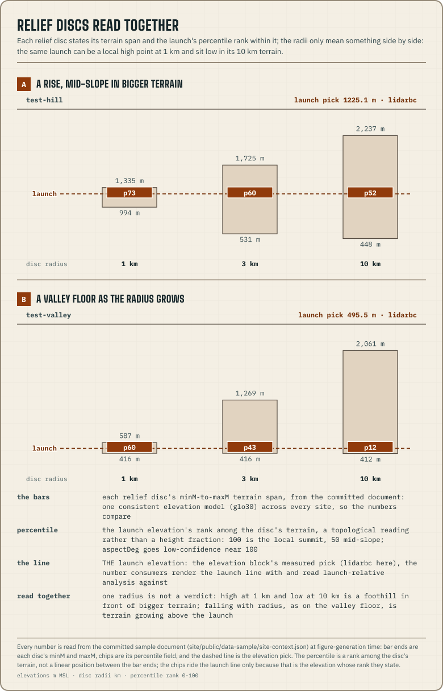

import { SITE_CONTEXT_SCHEMA_VERSION } from '@azohra/meteo.briefing/contract';

`site-context.json` is the third file at the catalogue root, next to
[`models.json`](/docs/briefing/catalogue/) and
[`sites.json`](/docs/forecast/configure-launches/). It records static ground
truth for each site, measured by machine from open elevation and land-cover
data, and it is committed like the catalogues it describes. Operators write
`sites.json` by hand; the forecast engine measures this file, and it is the
only published file of physical facts the engine measures.

The file describes what a launch physically is. A
[profile](/docs/briefing/profile-document/) can only say what one model
thinks the atmosphere above it will do.
[The mountain the model sees](/docs/forecast/the-mountain-the-model-sees/)
explains why these numbers matter to a pilot reading a Meteogram.

## On the wire

| Fact | Value |
| --- | --- |
| **Published at** | `site-context.json` at the dataset root, beside `sites.json` and `models.json` |
| **Parse** | `parseSiteContextJson` from [`@azohra/meteo.briefing/contract`](/docs/briefing/contract/) |
| **Zod authority** | `siteContextSchema`, pinning `SITE_CONTEXT_SCHEMA_VERSION` (<code>{SITE_CONTEXT_SCHEMA_VERSION}</code>) |
| **JSON Schema** | [`site-context.schema.json`](https://github.com/azohra/meteo/blob/main/briefing/schema/site-context.schema.json), the generated artifact for other languages |
| **Cadence** | None. The file has no runs; you regenerate it when the site catalogue changes, not on a schedule |

## Envelope and join semantics

```text
site-context.json
├── schemaVersion + generatedAt
├── sources[] { id, product, kind, resolutionM, licence, attribution, url }
└── sites { <site-slug> → entry }
    ├── point { latitude, longitude }
    ├── elevation { source, elevationM }
    ├── terrain { source, elevationM, slopeDeg, aspectDeg, relief[] }
    └── landCover { source, atLaunch, fractions[] }
```

Sites are identified by slug. Join `sites` to `sites.json` by slug; site
identity stays in the catalogue.

Each entry's `point` records where the measurement was taken. It is copied
verbatim from the catalogue when the file is generated, and it is not a
second copy of the site's identity. It also tests for staleness: if the
catalogue's coordinates have moved away from an entry's point, the context
needs regenerating. `meteo forecast terrain --check` answers this from the
published pair. Parsed v2 documents carry no `point`, and a measurement whose
point is unknown counts as stale. The timezone is not copied here; it stays in
the catalogue.

Every `source` field inside a site block names a `sources[]` entry. Each
`sources[]` entry carries the attribution statement its licence requires, so
the attribution travels with the data. A renderer that displays a source's
values also displays its attribution.

## The elevation block

This block holds the launch elevation. Consumers draw the launch line at this
height (`MeteogramOptions.launch`) and measure launch-relative analysis from
it. The engine selects a measurement; it does not compute one. It samples
ground observations at the catalogued coordinates and picks from them in a
fixed order of priority:

1. `lidarbc`, 1 m bare-earth lidar ground returns, where there is valid data
   at the point.
2. `mrdem30`, the national 30 m DTM, which covers all of Canada.
3. `glo30`, the surface model, which includes canopy. This is the last
   resort, and the terrain command warns on stderr when a site falls back to
   it, because a surface height over forest is not the ground.

`source` names the chosen `sources[]` entry, so the pick's resolution and
licence attribution are one lookup away. In the committed document,
`test-hill` and `test-valley` are covered by British Columbia's 1 m lidar
and read from LidarBC. No 1 m lidar covers `test-ridge`, so it reads from
MRDEM-30.

The document has only one elevation block, because the pick is already the
best bare-earth answer and a second would repeat it. The generator compares
the pick with `terrain.elevationM` and warns when they differ by more than
100 m. A gap that large suggests the coordinates land on different terrain in
different sources, which canopy alone would not explain.

## The terrain block

Terrain analysis uses **the same elevation model for every site**
(Copernicus GLO-30), so the numbers can be compared across the catalogue.

| Field | Meaning |
| --- | --- |
| `elevationM` | Terrain-model elevation at the launch point, in metres MSL, interpolated bilinearly. A surface model includes canopy, so compare this with the `elevation` pick before treating a small difference as an error. |
| `slopeDeg` | Terrain slope at the launch, in degrees (Horn 3×3 on the source grid). |
| `aspectDeg` | Compass bearing of the downslope direction, in degrees 0–359. It is low-confidence for launches near a summit (relief percentile near 100), where tiny elevation noise swings the bearing. |
| `relief[]` | Relief discs by increasing radius (1, 3, and 10 km here). Each gives the lowest (`minM`) and highest (`maxM`) terrain in the disc and the launch elevation's `percentile` rank within it. |

The percentile describes the launch's place in the landscape. 100 means the
launch is the local summit, and 50 means it sits mid-slope. Read the radii
together: a launch that ranks high at 1 km and low at 10 km is a foothill in
front of bigger terrain.



## The landCover block

This block describes what the ground around the launch is made of, which
shapes it as a thermal source. Forest holds heat back; clearcut, rock, and
grass release it; water kills it.

| Field | Meaning |
| --- | --- |
| `atLaunch` | The class of the single 10 m pixel under the launch point. One pixel is unreliable on its own, so read it with the 1 km fractions. |
| `fractions[]` | Composition discs by increasing radius. `byClass` maps each class to its fraction of the disc, from 0 to 1. |

The classes are the ESA WorldCover taxonomy, published as names instead of
numeric codes: 10 `treeCover`, 20 `shrubland`, 30 `grassland`, 40
`cropland`, 50 `builtUp`, 60 `bareSparse`, 70 `snowIce`, 80 `water`, 90
`wetland`, 95 `mangroves`, 100 `mossLichen`. A class missing from a disc is
left out of `byClass`, and here that absence means zero, because the
land-cover map covers every pixel. Everywhere else in the contract, a
missing value means "not published".

## Sources and licences — verified 2026-08-10

| Source id | Product | Kind | Resolution | Licence |
| --- | --- | --- | --- | --- |
| `glo30` | Copernicus GLO-30 DEM | surface model (DSM) | 30 m | Copernicus DEM licence |
| `lidarbc` | LidarBC bare-earth DEM | bare-earth model (DTM) | 1 m | OGL-BC |
| `mrdem30` | NRCan MRDEM DTM (CanElevation) | bare-earth model (DTM) | 30 m | OGL-Canada |
| `worldcover2021` | ESA WorldCover 2021 v200 | land cover | 10 m | CC-BY 4.0 |

These facts come from sampling the live feeds at the catalogued sites:

- **GLO-30 is a surface model.** It is radar-derived, includes canopy and
  buildings, and gives heights on EGM2008 [verified 2026-08-10]. In the
  committed document it lands within a few metres of the bare-earth pick over
  open ground (−0.5 m at `test-valley`, −2.3 m at alpine `test-ridge`) and
  12.4 m above it at forested `test-hill`, which is the canopy. Its 90 m
  sibling, GLO-90, smooths ridge-top launches and reads them too low, by up
  to 13 m at the founding catalogue's summit site [verified 2026-08-10].
  Weather-model terrain on 2.5–10 km grids smooths the same way, and more.
- **LidarBC** serves British Columbia's 1 m bare-earth lidar DTM from an
  anonymous object store under OGL-BC [verified 2026-08-10].
- **NRCan MRDEM-30** is the national 30 m DTM, on the CanElevation open
  bucket under OGL-Canada [verified 2026-08-10]. It covers all of Canada,
  which is why it is used here: it gives the bare-earth answer where no 1 m
  lidar project reaches.
- **ESA WorldCover 10 m 2021 v200** is CC-BY 4.0, with a global overall
  accuracy of 76.7% [verified 2026-08-10]. A single 10 m pixel's class is
  unreliable, so the disc fractions matter more than the class at the point.

Every licence above requires attribution, so the document carries each
source's required statement in `sources[].attribution`. A consumer that
displays the values displays the attribution, and needs nothing from this
page to do it.

## Generation and publication

The forecast engine's one-shot `meteo forecast terrain` command writes the
document. Its geospatial dependencies load only when this command runs, so
scheduled forecast builds do not carry them:

```sh title="Terminal"
pnpm exec meteo forecast terrain --sites ./sites.json --output ./site-context.json
```

One run reads the site catalogue, samples the four sources, and writes the
whole document. For the entire catalogue it fetches about 27 MB in under a
minute, all from anonymous stores with no credentials [verified 2026-08-10].
Commit the result next to your site catalogue, and have your upload publish
the two together at the dataset root, so the published context always
matches the published sites. Regenerate it when the site catalogue changes;
the [configure-launches guide](/docs/forecast/configure-launches/) includes
this in the steps for adding a site.

## The coverage lesson

NRCan's 1 m HRDEM was the obvious bare-earth candidate. When it was checked,
it covered only **one of the founding catalogue's four sites**, because its
lidar projects focus on valley corridors [verified 2026-08-10]. The STAC
search and bounding-box footprints suggested more. A launch inside a
project's declared footprint can still sit on nodata, so footprint
intersection overstates coverage; only sampling the pixel at the point proves
there is data. That is why the `elevation` pick reads from LidarBC where it
has valid data at the point and from MRDEM-30 where it does not.

## Reading caveats — verified 2026-08-10

- **Vertical datum.** The Canadian sources use CGVD2013 and Copernicus uses
  EGM2008. At these sites the two differ by decimetres, which is negligible
  next to DEM error, so the document does not convert between them.
- **Canopy.** GLO-30's surface heights include trees and buildings. Where a
  launch is next to forest, expect GLO-30 to read above the bare-earth value.
  That offset is the canopy.
- **Point pixels.** `test-valley`'s launch pixel reads `builtUp`, meaning
  built ground under the launch point, while its 1 km disc is nearly half
  grassland with forest behind. The fractions describe the site as a thermal
  source; the single pixel says little.
- **Aspect confidence.** Tiny elevation noise swings the downslope bearing
  wherever the ground barely falls away. At the founding catalogue's summit
  site, aspect differed by about 46° between GLO-30 and GLO-90 [verified
  2026-08-10]. In the committed document, `test-hill`'s slope is only 2.7°,
  so its 14° bearing is the one to distrust. Treat `aspectDeg` as
  low-confidence wherever the slope is slight or the 1 km percentile is near
  100.

## Consume it beside a profile

Fetch `site-context.json` from the dataset root on your own schedule, since
it has no cadence. Validate it when it enters your system, and join it by
slug. Next to a profile it does two things:

- **It supplies the launch elevation.** Profiles are not tied to a launch.
  The `elevation` pick is the measured launch elevation that a consumer
  passes at render time as `MeteogramOptions.launch`, and to
  `analyzeForecast` and `compareForecasts` as their `launch` option.
- **It shows the terrain gap.** Every profile publishes
  `site.modelElevationM`, the model's smoothed terrain. The context document
  adds the height the launch actually sits at.

```ts title="terrain-gap.ts"
import { parseSiteContextJson, parseSiteForecastJson } from "@azohra/meteo.briefing/contract";

export function modelTerrainGap(contextText: string, profileText: string): string {
  const context = parseSiteContextJson(contextText);
  const profile = parseSiteForecastJson(profileText);
  if (!context || !profile) throw new Error("unsupported document");

  const entry = context.sites[profile.site.id];
  if (!entry) return `${profile.site.id}: no published terrain context`;

  // The real mountain: the document's measured elevation pick.
  const mountainM = entry.elevation.elevationM;
  const gapM = profile.site.modelElevationM - mountainM;
  const direction = gapM < 0 ? "below" : "above";

  return (
    `${profile.site.name}: model terrain ${profile.site.modelElevationM} m sits ` +
    `${Math.abs(Math.round(gapM))} m ${direction} the real mountain (${mountainM} m)`
  );
}
```

The parse guards return the typed document or `null`, as described on the
[contract page](/docs/briefing/contract/). A consumer that renders any of the
document's values also renders the matching `sources[].attribution` string.
