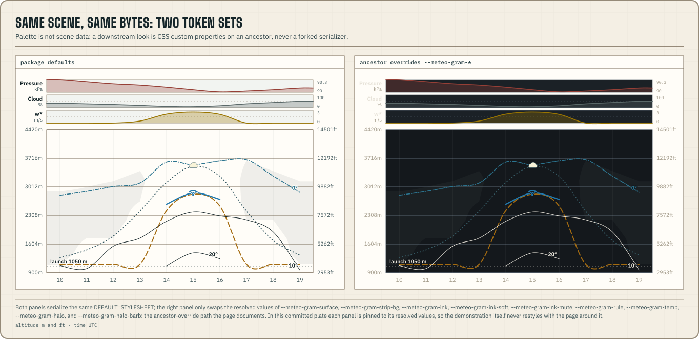

`renderMeteogramSvg(scene, options)` emits a complete SVG document with stable ordering
and two-decimal geometry, styled entirely by overridable `--meteo-gram-*` tokens:



```ts title="render-svg.ts"
import type { MeteogramScene } from "@azohra/meteo.briefing/meteogram";
import { renderMeteogramSvg } from "@azohra/meteo.briefing/meteogram";

export function renderClubSvg(scene: MeteogramScene): string {
  return renderMeteogramSvg(scene, { idPrefix: "club-main" });
}
```

Give each chart on an HTML page a unique `idPrefix`. The prefix namespaces
definitions such as cloud hatch patterns.

## Derive the key from the final scene

`buildKeySpec(scene)` reports only encodings that the scene actually drew. It
carries each keyed series' real class, dash, and stroke width; describes each
shaded field overlay as a `ramps` entry whose classes are the drawn patches'
own, in weak-to-strong reading order; includes the condensation hatch only
when dense cloud is visible; includes the stability ramp only when that field
is visible; and adds the p25–p75 note only when a drawn series has an
ensemble band. Lines that label themselves on the plot (the 10°/20°
isotherms, the Td isolines) stay out of the key by default — a consumer whose
look keys them anyway opts them in with
`selfLabeled: ["dewPointIsoline"]` and receives the real style facts instead
of restating dash and width. `renderKeySvg` serializes that spec with the
same package stylesheet:

```ts title="render-key.ts"
import type { MeteogramScene } from "@azohra/meteo.briefing/meteogram";
import { buildKeySpec, renderKeySvg } from "@azohra/meteo.briefing/meteogram";

export function renderClubKey(scene: MeteogramScene): string {
  return renderKeySvg(buildKeySpec(scene), { idPrefix: "club-main-key" });
}
```

Build the key from the final scene after every option or overlay change. An
all-layer key falsely labels a progressive or hidden-layer chart. Give each
key its own `idPrefix` to separate its hatch definition from every chart and
key on the page.

## Stylesheet choices

The default output embeds `DEFAULT_STYLESHEET`. Every colour fallback comes
from one of the exported maps:

- `TOKEN_DEFAULTS` for the renderer's general token surface;
- `STABILITY_TOKEN_DEFAULTS` for the eight-class stability ramp;
- `SERIES_TOKENS` for the key-entry id → token correspondence
  (`"meteo-gram-series-usable"` → `usable`) a legend or focus style needs — read it
  instead of parsing id strings; and
- `FIELD_STYLE_DEFAULTS` for each field-overlay class's fill token and
  opacity, the facts an HTML ramp chip needs.

Override tokens on an ancestor instead of forking the serializer:

```css title="club-overrides.css"
.club-meteogram {
  --meteo-gram-surface: #14181c;
  --meteo-gram-ink: #e8e4da;
  --meteo-gram-cape-watch: #b98a2d;
  --meteo-gram-temp: #d97706;
  --meteo-gram-text-hour-tick: 12px;
  --meteo-gram-halo-series: #14181c;
}
```

Pass `stylesheet: null` when the consumer will supply all class styling.
`DEFAULT_STYLESHEET` remains available as a reference, but copying individual
hex values into application code creates a second authority.

`TOKEN_DEFAULTS` defines a type-scale token for every serializer text role,
including strip scales, hour ticks, the surface-temperature row, and key
labels. The per-element `--meteo-gram-halo-series`, `--meteo-gram-halo-barb`,
`--meteo-gram-halo-marker`, and `--meteo-gram-halo-text` slots fall back to shared
`--meteo-gram-halo`; set one slot to `transparent` to remove that halo. Scalar strips
print their maximum and minimum at the right edge. The cloud-layer strip keeps
its H/M/L row tags.

The serializer fills sampled field bands with the SVG even-odd rule. Custom
renderers of `MeteogramScene.fields` must apply the same `fill-rule="evenodd"` to
preserve holes between interpolated contour thresholds.

## Deterministic SVG output

The same scene and options produce identical bytes, supporting static builds,
caching, reviewable golden diffs, and reproducible teaching figures. Ensemble
profile values remain percentile bands in the scene.

If an intentional renderer change alters a golden, follow the review sequence
in [Data and package versioning](/docs/briefing/versioning/). A new snapshot is not
evidence that labels, units, IDs, or accessibility stayed correct.
