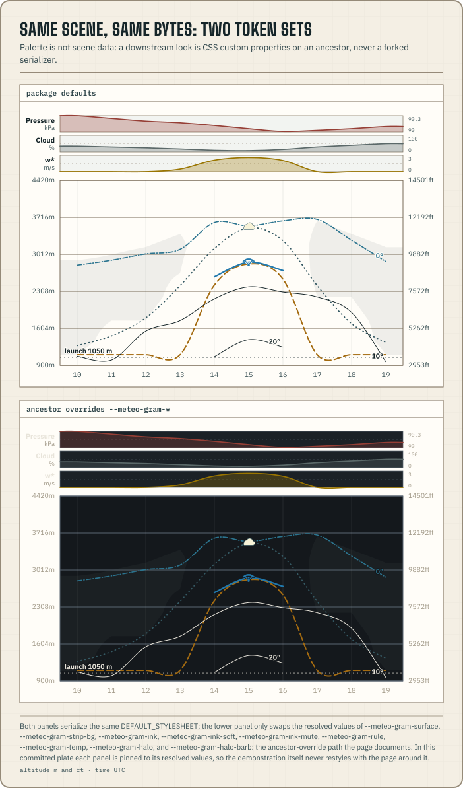
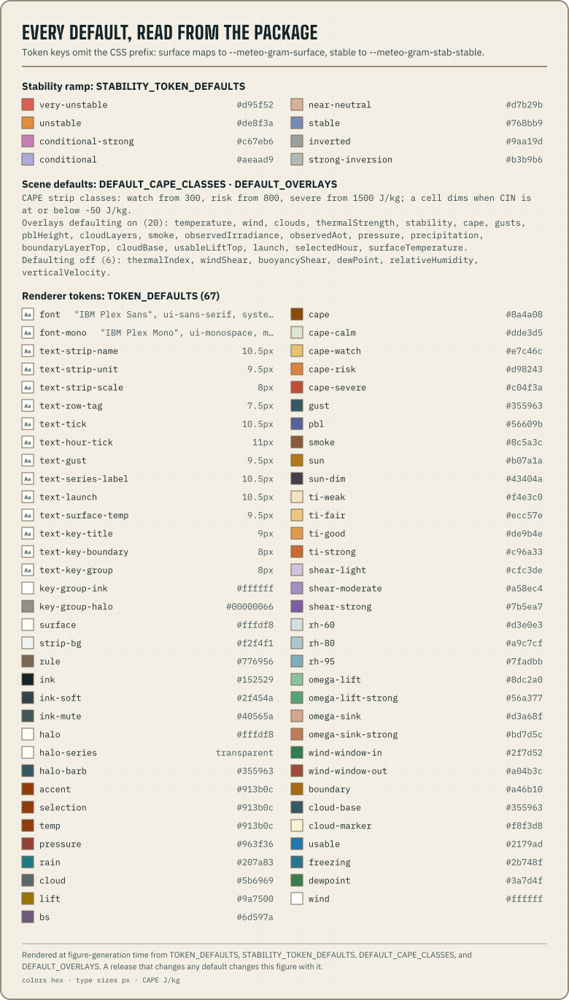

`renderMeteogramSvg(scene, options)` emits a complete SVG document with
stable ordering and two-decimal geometry. All of its styling comes from
`--meteo-gram-*` tokens, which you can override.



```ts title="render-svg.ts"
import type { MeteogramScene } from "@azohra/meteo.briefing/meteogram";
import { renderMeteogramSvg } from "@azohra/meteo.briefing/meteogram";

export function renderClubSvg(scene: MeteogramScene): string {
  return renderMeteogramSvg(scene, { idPrefix: "club-main" });
}
```

Give each chart on an HTML page a unique `idPrefix`. The prefix keeps
definitions such as cloud hatch patterns separate.

## Derive the key from the final scene

`buildKeySpec(scene)` reports only the encodings the scene actually drew:

- each keyed series, with its real class, dash, and stroke width;
- each shaded field overlay, as a `ramps` entry whose classes are the
  drawn patches' own, in weak-to-strong reading order;
- the condensation hatch, only when dense cloud is visible;
- the stability ramp, only when that field is visible;
- the p25–p75 note, only when a drawn series has an ensemble band; and
- the wind-window marker pair (filled triangle in, open circle out), only
  when the scene drew that row.

Lines that label themselves on the plot, such as the 10° and 20°
isotherms and the Td isolines, stay out of the key by default. A consumer
whose design keys them anyway adds them with
`selfLabeled: ["dewPointIsoline"]` and gets the real style facts, so it
does not have to restate dash and width. `renderKeySvg` serializes the
spec with the same package stylesheet:

```ts title="render-key.ts"
import type { MeteogramScene } from "@azohra/meteo.briefing/meteogram";
import { buildKeySpec, renderKeySvg } from "@azohra/meteo.briefing/meteogram";

export function renderClubKey(scene: MeteogramScene): string {
  return renderKeySvg(buildKeySpec(scene), { idPrefix: "club-main-key" });
}
```

Build the key from the final scene after every option or overlay change.
A key listing every layer mislabels a chart that reveals layers
progressively or hides some. Give each key its own `idPrefix` so its hatch
definition stays separate from every other chart and key on the page.

## Stylesheet choices

The default output embeds `DEFAULT_STYLESHEET`. Every colour fallback
comes from one of these exported maps:

- `TOKEN_DEFAULTS` for the renderer's general token surface;
- `STABILITY_TOKEN_DEFAULTS` for the eight-class stability ramp;
- `SERIES_TOKENS` for mapping a key-entry id to its token
  (`"meteo-gram-series-usable"` → `usable`), which a legend or focus style
  needs; read it instead of parsing id strings; and
- `FIELD_STYLE_DEFAULTS` for each field-overlay class's fill token and
  opacity, which an HTML ramp chip needs.

Token keys leave out the CSS prefix, so `surface` maps to
`--meteo-gram-surface` and `stable` maps to `--meteo-gram-stab-stable`.
Read the maps to build legends and swatches. To restyle the chart for your
own site, override the CSS custom properties on an ancestor.



The stability ramp has eight classes. In order they are `very-unstable`,
`unstable`, `conditional-strong`, `conditional`, `near-neutral`, `stable`,
`inverted`, and `strong-inversion`, and each is coloured by its
`--meteo-gram-stab-<name>` token. The figure reads its CAPE thresholds and
overlay defaults from the package exports `DEFAULT_CAPE_CLASSES` and
`DEFAULT_OVERLAYS`.

```ts title="stability-swatches.ts"
import { STABILITY_TOKEN_DEFAULTS } from "@azohra/meteo.briefing/meteogram";

export const stabilitySwatches = Object.entries(STABILITY_TOKEN_DEFAULTS).map(
  ([name, color]) => ({ name, color }),
);
```

The reference renderer keeps the stability field pale so that lines,
markers, labels, and white wind barbs stay in the foreground. The
[stability-ramp logbook entry](/logbook/stability-ramp/) records the
measured palette constraints.

To change the look, override tokens on an ancestor rather than forking
the serializer:

```css title="club-overrides.css"
.club-meteogram {
  --meteo-gram-surface: #14181c;
  --meteo-gram-ink: #e8e4da;
  --meteo-gram-cape-watch: #b98a2d;
  --meteo-gram-temp: #d97706;
  --meteo-gram-text-hour-tick: 12px;
  --meteo-gram-halo-series: #14181c;
}
```

Pass `stylesheet: null` when you will supply all the class styling
yourself. `DEFAULT_STYLESHEET` stays available as a reference, but copying
individual hex values into application code gives the colours a second
source that can drift.

`TOKEN_DEFAULTS` defines a type-size token for every text role in the
serializer, including strip scales, hour ticks, the surface-temperature
row, and key labels. The per-element halo tokens
`--meteo-gram-halo-series`, `--meteo-gram-halo-barb`,
`--meteo-gram-halo-marker`, and `--meteo-gram-halo-text` fall back to the
shared `--meteo-gram-halo`. Set one of them to `transparent` to remove that
halo. Scalar strips print their maximum and minimum at the right edge, and
the cloud-layer strip keeps its H/M/L row tags.

The serializer fills sampled field bands with the SVG even-odd rule. A
custom renderer of `MeteogramScene.fields` must use the same
`fill-rule="evenodd"` to keep the holes between interpolated contour
thresholds.

## Scene defaults

meteo by Azohra ships one reference look. Configure what the scene draws
through `MeteogramOptions`, and how it looks through the renderer's
`--meteo-gram-*` tokens. `DEFAULT_OVERLAYS` exposes the package's overlay
defaults for a control that has to list every layer. Leave out `overlays`
when the reference defaults are enough.

```ts title="build-reference-scene.ts"
import type { SiteForecast } from "@azohra/meteo.briefing/contract";
import { buildMeteogramScene, DEFAULT_OVERLAYS } from "@azohra/meteo.briefing/meteogram";

export function buildClubScene(profile: SiteForecast) {
  const timeZone = profile.site.timeZone;
  // Absence never implies UTC: an older document needs a caller-owned zone.
  if (!timeZone) throw new Error("older profile needs an explicit IANA timezone");
  return buildMeteogramScene(profile, {
    timeZone,
    smooth: false,
    overlays: {
      ...DEFAULT_OVERLAYS,
      thermalIndex: true,
    },
  });
}
```

Display windows, overlay choices, CAPE classes, sink rates, and local
colour overrides are the operator's choices. Pass them to
`buildMeteogramScene` or set them in your own stylesheet.

## Deterministic SVG output

The same scene and options always produce identical bytes. That makes
static builds, caching, reviewable golden diffs, and reproducible teaching
figures possible. Ensemble profile values stay percentile bands in the
scene.

If an intentional renderer change alters a golden file, the release tag
is the
[snapshot boundary](/docs/briefing/versioning/#release-tags-are-snapshot-boundaries).
A new snapshot does not show that labels, units, IDs, or accessibility
stayed correct.
