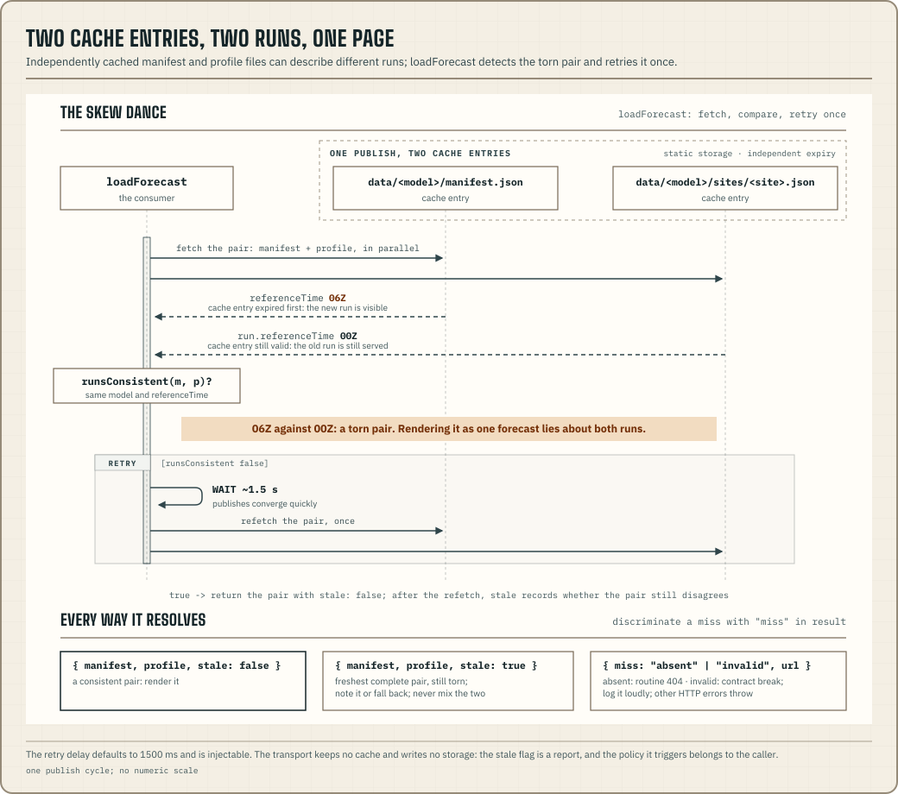

`@azohra/meteo.briefing/transport` fetches published documents and checks
that they belong together. A model's manifest and its site documents are
separately cached static files, so around a publish, a pair fetched together
can describe two different runs. This is a torn read. `loadForecast()` runs
the consistency check you would otherwise write by hand, and `loadSiteSet()`
runs it across a whole set of sites.



## Load a manifest/profile pair

```ts title="load-profile.ts"
import { loadForecast, type LoadedForecast } from "@azohra/meteo.briefing/transport";

export async function loadTestHill(): Promise<LoadedForecast | null> {
  const result = await loadForecast({
    fetch,
    baseUrl: "https://meteo.azohra.com/data-sample",
    modelSlug: "hrdps-continental",
    siteSlug: "test-hill",
  });

  if ("miss" in result) {
    // "absent" is routine: the model or site is not published here.
    if (result.miss === "invalid") console.error(`contract break at ${result.url}`);
    return null;
  }
  return result; // result.stale reports a pair still torn after the retry
}
```

`loadForecast` fetches both documents, validates each with its contract guard,
and compares them with `runsConsistent`. If they disagree, it waits and
refetches the pair once. The wait is 1500 ms by default and can be configured
or injected through `retry`. The call resolves to one of three shapes:

- `{ manifest, profile, stale: false }` is a consistent pair. Render it.
- `{ manifest, profile, stale: true }` is the freshest complete pair seen,
  still torn after the retry. A publish is in flight. Render it with a
  "still syncing" note, or fall back to a pair you cached earlier. Do not
  treat the two documents as one forecast.
- A `DocumentMiss` means there is nothing to render. Its `miss` field says
  why.

## Any run-stamped document

`loadForecast` is the profile-typed wrapper around `loadDocument`.
`loadDocument` runs the same check for any site document that carries the
run stamp, meaning `model` plus `run.referenceTime` (the exported
`RunStampedDocument` interface). Its `guard` parameter types the site
document (`parseSiteForecastJson`, `parseSmokeDocumentJson`, …). The
manifest side of the pair always uses the forecast-manifest guard, because
one manifest shape anchors every forecast document kind. `loadSmoke` is the
smoke-typed wrapper and behaves exactly as described above: the run check,
a single retry, an explicit `stale`, and discriminated misses.

## Load a site set as one publication

Two pairs can each be consistent and still come from two different runs. A
consumer ingesting many sites therefore needs a stronger anchor than pair
checks. `loadSiteSet({ fetch, baseUrl, modelSlug, siteSlugs, guard })`
fetches the model's manifest once as the commit point, then every site
document, and requires each document to carry that manifest's run. If a
publish is mid-way and the runs are mixed, it retries once, refetching the
manifest and only the documents that disagreed. The result discriminates on
`syncing`:

- `{ syncing: false, referenceTime, manifest, documents, misses }` is one
  coherent publication. Every document in `documents` (site slug to
  document) carries the manifest's run. Per-site misses are listed in
  `misses` and do not spoil the set. A coherent set may be the *previous*
  publication. A set that is entirely old counts as coherent, because it is
  the newest complete forecast there is.
- `{ syncing: true, runsSeen }` means the set still mixed runs after the
  retry. A publish is mid-flight, and `runsSeen` lists the distinct
  reference times seen. Ingest nothing; the next poll will read a coherent
  set.

A manifest miss returns that `DocumentMiss` directly. When the model
publishes nothing, there are no per-site results to report. The
store-and-serve loop built on this function is the
[ingest recipe](/docs/briefing/run-an-ingest/).

## Observations: one guarded fetch, no dance

`loadObservation({ fetch, baseUrl, modelSlug, siteSlug })` fetches one site's
observation document on its own, with no manifest and no retry option. There
is no pair to check, for three reasons:

- An observation document has no run. It is a self-contained rolling window
  of measured instants, identified by its own `observed` block. The
  observation manifest's `referenceTime` is the newest instant across *all*
  the dataset's sites (a maximum), so a manifest that disagrees with a
  document is normal for every site except the newest.
- The forecast-manifest guard cannot parse an observation manifest, so a
  pair check would report every load as invalid.
- The worst case is harmless and a retry would not help. The document is at
  most one internally consistent granule behind, timestamped by
  `observed.lastObservedAt`, and the next poll catches up. A retry cannot
  get past the CDN's cache anyway.

Misses report `absent` or `invalid` exactly as described below.

## `absent` is routine; `invalid` is loud

A `DocumentMiss` separates two situations that would otherwise both look like
"no chart":

| `miss` | Meaning | Treat it as |
| --- | --- | --- |
| `"absent"` | HTTP 404: the model or site is not published at this root | Routine; a site outside a model's domain reads this way |
| `"invalid"` | The document exists but failed its contract guard | Never routine. A contract break or prototype data; log the `url` loudly |

Test for a miss with `"miss" in result`. Any HTTP failure other than 404
throws `TransportHttpError`, which carries `status` and `url`, so it cannot
pass for absence. When both documents miss, the manifest's miss is returned,
because a model that publishes nothing is why its site documents are missing
too.

## Check freshness with `loadRuns`

`loadRuns({ fetch, baseUrl })` fetches `runs.json` from the data root. This is
the cross-model run index: each published model's current
`(referenceTime, generatedAt)`, keyed by slug. It is a single document, so it
cannot tear. The loader exists so run discovery reports misses the same way
`loadForecast` does. Judge its entries with
[`runFreshness`](/docs/briefing/derive/#judge-run-freshness) from
`@azohra/meteo.briefing/derive`. The catalogue supplies `runIntervalHours` and
`typicalPublicationLagHours`, and the caller supplies the boundaries between
current, delayed and stale.

The pair check is exported as a pure function too. `runsConsistent(manifest,
profile)` is true exactly when both documents name the same model and run.
Use it when documents reach you through your own storage instead of these
loaders.

## The tree's layout is exported

`documentPaths` is the published tree's path layout. It has
`manifest(model)`, `siteDocument(model, site)`, `history(model, site,
month)` and `historyIndex(model, site, month)`, plus the dataset-root
files `models()`, `sites()`, `siteContext()` and `runs()`. Each returns the
document's path relative to the root. Every URL these loaders fetch is
`${baseUrl}/${documentPaths...}`. The same keys address the tree where there
is no URL at all, as in the object-store case that
[Downstream access](/docs/forecast/static-output/#downstream-access)
describes.

## The caller owns fetch and storage

You pass `fetch` in as a parameter. Use the runtime's own WHATWG-shaped fetch
(browser, Node, workers, undici, or a test stub), which keeps this module
independent of any runtime. The only other subpath that fetches is
[`@azohra/meteo.briefing/history`](/docs/briefing/history/). It follows the
same conventions (injected fetch, discriminated misses, `TransportHttpError`
as the only throw) but runs server-side only, because its gzip reader needs
`node:zlib`. Every other subpath of the package does no I/O. The `station/*`
subpaths belong to a separate capability with its own
[client/server split](/docs/station/client-data/).

The transport does no caching and writes no storage, because no storage API
works across every runtime. Cache keys, quotas, invalidation and the policy
for a stale pair are up to you. The transport reports `stale`, and the caller
decides what to do about it.
`TransportResponse`, `TransportFetch`, `RetryOptions`,
`RunStampedDocument`, `LoadDocumentOptions`/`LoadedDocument`,
`LoadForecastOptions`/`LoadedForecast`, `LoadSmokeOptions`/`LoadedSmoke`,
`LoadObservationOptions`, `LoadSiteSetOptions`/`LoadedSiteSet`, and
`LoadRunsOptions` type these inputs and results.

[Publish static output](/docs/forecast/static-output/) covers the operator's
side: where these files come from and how they are deployed.
