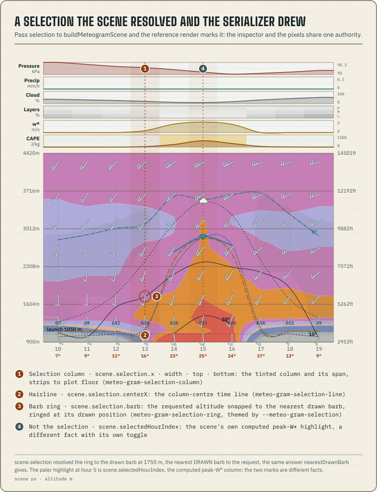
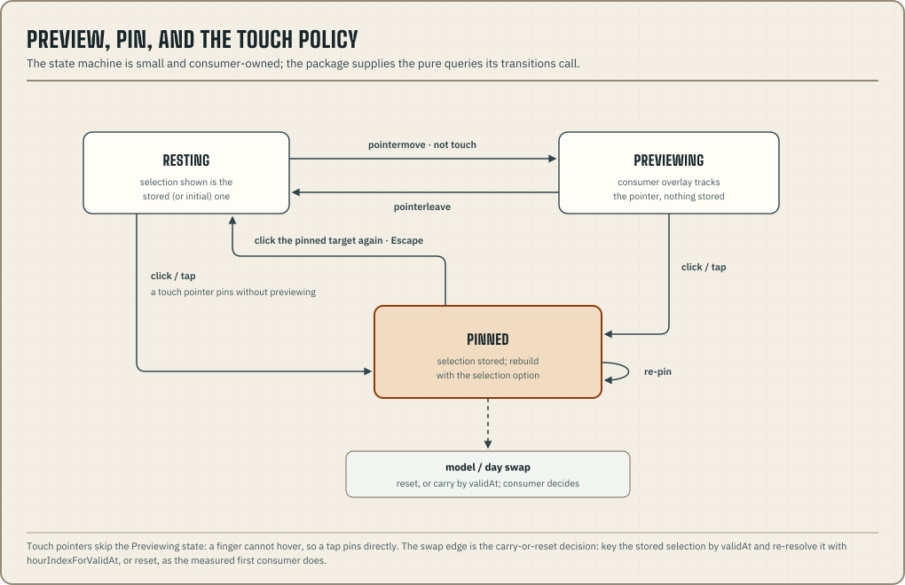

An inspector is the readout that follows the pointer, pins on a click,
and steps with the arrow keys. The package answers its geometry
questions as pure functions of the scene: which hour is under a pixel,
which drawn barb is nearest, and where an instant falls. The package
does not ship the state between events, such as preview versus pin, what
a touch does, and what survives a model switch. That state machine is
small, and it belongs to the consumer and its framework.

The first production consumer's inspector selects in two dimensions, is
never empty, and is driven from the keyboard. A second consumer's will
differ. This page wires one inspector from start to finish.



## From pointer to selection

Every consumer needs the same three steps. Convert client pixels into
scene coordinates, find the hour column, and snap to something that is
actually drawn. All three are package queries, so the whole resolver is
about a dozen lines and knows nothing about the renderer:

```ts title="selection-at-point.ts"
import type { MountRect, MeteogramScene } from "@azohra/meteo.briefing/meteogram";
import { clientPointToScene, hourIndexForX, nearestDrawnBarb } from "@azohra/meteo.briefing/meteogram";

/** Keyed by validAt, not index — see "Carry or reset" below. */
export interface InspectorSelection {
  validAt: string;
  altitudeM: number | null;
}

export function selectionAtPoint(
  scene: MeteogramScene,
  rect: MountRect,
  clientX: number,
  clientY: number,
): InspectorSelection | null {
  const point = clientPointToScene(scene, rect, clientX, clientY);
  if (point === null) return null; // zero-area rect: a hidden tab
  const hourIndex = hourIndexForX(scene, point.x, { clamp: true });
  if (hourIndex === null) return null; // empty scene
  const { plotTop, plotHeight } = scene.scales;
  const inPlot = point.y >= plotTop && point.y <= plotTop + plotHeight;
  const barb = inPlot ? nearestDrawnBarb(scene, hourIndex, point.y) : null;
  return {
    validAt: scene.hourValidAts[hourIndex],
    altitudeM: barb === null ? null : barb.altitudeM,
  };
}
```

Three decisions in that code matter. With `clamp`, the strips and
margins still select an hour, because a pointer over the pressure strip
is asking about that hour. The snap only goes to barbs that are drawn.
`nearestDrawnBarb` already accounts for the barb stride, the min-gap
thinning, and the surface row's raised position (`scales.surfaceWindY`),
so the selection ring always circles a glyph that exists. Above or below
the plot, the selection keeps only the hour and does not invent an
altitude.

For continuous readouts, such as temperature, wind, or lapse rate at the
exact cursor altitude, call `cursorReading(scene, point.x, point.y)` with
the same converted point. The interpolated reading and the snap answer
different questions, and inspectors usually want both.

## Preview, pin, touch



The machine has three states, with a rule for each transition. Hover
previews only for pointers that can hover. With `pointerType ===
"touch"` a tap goes straight to the pin, because a finger has to touch
the chart to point at it and should not also trigger a hover state.
Leaving the chart clears a preview but leaves a pin in place. Clicking
the pinned target again unpins, and clicking anywhere else moves the
pin. Escape unpins. As a reducer this is a handful of cases over
`{ selection, preview, pinned }`. It is small enough that writing your
own costs less than adapting a shipped one to your framework's
rendering model.

The worked example behind this page makes three more choices that a
second consumer might make differently. They are all consumer policy,
and none of them are scene facts:

- Its selection is never empty. It starts at the first hour at the
  site's altitude, so the inspector always reads a real place in the
  forecast.
- Unpinning requires clicking the same hour and the same level, so a
  click at a different altitude moves the pin instead.
- The arrow keys form a second input axis. Left and right step through
  hours, and up and down walk the drawn ladder from `drawnBarbsForHour`.
  The readout's `aria-live` is enabled only while pinned, so hover
  motion doesn't flood a screen reader.

## Render the pin through the scene

A pinned selection is worth a rebuild. Pass it as the `selection` option,
and the reference serializer draws the column, hairline, and barb ring
from the same scales as everything else. The figure above is that
output. The pixels and the readout always agree, and one token
(`--meteo-gram-selection`) rethemes the marks.

```ts title="render-pinned.ts"
import type { SiteForecast } from "@azohra/meteo.briefing/contract";
import { buildMeteogramScene, renderMeteogramSvg } from "@azohra/meteo.briefing/meteogram";

export function renderPinned(
  profile: SiteForecast,
  timeZone: string,
  selection: { hourIndex: number; altitudeM?: number | null },
): string {
  const scene = buildMeteogramScene(profile, { timeZone, selection });
  return renderMeteogramSvg(scene, { idPrefix: "club-main" });
}
```

Pins change on clicks and key presses, so rebuilding on each one is
cheap. Hover previews fire on every pointer event. If a rebuild per move
measures too slow on your target hardware, draw the preview as your own
overlay and keep the scene option for the pin. Position the overlay with
`resolveSelection(scene, { hourIndex, altitudeM })`, the same function
`buildMeteogramScene` runs for its `selection` option, so the preview and
the drawn pin resolve through one implementation.

## Carry or reset across a swap

Hour windows renumber. The same afternoon hour can be index 9 in one
model's window and index 3 in another's, so a pin keyed by index moves
without warning when the consumer switches models or days. Key stored
selections by `validAt` and resolve them again against each newly built
scene:

```ts title="carry-selection.ts"
import type { MeteogramScene } from "@azohra/meteo.briefing/meteogram";
import { hourIndexForValidAt } from "@azohra/meteo.briefing/meteogram";

export function carrySelection(
  scene: MeteogramScene,
  stored: { validAt: string; altitudeM: number | null },
): { hourIndex: number; altitudeM: number | null } | null {
  const hourIndex = hourIndexForValidAt(scene, stored.validAt);
  if (hourIndex === null) return null; // the hour left the window
  return { hourIndex, altitudeM: stored.altitudeM };
}
```

Whether to carry the pin at all is a product decision, not a matter of
correctness. The worked example resets its pin on every model and day switch
and carries only the overlay toggles. A pilot who turned on the thermal
index is asking a question about the day, and that should survive the
switch, while a pin on 2 p.m. may not need to. If you do carry, carry by
`validAt` as above, and decide what a `null` result means for your
inspector: fall back to the initial selection, or to the nearest
rendered hour.

## Time cursors

Some marks fall between columns, such as a "now" line or sunrise and
sunset ticks. `xForTime(scene, instant)` interpolates between hour
centres and returns null outside the rendered window.
`xForTime(scene, instant, { clamp: true })` pins the result to the frame
edge instead, which suits a shading band that starts before the window.
For anything that names a whole column, use `xForHour`. The sunrise and
sunset instants come from
[`solarEventsForDate`](/docs/briefing/derive/#sunrise-and-sunset), given
the day's date key and the site's coordinates.
