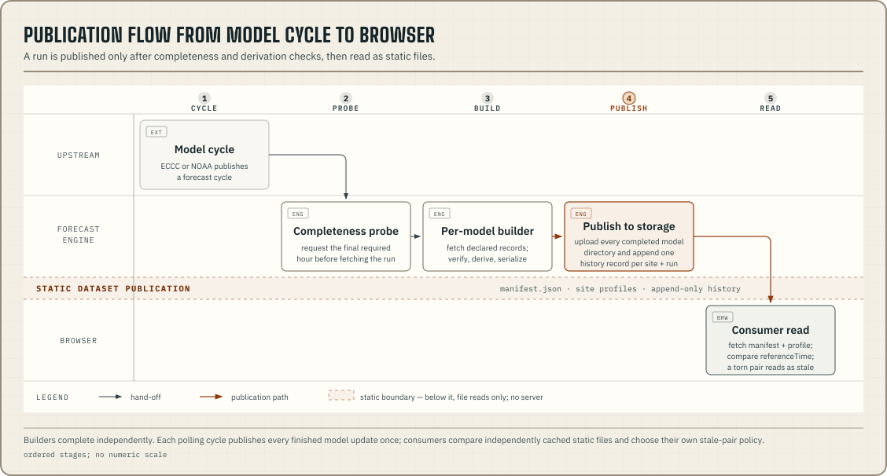
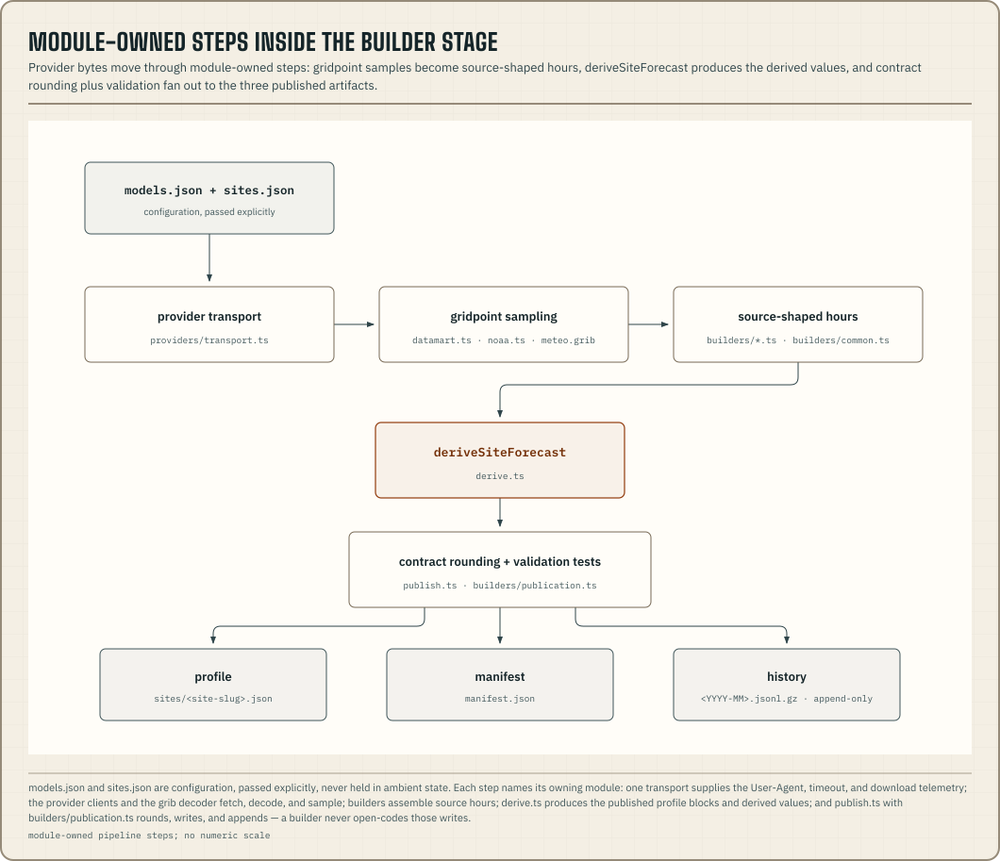

The supported interface of `@azohra/meteo.forecast` is the `meteo` CLI
(`pnpm exec meteo`, or `node forecast/dist/cli.js` from a workspace checkout)
and the versioned documents it writes.

Inside the builder stage, each step belongs to one module.

## Responsibility by module

| Area | Repository home | Responsibility |
| --- | --- | --- |
| CLI and scoped paths | `forecast/src/cli.ts`, `forecast/src/config.ts` | Select model(s), validate site and output paths, cap forecast steps (`--max-steps` caps every model, GOES granules included), and dispatch safely. Configuration is passed explicitly and is not held in ambient state |
| Site catalogue | `sites.ts` | Load the versioned, identity-only site envelope and reject shapes the loader does not speak |
| Provider transport plumbing | `providers/transport.ts` | One User-Agent, one request timeout, and the download telemetry that manifests publish |
| Provider clients | `providers/datamart.ts`, `providers/noaa.ts`, and the workspace's `@azohra/meteo.grib` decoder | Fetch, range-read, decode, sample, and account for transport work |
| Published-dataset reads | `dataset.ts` | Read what is already published (public HTTPS via `METEO_DATA_BASE`, or the bucket directly when upload credentials are present) to gate rebuilds and seed history |
| Builder registry | `builders/registry.ts` | Maps each catalogued model slug to an options-only build entry, in exact model-catalogue order. Each factory imports its builder module (dynamic `import()`) only when a build runs |
| Builder helpers | `builders/common.ts` | The code every build uses the same way: forecast-slot timestamps, the bounded fetch pool, and source-hour and level skeletons |
| Builders | `builders/*.ts` | Verify run completeness, request declared fields, preserve absence, and assemble source hours |
| Shared field science | `sentinel.ts`, and the moisture functions imported from `@azohra/meteo.briefing/derive` | Inverse-Magnus dew-point depression for models that publish only RH, and masking of ECCC's "not computed" CAPE/CIN sentinels |
| Derivation | `derive.ts` | Produce published profile blocks and model-dependent derived values. The usable-lift derivation is imported from `@azohra/meteo.briefing/derive` and stored at the 1 m/s sink |
| Ensemble aggregation | `ensemble.ts` | Aggregate member profiles, including circular wind and censored counts |
| Publication | `publish.ts` | Round contract fields, write JSON, append gzip history, and build the run index |
| History mechanics | `history.ts` | Split gzip members and recompute each month's [sidecar byte-offset index](/docs/briefing/history-archives/#the-sidecar-index) after every append |
| Site context | `terrain.ts` | One-shot `site-context.json` enrichment (elevation, slope/aspect, relief, land cover). The geospatial stack loads only when the `terrain` command runs |
| Teaching scenarios | `scenario/` | Generate fixed inputs through the same derivation authority. This is source-checkout tooling and is not part of the engine surface |

## Authority boundary

The [project overview](/docs/#who-owns-each-value) defines which quantities
the forecast engine owns and which belong to `@azohra/meteo.briefing`,
including the one parameterized exception. The
[Meteogram derivations](/docs/forecast/derivation-science/) define the
engine's equations, constants, fallbacks, and renderer-only transformations.

The [builder contract](/docs/forecast/builder-contract/) defines the required
inputs, validation, and publication behaviour for model modules.
