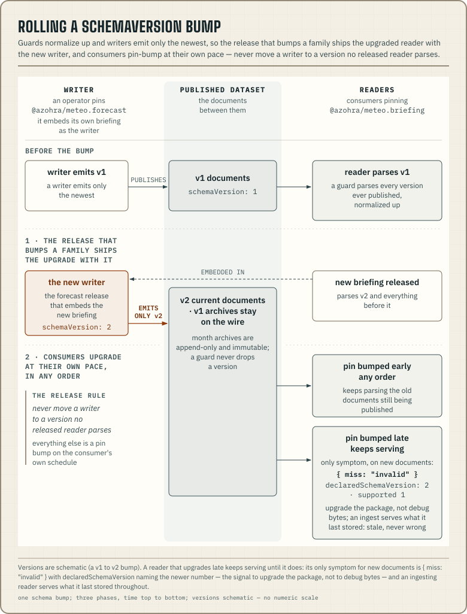

import { Aside } from '../../../components/docs/starlight';
import {
  MANIFEST_SCHEMA_VERSION,
  MODEL_CATALOGUE_SCHEMA_VERSION,
  OBSERVATION_SCHEMA_VERSION,
  RUNS_INDEX_SCHEMA_VERSION,
  SITE_CONTEXT_SCHEMA_VERSION,
  SITE_FORECAST_SCHEMA_VERSION,
  SITES_SCHEMA_VERSION,
  SMOKE_SCHEMA_VERSION,
} from '@azohra/meteo.briefing/contract';
import { BRIEFING_PACKAGE_VERSION } from '../../../components/docs/package-info';

Published documents and npm packages version independently. One rule
covers every reader. A document names its family with `schemaVersion`,
and the package you installed is the exact compatibility test. Parse the
document with the package you chose and let the parser answer.

<Aside type="caution" title="Do not compare the numbers">
  An npm `0.x` release does not mean schema `0.x`, and the package
  version never names the schema.
</Aside>

## Document families

Every family pins its own exported constant, so a breaking change to one
family does not invalidate readers of another.

| Documents | Current `schemaVersion` | Constant (all in the zod contract, `briefing/src/contract.ts`) |
| --- | ---: | --- |
| Site-forecast and history | <code>{SITE_FORECAST_SCHEMA_VERSION}</code> | `SITE_FORECAST_SCHEMA_VERSION` |
| Manifests (forecast and observation) | <code>{MANIFEST_SCHEMA_VERSION}</code> | `MANIFEST_SCHEMA_VERSION` |
| Model catalogue | <code>{MODEL_CATALOGUE_SCHEMA_VERSION}</code> | `MODEL_CATALOGUE_SCHEMA_VERSION` |
| Run index | <code>{RUNS_INDEX_SCHEMA_VERSION}</code> | `RUNS_INDEX_SCHEMA_VERSION` |
| Smoke documents | <code>{SMOKE_SCHEMA_VERSION}</code> | `SMOKE_SCHEMA_VERSION` |
| Observation documents | <code>{OBSERVATION_SCHEMA_VERSION}</code> | `OBSERVATION_SCHEMA_VERSION` |
| Site catalogue and site context | <code>{SITES_SCHEMA_VERSION}</code>, <code>{SITE_CONTEXT_SCHEMA_VERSION}</code> | `SITES_SCHEMA_VERSION`, `SITE_CONTEXT_SCHEMA_VERSION` |

The generated JSON Schemas under each package's `schema/` directory
describe the inputs the released package accepts; the zod schemas and
their parse guards are the behavioural authority.

These rules hold across every family:

- Adding an optional field, enum-independent metadata, or a new model
  catalogue entry is not a schema break.
- An absent optional declared-capability field means the value is not
  published. It does not mean zero.
- Changing a stored field's unit or meaning, removing or renaming a stored
  field, or making an optional field required changes the `schemaVersion`.
- Readers parse every version a family has ever published, normalize old
  documents up to the newest shape, and reject only a `schemaVersion` newer
  than the package. A guard does not drop support for a version,
  because month archives are append-only and immutable, so documents of
  every past version stay on the wire forever.
- Model identity is an open slug from `models.json`. It is not a package
  enum.
- Stored documents keep their own run, site, and semantics. Later catalogue
  values do not reinterpret them.

Validate with the raw-text guards at every storage or network boundary. The
[contract guide](/docs/briefing/contract/) has the worked example. Do not
patch a rejected document in presentation code. Upgrade the writer or choose
a compatible package before validation.

## Rolling a schemaVersion bump across a deployment

A deployment has three moving parts: readers pinning
`@azohra/meteo.briefing`, an operator pinning `@azohra/meteo.forecast`
(which embeds its own briefing as the writer), and the published dataset
between them. Guards normalize up. A package parses every version its
family has ever published and returns the newest shape, while writers emit
only the newest. The bump itself therefore sets the order of the rollout.

1. The release that bumps a family ships the upgrade with it. The new
   briefing parses the new version and everything before it, and the
   forecast release that embeds it is the new writer.
2. Consumers upgrade at their own pace, in any order. A reader that
   upgrades early keeps parsing the old documents still being published.
   A reader that upgrades late keeps serving until it upgrades. Its only
   symptom for new documents is `{ miss: "invalid" }` with
   `declaredSchemaVersion` naming the newer number. That result is the
   signal to upgrade the package rather than debug the bytes. An
   [ingesting reader](/docs/briefing/run-an-ingest/) serves what it last
   stored the whole time, so its data can be stale but is never wrong.

One release rule remains. Do not move a writer to a version that no
released reader parses. Everything else is a pin bump on the consumer's
own schedule.

## The forecast engine's boundary

The engine is the `@azohra/meteo.forecast` package, versioned and
released like every other platform package. Its supported boundary is
the documents it publishes and the documented CLI invocations
(`pnpm exec meteo forecast ...`). Internal modules are not a promised
API. A scientific change to a derived value that leaves the JSON shape
untouched is a package release; a change to a stored field's unit, null
meaning, or shape follows the document rules above.

## Publication identity

A published run is identified by the pair
`(run.referenceTime, run.generatedAt)`. A later `generatedAt` for the
same `referenceTime` is a corrected re-publication that consumers should
re-ingest; it is not a schema or package release. `runs.json` at the
data root is regenerated from manifests and exposes those pairs across
the published models.

Forecast archives contain the complete profile document as it was
published. They do not inherit later catalogue or package metadata.

[The briefing package's versioning page](/docs/briefing/versioning/)
covers package-level versioning, meaning npm semver intent and the finding
vocabularies. The read side is currently npm
<code>{BRIEFING_PACKAGE_VERSION}</code>.
