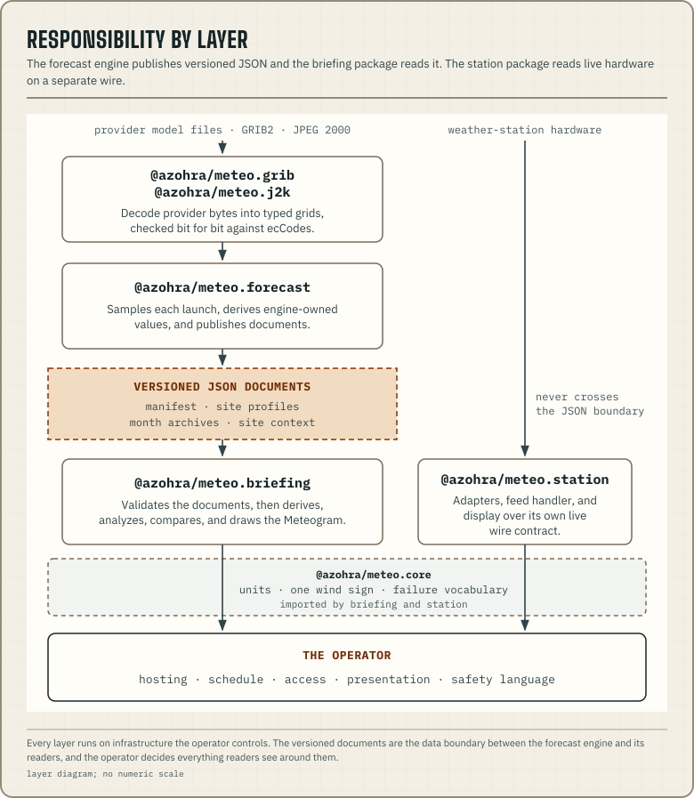

import QuantityHomes from "../../../components/about/QuantityHomes.astro";

meteo by Azohra publishes soaring forecasts for a flying community. The
forecast engine builds versioned JSON documents for the launches you list,
and the TypeScript packages validate those documents and draw the charts.
You can run every part on infrastructure you control.

## Where to begin

Pick the path that matches what you want to do:

- **Publish forecasts for your launches.** Start at
  [Configure launches](/docs/forecast/configure-launches/).
- **Read published forecasts in TypeScript.** Start at
  [Render a first Meteogram](/docs/briefing/render-first-meteogram/).
- **Show live wind from a weather station.** Start at
  [Station getting started](/docs/station/getting-started/).

Each package's section in the sidebar begins with an overview and its
install command. The rest of this page shows how the packages fit together.

## The responsibility boundary

| Layer | What it handles | What it produces |
| --- | --- | --- |
| [`@azohra/meteo.grib`](/docs/grib/) and [`@azohra/meteo.j2k`](/docs/j2k/) | Provider files: GRIB2 sections, grids, and packing, and the JPEG 2000 images inside ECCC messages | Decoded grids that match ecCodes bit for bit |
| [`@azohra/meteo.forecast`](/docs/forecast/) | Fetching provider data, sampling each model at each site, and computing values that need raw model inputs or several runs | The values in each published profile |
| Versioned JSON documents | Model, site, time, semantics, source fields, and derived values in a portable form | The boundary between whoever publishes and whoever reads. [Compatibility](/docs/compatibility/) explains how to read across versions |
| [`@azohra/meteo.briefing`](/docs/briefing/) | Contract validation, pure derivations from a document, scene construction, hit-testing, and reference SVG | Analysis and chart building blocks |
| [`@azohra/meteo.station`](/docs/station/) | Reading, deriving, and displaying live station data, with client, server, React, and custom-element bindings | Live station feeds and components |
| [`@azohra/meteo.core`](/docs/core/) | Units, angle and wind-vector math with one sign convention, zod primitives, and the upstream-failure vocabulary | Shared types and helpers for briefing and station |
| The [operator](/docs/glossary/#operator) | Choosing locations, schedule, hosting, retention, presentation, access, verification, and safety language | The publication their audience sees |

The project ships the engine. Each operator runs their own copy of it in a
pipeline they control ([engine and instance](/docs/forecast/#engine-not-instance)).

## Who owns each value

The forecast engine computes the **stored derivations**. These are values a
reader can't recompute from the published profile, such as the
boundary-layer top, thermal velocity, cloud base, and usable-lift series.
The briefing package computes the **pure derivations**, which depend only on
the published document, and provides the reference renderer. The reader
chooses presentation settings: timezone, time windows, palette, overlays,
and the sink rate the renderer uses.

`usableLiftTopM` is the one value on both sides. The calculation lives in
the briefing package as a pure function. The engine imports that function
and stores its result for a 1.0 m/s sink rate as the published value. A
reader who wants another sink rate runs the same code that produced the
stored series.

<QuantityHomes />

The model catalogue declares what each model can publish and what its
provider values mean. The
[model-capabilities guide](/docs/forecast/model-capabilities/) explains how
readers should display those declarations.

The chart at the end of the pipeline is the **Meteogram**. It lines up
surface forcing with the atmosphere above one model grid cell.
[Reading a Meteogram](/docs/briefing/reading-a-meteogram/) explains every
mark on it. The [glossary](/docs/glossary/) defines the project's other
terms, and the [logbook](/logbook/) records how the derivations and visual
conventions were worked out. The [about page](/about/) covers where the
project came from.
