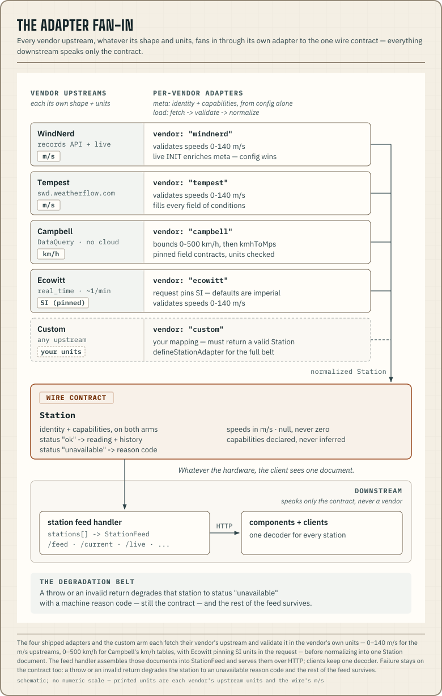

An adapter turns one vendor's station hardware into wire documents. It is
two functions. `meta` declares the station's identity and capabilities from
config alone. `load` fetches the vendor's upstream, validates it in the
vendor's own units, and normalizes it into the shapes specified in
[the wire contract](/docs/station/wire-contract/). The client sees the same
document whatever the hardware.



## The shipped adapters

Four vendors are built in. Each has a reference page covering its config
fields, capabilities, endpoint, and the quirks the adapter guards. Every
vendor page ends with the same Setup block, which is the
[getting-started](/docs/station/getting-started/) mount with a one-entry
`stations` array. Only the config entry differs from page to page.

| Vendor | Hardware |
|---|---|
| [WindNerd](/docs/station/adapters/windnerd/) | windnerd.net wind stations |
| [Tempest](/docs/station/adapters/tempest/) | WeatherFlow Tempest |
| [Campbell](/docs/station/adapters/campbell/) | Campbell Scientific loggers |
| [Ecowitt](/docs/station/adapters/ecowitt/) | Ecowitt arrays behind a gateway (WS90 Wittboy and siblings) |

[What your hardware shows](/docs/station/what-your-hardware-shows/) maps
what each vendor declares, and what each declaration turns on (chart,
stream, matrix column), surface by surface.

Any other hardware plugs in as a custom adapter, described below.

## The custom arm

The rest of this page is for writing your own adapter. If your vendor is in
the table above, its page has everything you need.

The derivations the built-in vendors use to fill the wire are public, so a
custom adapter can produce the same physics. `pressureTendency` computes the
trend code from recent history, and `seaLevelPressureHpa` reduces station
pressure to sea level. Both are exported from `@azohra/meteo.station`. If
you skip them, your stations disagree with every other vendor's.

A station without a built-in vendor plugs in as `vendor: "custom"`.

<!-- meteo-doc-fence: ignore — toStation is the reader's own mapping; the fence shows the loader's shape -->
```ts
const stations = [{
  vendor: "custom", id: "ridge", name: "Ridge Sensor",
  latitude: 49.5, longitude: -117.5, timeZone: "America/Vancouver",
  async load({ environment, historyHours, mode, station }) {
    // `station` is the parsed identity from this very config entry (id, name,
    // position, zone, pageUrl — nullish claims normalized to null), so meta
    // never re-declares the fields written three lines up.
    const body = await environment.fetch("https://acme.example/latest");
    return toStation(station, await body.json()); // your mapping; must return a valid Station
  },
}];
```

The returned document is validated against the wire schema. An invalid
return degrades that station to `unavailable` with reason `contract_break`,
and the rest of the feed still loads. A loader that throws degrades through
the same reason mapping the built-in adapters use. A thrown
`UpstreamError("…", "timeout")` surfaces as `timeout`, and a network
`TypeError` surfaces as `upstream_error`. `contract_break` is reserved for
invalid returned documents and unclassified throws.

## The plugin-factory pattern

A third-party vendor package ships the same thing as a plugin factory. That
is a function that closes over vendor options and returns a config entry.

<!-- meteo-doc-fence: ignore — a vendor-package sketch; toStation is the vendor's own mapping -->
```ts
// @acme/meteo-acmewind
import { emptyConditions, unavailableStation } from "@azohra/meteo.station";
import { fetchUpstreamText, type StationConfigInput } from "@azohra/meteo.station/server";

export function acmeStation(options: {
  id: string; name: string; deviceUrl: string; apiKey: string;
}): StationConfigInput {
  return {
    vendor: "custom", id: options.id, name: options.name,
    async load({ environment, historyHours, mode, station }) {
      const text = await fetchUpstreamText(environment, {
        url: `${options.deviceUrl}/latest`,
        headers: { Authorization: `Bearer ${options.apiKey}` },
        cacheKey: `acmewind/${options.deviceUrl}`, // names the upstream, not the key
        cacheTtlSeconds: 30,
        subject: `AcmeWind ${options.deviceUrl}`,
      });
      return toStation(station, JSON.parse(text)); // the vendor package's own mapping
    },
  };
}

// host app:
// stations: [acmeStation({ id: "ridge", name: "Ridge Sensor", deviceUrl: "…", apiKey: "…" })]
```

## defineStationAdapter

A vendor package that wants the same handling as the built-in adapters
builds its loader with `defineStationAdapter({ meta, load })` from
`@azohra/meteo.station/server`. It handles environment resolution, meta
assembly, the try/catch that degrades failures, failure logging, reason
mapping, and `mode: "current"` slimming. The adapter body only parses and
maps. Its `load` can throw freely, and the wrapper degrades the station.

## The rulebook

These rules apply to what an adapter returns, however it is built.

- An upstream failure degrades the station to `unavailable` with a reason.
  The adapter does not resolve a healthy-looking document for it. Anything
  thrown is degraded this way automatically.
- Capabilities are declared from what the hardware carries. They are not
  inferred from the data that happened to arrive.
- A calm reading (below the WMO threshold) carries no direction. The speed
  still travels.
- Plausibility bounds live in the adapter, in the vendor's units: 0–500 km/h
  for km/h upstreams and 0–140 m/s for m/s ones. Checked there, a faulty
  instrument costs one station. The contract only validates shape.
- Cache keys name the upstream identity (vendor plus endpoint or station).
  They do not use a host-chosen label.
- `mode: "current"` returns history as `null` with meta intact. It uses the
  same decoder and produces a lighter document.

For a station with one or two conditions-class sensors, start from
`emptyConditions()` in `@azohra/meteo.station`. Spread the measured fields
over it, and every absent quantity stays null rather than zero.

## Environment injection

Adapters reach the outside world only through an injected environment,
`{ fetch, cache, logger, userAgent, now }`. Upstream documents go through
`fetchUpstreamText`. It enforces a 4-second timeout and a 512 KiB response
cap, and maps HTTP 429 to `rate_limited`. Upstream streams go through
`fetchUpstreamStream`, whose deadline covers only the connect. Headers must
arrive within 10 seconds. After that, the open body is governed by the
caller's `signal` and an idle watchdog, and there is no whole-response
timeout. It uses the same failure mapping. Streams are not cached, so every
caller owns its own connection.

- `cache` takes a `FeedCache`. Provide one backed by KV or Redis when your
  platform runs multiple isolates, so they share one upstream poll instead
  of each keeping a private memory cache. On Cloudflare Workers,
  `workersCache()` provides that shared cache over the ambient
  `caches.default`. Off-platform it returns `undefined`, so
  `cache: workersCache()` falls back to the memory default.
- `logger` defaults to writing degradations to the console (`warn` and
  `error`). Inject your own to route them, or a no-op to silence them.
  Every `LogEvent` carries a stable `code` (`"upstream_failure"`,
  `"config_invalid"`, `"clock_skew"`, …). Match alerting on the code
  rather than the prose `message`.
- `userAgent` overrides the default
  `azohra-meteo/0.1 (+https://meteo.azohra.com)`.
- `now` is an injectable clock for tests and replay.

## The cache trust model

The shared default cache is a trust boundary. When no cache is injected,
every handler and bare adapter call in the process shares one bounded
in-memory cache, and concurrent misses on a key coalesce into a single
upstream hit. Cache keys name the upstream (vendor plus endpoint or station
identity). They leave out credentials and host-chosen labels.
[Tempest keys exclude the token](/docs/station/adapters/tempest/#endpoint-and-the-token-free-cache-key),
so a config with a wrong token can be served a payload that another
config's valid token put in the cache. Payloads are per station rather than
per credential, so that sharing is correct. It does mean the default cache
trusts every tenant in the process. A multi-tenant host whose tenants must
not share payloads, or must re-prove credentials per request, should inject
a cache per tenant.

## Polling etiquette

Every response advertises `recommendedPollSeconds` per station, derived
from upstream cache TTLs. Polling faster than those TTLs returns the same
cached payload. Upstreams that are not official APIs get extra care.
Validate every value, degrade to `unavailable` on any contract break
rather than guessing, and send a User-Agent that names the project.
[WindNerd's endpoints](/docs/station/adapters/windnerd/#endpoints) are
the shipped example.
