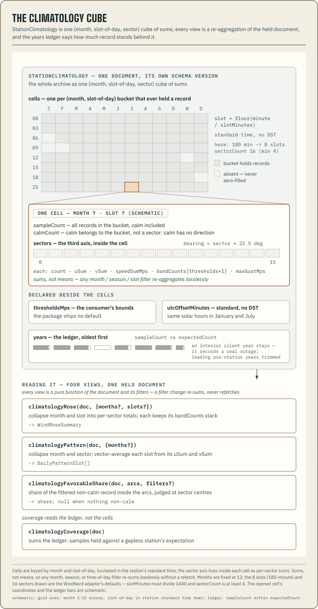

The climatology document condenses a station's whole archive into one cube
that a client slices by month, season, or time of day without refetching.
The live feed tells you what the wind is doing now, and the climatology
document tells you what the spot is like.



## The document

`StationClimatology` is its own document family with its own
`STATION_CLIMATOLOGY_SCHEMA_VERSION`. History is near-immutable and has a
different lifetime and cadence than the feed, so it is versioned
separately. The core of the document is `cells`, with one entry for each
**(month, slot-of-day)** bucket that ever held a record. An empty bucket is
absent and is never zero-filled. Each cell carries `calmCount`, because
calm has no direction and so belongs to the bucket. Each cell also carries
per-sector sums: `count`, `uSum`/`vSum` (core's wind sign), `speedSumMps`,
`bandCounts`, and `maxGustMps`. The cells store sums instead of means, so
any filter re-aggregates losslessly.

Three declarations sit beside the cells.

- `thresholdsMps` holds the consumer's speed-band bounds that the cube was
  binned with. They are the bounds behind every `bandCounts` stack. The
  package ships no default.
- `utcOffsetMinutes` is the station's standard offset (no DST) used for
  bucketing, so a slot means the same solar hours in January and July.
- `years` is the coverage ledger. For each calendar year it gives
  `sampleCount` against the `expectedCount` that a gapless station would
  have produced. Leading years that predate the station are trimmed. A
  silent year in the middle stays, because it records a real outage.

## Building it

The WindNerd adapter builds the cube the way the vendor's own views do. It
makes one records request per calendar year at the 180-minute period. It
caches closed years for about 30 days and the running year for 6 hours. If
the upstream refuses any year, the whole document fails, because a silently
missing year would read as an outage. The yearly fetches are cached as raw
records, so one shared cache serves every consumer regardless of
thresholds. The fold itself is cheap and runs per request.

```ts
import { loadStationClimatology } from "@azohra/meteo.station/server";
import type { StationConfigInput } from "@azohra/meteo.station/server";

// A fictional station — substitute your own identifiers.
const stations: StationConfigInput[] = [
  { vendor: "windnerd", id: "launch", name: "Bluff Launch",
    stationKey: "bluff-launch", locationId: 8675 },
];

const cube = await loadStationClimatology({
  stations,
  stationId: "launch",
  thresholds: { unit: "kmh", values: [12, 20, 28] }, // your judgment, required
});
```

The mounted handler serves the same document at `/climatology?station=`
once the host passes its thresholds at mount
(`createStationFeedHandler({ …, climatology: { thresholds } })`). Without
that option the route answers 404. Responses carry a 6-hour cache life and
the handler's usual `ETag`/304 revalidation.

## Reading it

Every view is a pure function of the document and the consumer's filters,
so changing a filter never refetches.

- `climatologyRose(document, { months?, slots? })` returns geometry's
  `WindRoseSummary`, with every sector carrying its `bandCounts` stack.
- `climatologyPattern(document, { months? })` returns geometry's
  `DailyPatternSlot` list, vector-averaged per slot.
- `climatologyCoverage(document)` returns the samples held against the
  ledger's expectation.
- `climatologyFavorableShare(document, arcs, filters?)` returns the share
  of the filtered non-calm record that falls inside the consumer's arcs,
  judged at sector centres. It returns `null` when nothing non-calm was
  recorded.

`createStationClimatologyStore(url)` on the client subpath fetches the
document once and holds it. `climatologyEndpoint(base, stationId)` builds
the URL, and `useStationClimatology(base, stationId)` wraps both for React.
Month filters compose with `METEOROLOGICAL_SEASON_MONTHS` for season
presets.

Two display pairs draw the cube directly:
[`ClimatologyRose` / `<meteo-climatology-rose>`](/docs/station/react/#components)
stacks each wedge by the document's own thresholds and captions the
favorable share and coverage.
`ClimatologyDailyPattern` / `<meteo-climatology-daily-pattern>` runs the
cube through the daily-pattern drawing. Every filter change re-sums the
held document.
