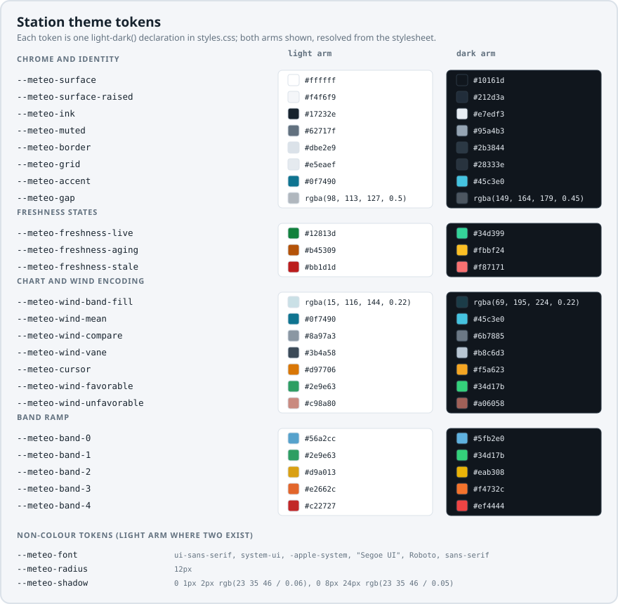

Every colour the components paint comes from a CSS custom property with a
built-in light fallback. Import the default skin once.

<!-- meteo-doc-fence: ignore — a CSS side-effect import; there are no type declarations to check -->
```ts
import "@azohra/meteo.station/styles.css";
```

Then wrap your markup in `.meteo-root` to get the token set. To change the
theme, override any token on any ancestor.

## Scoping and layering

`.meteo-root` carries the tokens and `color-scheme`. Components outside a
`.meteo-root` still render with the light fallbacks. Inside one, every token
can be themed.

The whole sheet ships inside `@layer meteo`, so your unlayered CSS always
takes precedence over it without higher specificity or `!important`.

## Light, dark, and the toggle

Each token is defined once with `light-dark()`, and the root sets
`color-scheme: light dark`, so the system preference picks the theme without
duplicate token blocks. A manual toggle sets `data-theme="dark"` (or
`"light"`) on `.meteo-root`. That attribute sets `color-scheme` in one line
and overrides the system preference.

```html
<div class="meteo-root" data-theme="dark">…</div>
```

Remove the attribute (or set any other value) to follow the system again.
Both the light and dark values of every token are always declared, so a
theme switch is instant and complete, with no partially themed state.

## The vocabulary

Every class and token the platform ships starts with `meteo-`, so one grep
of your page finds all of them. Names under that prefix fall into three
tiers.

- Bare `meteo-*` names are the shared skin and the generic parts any
  capability may use: surfaces, ink, `meteo-grid-line`, `meteo-tick`,
  `meteo-cursor`, `meteo-hit`, `meteo-microlabel`, the freshness badge, and
  the value and unit spans.
- `meteo-band-*` names are speed grading, and they are platform-wide on
  purpose. Today the station components use `meteo-band-0..n`, and any
  future capability that grades wind speeds will use the same tokens.
- `meteo-<family>-*` names are scoped to a component family. The
  `meteo-wind-*` names appear only where wind is drawn: the dial, the rose,
  the wind history chart, vanes, and the lull–gust band. Station-level parts
  use station-scoped names (`meteo-station-card-*`, `meteo-station-table-*`,
  `meteo-current-*`, `meteo-summary-*`) because a station is a weather
  station rather than a wind station. The other families are
  `meteo-air-*`, `meteo-sample-*`, `meteo-trend-*`, `meteo-strip-*`, and
  `meteo-sparkline-*`. The Meteogram renderer already follows the same
  pattern (`meteo-gram-*`, themed on the
  [SVG renderer page](/docs/briefing/svg/)), and future capabilities will
  continue it (`meteo-sounding-*`).

## Hook-only classes

The default skin paints nothing on the classes below. They exist as stable
handles for your own styling, on parts the skin leaves alone. They are
versioned API like every other class, and a test checks the list against
both the source and the stylesheet.

<!-- Kept in sync by hand with station/test/hook-only-classes.ts (the
     committed allowlist station/test/class-contract.test.ts enforces);
     the test cannot read this prose, so edit both together. -->

| Class | Seam |
|---|---|
| `meteo-speed` / `meteo-temperature` / `meteo-pressure` | The reading's kind, on each text atom's `<data>` element |
| `meteo-grid-label` | Axis labels in the SVG charts |
| `meteo-tick` | Axis tick marks in the SVG charts |
| `meteo-wind-gap` | The dropout gap group in the wind charts |
| `meteo-wind-vane-calm` | A calm hour's vane glyph |
| `meteo-wind-dial` | The dial's SVG root |
| `meteo-wind-dial-bezel` | The dial's bezel ring |
| `meteo-wind-needle` | The dial's direction needle |
| `meteo-current-observed` / `meteo-current-chill` | The current-conditions reading rows |
| `meteo-current-flank-gust` / `meteo-current-flank-lull` | The gust and lull flanks around the dial |
| `meteo-station-card-identity` / `-elevation` / `-source` | The station card's header regions |
| `meteo-station-table-time` / `meteo-strip-time` | Time cells in the table and the strip |
| `meteo-air-corner` | The air matrix's corner cell |
| `meteo-compass-fan` | The compass fan's wrapper, beside its styled state classes |

You can style these classes from your own CSS or leave them alone, and
the default look does not depend on them. The SVG text classes
(`meteo-grid-label`, `meteo-tick`) still render styled text. Their font,
size, and ink come from the chart's base `.meteo-*-svg text` rule, and the
class itself has no rule to replace. To restyle them, override the base
rule instead of adding rules per class.

## Token reference



### `--meteo-*` shared skin

| Token | Role |
|---|---|
| `--meteo-surface` | Card and panel background |
| `--meteo-surface-raised` | Raised elements (dial face, matrix header) |
| `--meteo-ink` | Primary text and strokes |
| `--meteo-muted` | Secondary text, axis labels |
| `--meteo-border` | Card and table borders |
| `--meteo-grid` | Chart gridlines |
| `--meteo-accent` | The accent (ungraded traces, links, emphasis) |
| `--meteo-gap` | Dropout hatching in charts |
| `--meteo-cursor` | The chart inspector cursor |
| `--meteo-freshness-live` / `-aging` / `-stale` | The freshness badge states |
| `--meteo-font` | Font stack for all component text (incl. SVG) |
| `--meteo-radius` | Corner radius |
| `--meteo-shadow` | Card shadow |

### `--meteo-band-*` speed grading

| Token | Role |
|---|---|
| `--meteo-band-0` … `--meteo-band-4` | Speed grading, calm → strong |

### `--meteo-wind-*` wind encoding

| Token | Role |
|---|---|
| `--meteo-wind-band-fill` | The lull–gust envelope fill |
| `--meteo-wind-mean` | The mean trace when ungraded |
| `--meteo-wind-vane` | Vane glyphs in the direction row |
| `--meteo-wind-compare` | The day-over-day compare overlay trace |
| `--meteo-wind-favorable` / `--meteo-wind-unfavorable` | The favorable and unfavorable verdicts: the rose's and dial's rings, vane tints, the direction fragment, the favorable-share stat |

## Speed bands and your palette

`thresholds` ([React](/docs/station/react/#thresholds)) grades traces, dial
arcs, and rose petals into `meteo-band-0..n` classes. Your CSS decides what
each band means and what colour it gets. Three thresholds make four bands.
Add `--meteo-band-*` overrides to use your own colours, and add rules for
higher indices if you declare more thresholds.

## Dark-mode notes

- The site's theme toggle on the
  [component gallery](/docs/station/component-gallery/) uses only this
  mechanism, `data-theme` on `.meteo-root`.
- If your page also sets `color-scheme` globally, the root's own
  declaration wins inside `.meteo-root`. The components stay consistent even
  when the page around them uses a different scheme.
- README images are generated from these same tokens, so the docs always
  match the palette.
