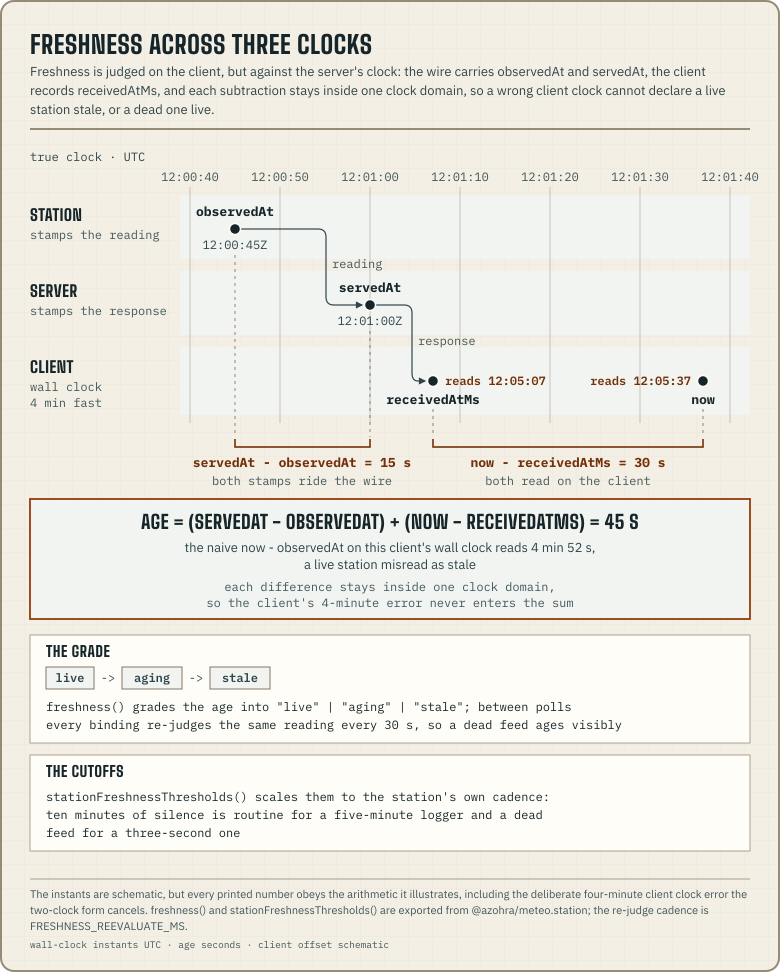

This page defines the contract between a station feed handler and its
clients. The source of truth is the zod schema in
[`station/src/contract.ts`](https://github.com/azohra/meteo/blob/main/station/src/contract.ts),
exported from `@azohra/meteo.station`. JSON Schema and annotated examples
generated from it ship in the package under
[`schema/`](https://github.com/azohra/meteo/tree/main/station/schema).

## The documents

`StationFeed` is `{ schemaVersion, servedAt, primaryStationId, stations[] }`.
Each station is a union on `status`, and it carries its identity and
declared capabilities in both arms.

- With `status: "ok"`, the station has a `reading` (windowed average,
  gust/lull, direction, temperature, and optional extended `conditions`),
  plus `history` when the station keeps one. Two nullish blocks come with
  this arm when the source serves them. `telemetry` holds device health,
  which today is `batteryVoltage` in volts. `samples` is
  `{ intervalSeconds, points }` of instantaneous `LiveSample`s.
- With `status: "unavailable"`, the station has a machine `reason` code, and
  `reading` and `history` are null. The codes are
  [core's four upstream-failure codes](/docs/core/failures-and-schema/#the-failure-vocabulary)
  plus one that belongs to station, `not_configured` (`UNAVAILABLE_REASONS`
  in `contract.ts`).

`StationCurrent` is `{ schemaVersion, servedAt, station }`. It holds one
station with its reading only, and history is null. It reuses the station
shape, so clients need one decoder.

`StationLiveFrame` is the unit of the `/live` stream. Each SSE data event
carries one JSON document, discriminated on `type`.

| Frame | Carries | Cadence |
|---|---|---|
| `init` | `{ schemaVersion, servedAt, station }`: a full ok station with its sample ring | once per connection |
| `samples` | `{ stationId, samples }`: the newest batch of instantaneous samples | as the source batches them |
| `reading` | `{ stationId, servedAt, reading, telemetry }`: a fresh reading | as the source digests |
| `summaries` | `{ stationId, servedAt, summaries }`: the source's pre-digested step blocks, whole | with each digest, when the source keeps them |
| `ping` | `{ servedAt }`: keepalive; feeds the client's idle watchdog | ~20 s |
| `unavailable` | `{ stationId, reason }`: terminal; the stream closes after it | on failure |

This station entry from the committed example
[`schema/example-feed.json`](https://github.com/azohra/meteo/blob/main/station/schema/example-feed.json)
shows the `unavailable` arm. Its identity and capabilities are intact, and
`reading` and `history` are null.

```json
{
  "id": "narrows",
  "name": "Gorge Narrows",
  "sourceLabel": "Campbell logger",
  "pageUrl": "https://example.com/stations/gorge-narrows",
  "latitude": 49.3,
  "longitude": -118.8,
  "timeZone": "America/Vancouver",
  "elevationM": 460,
  "capabilities": {
    "gustLull": true,
    "temperature": true,
    "conditions": false,
    "history": true
  },
  "samplingWindowSeconds": 3,
  "recommendedPollSeconds": 15,
  "status": "unavailable",
  "reason": "upstream_error",
  "reading": null,
  "history": null
}
```

The contract ships parse helpers. `parseStationFeed(Json)`,
`parseStationCurrent(Json)`, and `parseStationLiveFrame(Json)` return the
typed document or null, and they never throw.

## Semantics

- Capabilities are declared, never inferred from the data. A station that
  carries no thermometer says so in `capabilities`, and a thermometer that
  is dark right now reports null. These are different facts, and the
  contract can represent both. Capabilities gate the structure of the
  client UI, and a dark sensor keeps its UI structure.
- A missing quantity is null and is never sent as zero. `windGustMps: null`
  means "not measured" and does not mean "no gust".
- Calm carries no direction. Below the WMO calm threshold (0.5 m/s,
  `CALM_THRESHOLD_MPS`), `windDirectionDeg` is null, because a vane parked
  below its start-up torque, or a sonic head reading thermal drift, would
  fabricate a bearing. The measured speed is still sent. A null direction
  on a blowing reading means a dead vane.
- A dropout is an absent record. Gaps in `history.points` carry no points,
  and no zeroed records fill them. `periodMinutes` is on the wire because
  wind run, vane thinning, and dropout detection all depend on it. A client
  has to treat 1-minute records and 5-minute logger records differently.
- A `LiveSample` is an instant. `HistoryPoint.windAvgMps` is contractually
  a period mean, and `LiveSample.windMps` is a single anemometer sample. The
  two shapes are separate types, so one cannot be used as the other. The
  calm and dropout rules apply to both.
- Telemetry is device health and holds no weather. `batteryVoltage` sits in
  its own block beside the reading, gated by the `battery` capability, and
  never appears inside `conditions`. As with every sensor field, a declared
  battery that reports nothing is null, and its structure stays present.
- Declared favorable sectors are data. `declaredFavorableDirections` on the
  meta carries what the *source* declares about the spot. Null or absent
  means nothing is knowable, and `[]` means explicitly none. No component
  reads it. A consumer adopts it explicitly
  (`favorableDirections={declaredFavorableDirections(station) ?? ownArcs}`),
  so a vendor's opinion never becomes a judgment default. The optional
  `broadcastDelaySeconds` states the source's own live-playback delay.
- The `recentSummaries` block, gated by the capability of the same name,
  carries the source's own pre-digested rolling step windows. They are
  reused `HistoryPoint`s, oldest first, and an empty step is absent. A
  client cannot derive them itself, because the samples ring covers only
  about 10 minutes. The block travels whole, and a merge never mixes two
  sources' steps.
- History points may carry per-period extremes and the vector mean.
  `windVectorAvgMps`, `temperatureMinC`/`temperatureMaxC`, and
  `seaLevelPressureMinHpa`/`seaLevelPressureMaxHpa` are additive and
  nullish. Absent or null reads as "not published here" and never as zero.
  The vector mean is at most `windAvgMps` and is the correct input for
  further vector re-aggregation.
- The wire carries no prose. Failures carry a reason code, and directions
  are degrees instead of compass words. Display language, units, and colours
  belong to the client.
- Units are SI. Speeds are m/s and are converted for display with
  `speedFromMps`. Everything else keeps its conventional unit: °C, hPa, mm,
  km (lightning distance), W/m², and degrees.
- The `conditions` block is extensible, and not every station fills it.
  It is WeatherFlow-shaped, with a pressure-trend enum, a
  one-hour lightning bucket, and station-local "today" fields. The
  [Tempest adapter](/docs/station/adapters/tempest/) fills every field of
  it. Every field is nullable. Null means "not reported here" and does not
  distinguish a missing sensor from a dark one. The station-level
  capability flag gates the block.

## Evolution rules

These rules are normative. They apply to `STATION_SCHEMA_VERSION` the same
additive and breaking pattern that [Compatibility](/docs/compatibility/)
states for the forecast document families.

- An additive change, such as a new field, never bumps
  `STATION_SCHEMA_VERSION`. New fields arrive nullable, with null meaning
  what absence meant before. Readers ignore unknown keys. The schemas parse
  in strip mode, and the additive rule depends on that.
- New capability keys must arrive nullish (null = undeclared = false). A
  required boolean would brick every already-published document that
  predates the key.
- `STATION_SCHEMA_VERSION` bumps only when an existing field changes
  meaning, unit, or shape, or is removed. A reader that then rejects the
  unrecognized version is behaving as intended.
- Because parsing strips unknown keys, parse-then-reserialize is lossy. A
  proxy must pass bodies through verbatim.

## The HTTP protocol

A mounted handler serves five routes. They are suffix-matched by default
and exact-matched under `basePath`.

| Route | Document | Notes |
|---|---|---|
| `GET …/feed` | `StationFeed` | Every station + history. `?hours=` narrows the window; it must be in `(0, maxHistoryHours]` (default 6), out of range is a 400; valid values snap to quarter-hour steps. |
| `GET …/current?station=<id>` | `StationCurrent` | One station, reading only: the light poll. |
| `GET …/live?station=<id>` | `StationLiveFrame` stream | SSE (`text/event-stream`), one frame per data event. `?hours=` is ignored; live carries no history. |
| `GET …/history?station=<id>&from=<iso>&to=<iso>&period=<min>` | `StationHistory` | One requested archive window, used for pan and zoom. 400 on a bad window, a period the vendor cannot serve, or a window over the point budget; 404 on a vendor with no archive. A fully-past window is immutable and caches a day. |
| `GET …/climatology?station=<id>` | `StationClimatology` | The [multi-year cube](/docs/station/climatology/); 404 unless the host mounted its judgment thresholds. |

Feed and current responses carry `Cache-Control` derived from upstream cache
TTLs and a weak `ETag` computed over station content excluding `servedAt`, so
unchanged upstreams revalidate to 304. One broken station degrades to a
reason code, and the rest of the feed is still served. A handler returns 500
only when it cannot produce a document at all.

The live route never caches (`Cache-Control: no-cache, no-store`, no ETag).
Errors before the stream opens are JSON with a status. The route returns 400
with no `?station=`, 404 for an unknown station or a station whose vendor has
no live arm, and 502 with `{ error, reason }` when the upstream connect
fails. After the stream opens, a failure sends a terminal `unavailable` frame
and closes the stream. The client reconnects, and the fresh `init` frame is
how it resumes, because there are no SSE ids. Each client connection holds
one upstream connection, because the handler does not multiplex. A host that
expects many concurrent viewers of one station handles fan-out in its own
infrastructure, using the exported `openWindnerdLive` and
`encodeStationLiveSse` functions.

## Freshness: the servedAt anchor

The client judges freshness against the server's clock. The wire carries
each reading's `observedAt` and the document's `servedAt` (the server clock
at response time). The client records when it received the response
(`receivedAtMs`) and computes

```
age = (servedAt − observedAt) + (now − receivedAtMs)
```

so a wrong client clock cannot declare a live station stale (or a dead one
live). `freshness()` in `@azohra/meteo.station` grades that age into
`"live" | "aging" | "stale"`. `stationFreshnessThresholds()` scales the
cutoffs to the station's own cadence. Ten minutes of silence is routine for
a five-minute logger and means a dead feed for a three-second one.



Each station also advertises `recommendedPollSeconds`, matched to upstream
cache TTLs. See [polling etiquette](/docs/station/adapters/#polling-etiquette).
